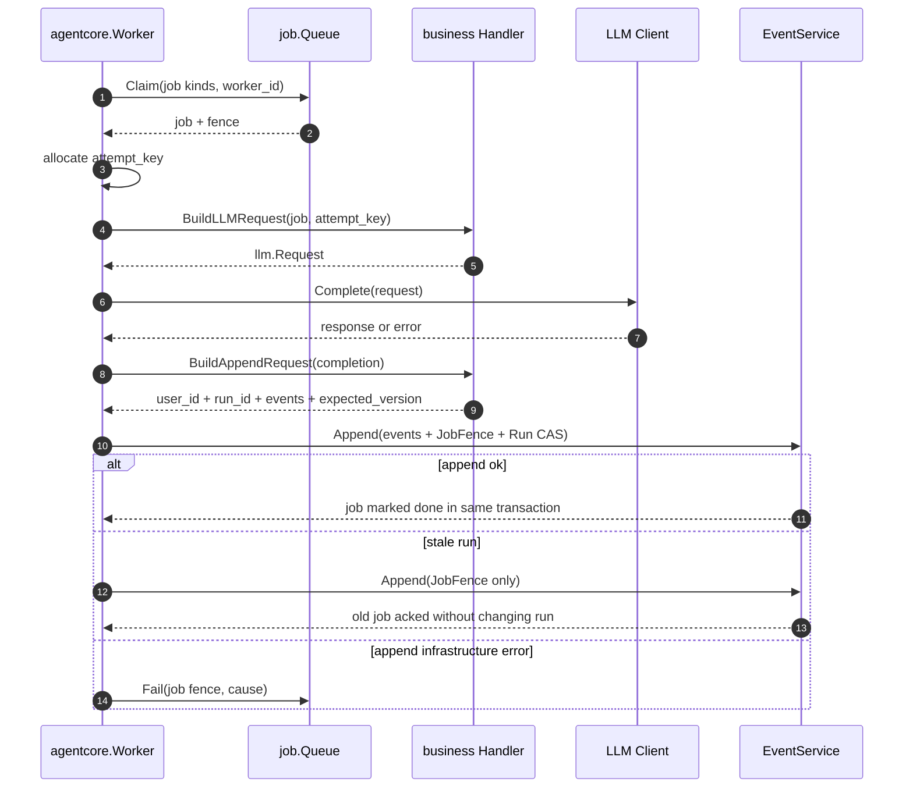

# Agent Execution Kernel

本文定义 Cloud Agent 执行内核的边界。它服务于不同业务 Agent，但不包含业务自己的字段、prompt、validator 或落库规则。

## 目标

Agent 任务和普通后台任务的区别是：它通常会调用 LLM 或工具，花钱、耗时、可能重复、可能超时，也可能在外部副作用已经发生后崩溃。因此执行内核必须统一处理这些非业务不变量：

- run 生命周期只能按状态机推进。
- job lease 过期后，旧 worker 不能覆盖新结果。
- worker 成功写事件和 ack 当前 job 必须原子提交。
- API 幂等和 worker fence 不能散落在业务 handler 里。
- LLM 调用必须有 attempt key、prompt version 和 context manifest。
- 业务输出校验失败时，run 要收敛到明确失败；执行基础设施失败时，job 要可重试。

## 边界

内核负责：

- `agent_runs`：执行实例的状态、版本和错误投影。
- `agent_jobs`：异步执行队列、lease、fence、attempt、fail/dead。
- `agent_events` / `EventService.Append`：事件追加、per-user seq、幂等、Run CAS、JobFence ack。
- `agent_idempotency_keys`：API 写入口的请求重放响应和服务端 `command_id` 映射。
- `agent_llm_ledger`：LLM 调用前置记账和 `pending/ok/provider_error/unknown` 语义。
- worker runtime：claim job -> allocate attempt -> build LLM request -> call LLM -> append terminal events -> ack/fail job。

内核不负责：

- 业务输入字段。
- 业务输出结构。
- 业务画像或领域语义。
- prompt 文案。
- 业务 validator。
- 业务事实表。

换句话说，不同业务 Agent 复用的是“可靠执行能力”，不是同一张输出表，也不是同一份 prompt。

## 实现边界

未来实现可以按模块化单体起步，但执行内核至少需要收敛出这些边界：

```text
agentcore
  Worker                  # 通用执行骨架
  Handler                 # 业务插件点
  Queue / EventAppender   # 内核依赖的最小接口

event
  Append                  # 原子 append、幂等、Run CAS、JobFence ack

job
  Queue                   # lease queue

run
  Reducer                 # Run 状态机投影
  Event helpers           # RunAccepted / RunQueued / RunStarted / RunSucceeded / RunFailed / RunExpired payload 构造

llm
  Client / ledger         # LLM 调用与账本

business handlers
  xxxGenerationHandler    # 业务 handler，只处理业务输入、prompt、validator 和业务事实
```

业务 Agent 应该实现 handler，而不是复制 worker 生命周期代码。

## Handler 合约

业务 handler 只需要实现三件事：

```go
type Handler interface {
    JobKinds() []string
    BuildLLMRequest(ctx context.Context, job JobContext) (llm.Request, error)
    BuildAppendRequest(ctx context.Context, completion Completion) (CompletionAppend, error)
}
```

含义：

- `JobKinds`：声明这个 handler 消费哪些 job kind。
- `BuildLLMRequest`：解析业务 payload，构建 LLM 请求。这里可以读业务输入，但不应该改数据库。
- `BuildAppendRequest`：把 LLM 成功/失败转成业务事件；必要时做结构化输出解析、校验和业务事实落库。

`CompletionAppend` 只暴露内核需要知道的内容：

```text
- user_id
- run_id
- expected_run_version
- events[]
```

内核会补上：

```text
- Actor{worker}
- JobFence{job_id, lease_token}
- RunAggregate{run_id, expected_version}
```

这样业务 handler 不需要直接碰 worker fence，也不负责自己 ack job。

## Worker 生命周期



## 错误语义

| 位置 | 例子 | 内核处理 |
| --- | --- | --- |
| Claim 没有 job | 队列为空 | 返回 `processed=false`，worker sleep |
| payload / request 构建失败 | job payload 无法解析、缺 user_id | fail 当前 job，等待重试或 dead |
| LLM 返回错误 | provider error、预算拒绝 | 交给 handler 生成 `RunFailed` 业务事件 |
| 业务输出无效 | JSON 不合法、validator 不通过 | handler 生成 `RunFailed` 业务事件 |
| 业务落库失败 | artifact 存储失败 | fail 当前 job，稍后重试 |
| Append Run CAS 冲突 | sweeper 或另一个 worker 已推进 run | fence-only ack 旧 job，不再改 run |
| Append 基础设施失败 | DB 错误、fence 无效 | fail 当前 job |

注意：LLM 错误不等于 worker 基础设施错误。前者通常应该收敛成 run 失败事件；后者应该让 job 可重试。

## 数据库命名

建议执行内核使用 `agent_*` 前缀：

```text
agent_runs
agent_events
agent_event_cursors
agent_jobs
agent_idempotency_keys
agent_llm_ledger
```

业务事实表不使用 `agent_*` 前缀，避免把领域对象和执行队列对象混在一起。关键原则：业务里的 task 是领域任务；内核里的 job 是执行队列任务。二者不能混用。代码包名仍保留 `event` / `job` / `run` / `llm` 这些领域名，`agent_*` 只表达数据库物理表属于执行内核。

## 复用方式

后续业务 Agent 应该这样接入：

| Handler | 输入 | 输出 | 业务落库 |
| --- | --- | --- | --- |
| `planning_agent` | 用户目标 + 约束 | Plan + next actions | 业务 plan / task 表 |
| `artifact_agent` | TaskSpec + context | Artifact | 业务 artifact 表 |
| `review_agent` | Evidence + result | Review + profile delta | 业务 review / profile 投影 |

它们共用同一个执行内核，但各自拥有 schema、prompt、validator 和业务事实表。

## 验证建议

执行内核需要至少覆盖三层测试：

- Worker 单元测试：覆盖 claim、fail、append、stale ack 和 append 失败语义。
- 业务 handler 集成测试：覆盖 run/job/business fact/event 的数据库链路。
- API 端到端 smoke：覆盖 create run -> worker process -> get run -> get artifact/output。

目标不是证明所有业务都完成，而是证明不同业务不会拥有重复的 worker 生命周期代码。

## 演进顺序

1. 为 handler 增加非 LLM 执行模式，支持纯工具或无需模型的 agent job。
2. 将 worker 指标标准化：claimed、completed、failed、stale_acked、append_failed、llm_error。
3. 用第二个业务 handler 验证内核覆盖不同业务输出。
