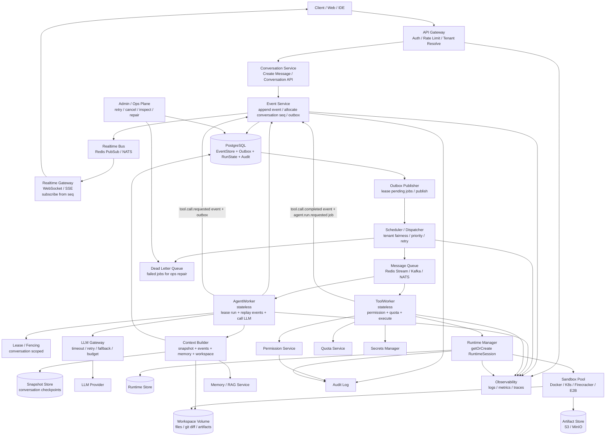

# Lites Cloud Agent 架构设计

Lites 是一个生产级 Cloud Agent 平台的 lite 版本。项目可以从简单的本地组件开始，但架构边界和核心语义需要对齐真实云端部署的要求。

本文档将 "w-level" 理解为万级规模：例如万级并发客户端、万级任务、万级会话或万级租户工作负载。具体能支撑到哪一档，需要通过容量规划、压测和故障演练验证，不能只由架构图承诺。

## 设计目标

- 保持产品足够轻量，方便作为 lite 平台构建和运维。
- 保留生产级语义：事件顺序、重试、幂等、多租户、权限、持久化、运行时隔离和审计。
- 让本地简版实现可以在未来替换为托管基础设施，而不需要重写业务逻辑。
- 避免在请求处理器里直接执行长时间运行的 Agent 任务。
- 将 EventStore 作为事实源，将实时通道作为通知通道。

## 更新后的架构

## 核心标识

所有核心记录都应该携带足够的身份信息，用于租户隔离、调试、回放和审计：

- `tenant_id`：客户边界。
- `user_id`：已认证的用户。
- `conversation_id`：会话边界，也是事件顺序边界。
- `run_id`：一次 Agent 执行或续跑。
- `event_id`：稳定唯一的事件 id。
- `seq`：会话内单调递增序号，不做全局递增。
- `request_id`：一次 API 请求的 trace id。
- `idempotency_key`：客户端或服务端生成的重放保护 key。

`seq` 应该是 conversation-scoped，避免全局序列带来的写入热点。普通 Agent 执行不需要全局事件顺序。

## 请求流程

1. Client 调用 API Gateway。
2. Gateway 完成认证、租户解析、限流，并将可信上下文传给 Conversation Service。
3. Conversation Service 校验请求，并调用 Event Service。
4. Event Service 在同一个数据库事务中写入事件、更新必要的 run state，并插入 outbox job。
5. Event Service 发送尽力而为的实时通知。
6. Outbox Publisher 对 pending job 加租约，并交给 Scheduler。
7. Scheduler 负责租户公平性、优先级、重试时间和队列路由。
8. AgentWorker 或 ToolWorker 消费 job，并通过 Event Service 写入完成、失败或后续事件。

请求处理器只返回任务或 run 的标识，不等待长时间运行的 Agent 任务完成。

## EventStore 与 Outbox

在 lite 架构中，PostgreSQL 是事实源。它应存储事件、outbox job、run state、审计事件、快照和运维修复元数据。

必须保留的生产级语义：

- 事件追加和 outbox job 写入必须在同一个事务中完成。
- `seq` 按 `conversation_id` 分配。
- 通过唯一键保证幂等。
- outbox job 需要保存 `pending`、`leased`、`published`、`done`、`failed`、`dead_lettered` 等状态。
- outbox job 需要保存 `lease_until`、`lease_owner`、`attempts`、`max_attempts` 和 `last_error`。
- 当写入量上升时，高容量表需要按时间、租户或 conversation hash 做分区或分片。
- 终态 run state 不应被普通流程修改，只有明确的管理员修复流程可以处理。

Outbox 是持久状态和异步执行之间的一致性桥梁。即使实时通知失败，事件仍然可以从 EventStore 恢复。

## 队列与调度

队列可以从 PostgreSQL-backed jobs 或 Redis Stream 开始，但必须保留生产队列应有的语义：

- enqueue、lease 或 claim、acknowledge、retry、timeout、dead-letter。
- 通过 visibility timeout 或 lease expiration 支持 worker 崩溃恢复。
- 租户级公平调度，避免单个租户饿死其他租户。
- 区分交互式任务和后台任务的优先级路由。
- 默认接受重复投递，消费者必须幂等。
- 当 queue lag、LLM 延迟、数据库压力或 runtime 使用率过高时，需要有反压机制。

规模更大时，可以在相同 job 接口后面将 lite 队列替换成 Kafka 或 NATS JetStream。

## Worker 执行模型

Worker 是无状态的。持久状态存在于 PostgreSQL、workspace storage、artifact storage、runtime store 和 memory service 中。

AgentWorker 职责：

- 使用 fencing token 对 run 或 conversation 加租约。
- 从 snapshot 加增量 events 恢复状态。
- 基于 events、memory、workspace 和 policy 构建上下文。
- 通过 LLM Gateway 调用 LLM，并处理超时、重试、fallback 和预算控制。
- 所有生成的消息、工具请求、失败和后续 job 都通过 Event Service 写入。

ToolWorker 职责：

- 重新加载可信的 tenant、user、run 和 tool call 上下文。
- 执行前检查权限和配额。
- 只通过 Secrets Manager 获取密钥。
- 在 RuntimeManager 管理的 sandbox session 中执行。
- 通过 Event Service 写入工具完成、失败、artifact 和后续事件。

Worker 必须幂等。重试后的 job 应能判断副作用是否已经发生，并安全返回已有结果。

## 锁、顺序与 Fencing

正确性不能只依赖普通分布式锁。应以持久状态和 fencing token 作为主要安全机制。

- 锁粒度应是 `conversation_id` 或 `run_id`，不能是全局锁。
- 每个 lease 都应有 TTL 和 owner token。
- 当 worker 的写入依赖独占执行时，写事件时应携带最新 fencing token。
- 已过期的 worker 不能覆盖更新的 run state。
- 只有当 tool call 有唯一 id，并且完成顺序被显式建模时，才允许并行 tool call。

这样可以防止旧 worker 在重试或故障转移之后写入过期结果。

## 实时投递

实时通道是优化，不是事实源。

- WebSocket 和 SSE 向客户端推送事件通知。
- 客户端记录最后看到的 conversation `seq`。
- 断线重连后，客户端通过 Conversation API 从 `last_seen_seq + 1` 开始补拉事件。
- RealtimeGateway 丢消息不应破坏系统状态。
- EventStore 必须能在浏览器刷新、网络切换、多标签页等场景中修复事件缺口。

## Runtime 与 Sandbox

RuntimeManager 是代码执行和 workspace 修改的控制平面。

必须保留的生产级语义：

- runtime session 按 tenant 和 workspace 隔离。
- 强制 CPU、内存、磁盘、网络和执行时长限制。
- 支持 warm pool，但不能在租户之间泄漏状态。
- secrets 只在本次操作需要时注入，避免写入 workspace 文件或日志。
- 记录文件变更、git diff、artifacts 和命令元数据。
- 过期并清理空闲或卡住的 runtime session。

lite 部署可以使用 Docker。更大规模部署可以替换为 K8s、Firecracker 或 E2B。

## 多租户

租户隔离是核心设计属性。

- 租户拥有的数据表需要包含 `tenant_id`。
- 查询默认按租户限定，除非是明确的管理操作。
- 队列调度需要应用租户配额和公平性。
- runtime session、workspace、artifact、memory 和 audit log 都需要租户作用域。
- 租户级限制应覆盖请求速率、队列深度、runtime session、token budget、存储和 artifact 大小。

这些约束用于防止单个租户在 API、队列、LLM、runtime 或存储层影响其他租户。

## 安全与权限

安全决策需要明确且可审计。

- 默认拒绝。
- tenant 和 user 上下文来自认证结果，不能信任客户端直接传入的 id。
- 在 API 边界检查权限，在 worker 执行敏感操作前再次检查。
- tool 权限应限定在当前 tenant、workspace 和 run 范围内。
- secrets 存放在普通应用配置之外，并在需要时临时获取。
- 不记录 token、credential、原始 secret 或敏感 payload。
- 对权限变更、管理员操作、runtime 执行、租户配置、取消、重试和修复记录审计事件。

## 可观测性与运维

系统需要足够的运维可见性，才能调试异步执行链路。

最低限度的指标：

- API 延迟、错误率和限流决策。
- 事件追加延迟和数据库写入量。
- outbox lag 和发布失败次数。
- 队列深度、任务年龄、attempts、retries 和 DLQ 大小。
- worker 成功率、失败率、lease timeout 和 job duration。
- LLM 延迟、超时、token 使用量、fallback 和 provider 错误。
- runtime cold start、活跃 session、资源使用量和清理失败。

日志和链路追踪应尽量包含 `tenant_id`、`user_id`、`conversation_id`、`run_id`、`task_id` 或 job id，以及 `request_id`。

Admin/Ops Plane 应支持：

- 查看 conversation events 和 run state。
- 取消 run。
- 重试失败 job。
- 修复后将 DLQ job 重新放回队列。
- 调整租户配额。
- 查看 runtime session 并清理卡住的 session。

## Lite 到生产的替换路径

| 关注点 | Lite 实现 | 生产替换 |
| --- | --- | --- |
| EventStore | PostgreSQL | 分区 PostgreSQL 或分片事件存储 |
| Outbox | PostgreSQL 表 | PostgreSQL outbox + 独立 publisher fleet |
| Queue | PostgreSQL jobs 或 Redis Stream | Kafka 或 NATS JetStream |
| Scheduler | 进程内 dispatcher | 独立 scheduler service |
| Realtime | Redis PubSub + SSE/WebSocket | NATS 或托管 pub/sub + gateway fleet |
| Runtime | Docker 本地池 | K8s、Firecracker 或 E2B |
| Workspace | 本地或挂载 volume | 隔离持久卷或对象存储型 workspace |
| Artifact Store | 本地磁盘或 MinIO | S3-compatible object store |
| Memory | PostgreSQL 表 | 向量数据库或托管 RAG 服务 |
| Secrets | 本地加密文件或 env-backed provider | 云 secrets manager |
| Observability | 结构化日志 | OpenTelemetry、指标、链路追踪、告警 |

## 万级就绪检查清单

在宣称达到万级能力之前，需要用压测和故障测试验证：

- 在预期租户组合下，事件追加吞吐和 p95 延迟达标。
- worker 或队列故障期间，outbox lag 保持有界。
- 队列重试和 DLQ 在重复投递下行为正确。
- 租户公平性可以防止单个租户耗尽所有 worker 容量。
- conversation replay 使用 snapshot，不会随会话长度线性恶化。
- LLM 超时、provider 故障和 fallback 行为有明确边界。
- runtime cold start 和活跃 session 数满足交互式延迟目标。
- sandbox 隔离可以防止跨租户文件、网络和 secret 泄漏。
- realtime reconnect 可以基于 `last_seen_seq` 补回缺失事件。
- Admin repair 可以重试、取消或 dead-letter job，且不破坏数据。
- 核心表的备份、恢复演练和 schema migration 可以正常工作。

当这些语义被实现并通过测试后，即使第一版使用 lite 基础设施，这套架构也可以被认为是生产导向的。
