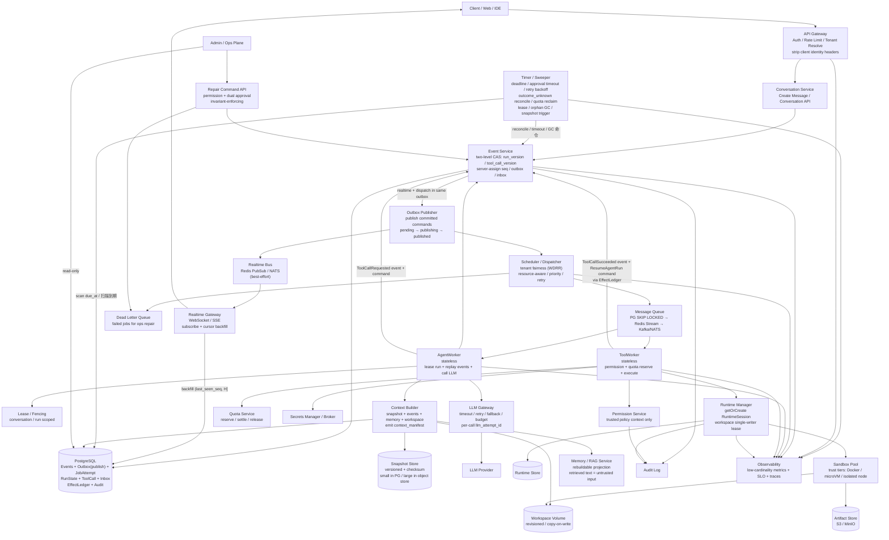

# Lites Cloud Agent 架构设计

Lites 是一个生产级 Cloud Agent 平台的 lite 版本。项目可以从简单的本地组件开始，但架构边界和核心语义需要对齐真实云端部署的要求。

本文档将 "w-level" 理解为万级规模：例如万级并发客户端、万级任务、万级会话或万级租户工作负载。具体能支撑到哪一档，需要通过容量规划、压测和故障演练验证，不能只由架构图承诺。

> 本版本在原有"生产原则清单"之上，补齐了**正确性闭环**：把 `Command → 持久发布 → Attempt → 外部副作用 → 结果事件 → Run 状态转换 → 下一个 Command` 这条链定义成可验证的状态机，并明确乐观并发、幂等、未知结果与修复路径。本质上这是一个**以 PostgreSQL 为持久化核心的简化型 durable workflow / Agent runtime 平台**，而不仅是 "API → MQ → Worker → 回写数据库"。

## 文档索引

本架构设计按关注点拆分为以下子文档：

| 文档 | 内容 |
| --- | --- |
| **本文（architecture.md）** | 全局概览：设计目标、非目标、架构图、核心标识、请求流程 |
| [state-machines.md](./state-machines.md) | Run / ToolCall / Command 三个状态机、不变量、取消语义、失控保护 |
| [concurrency-and-durability.md](./concurrency-and-durability.md) | EventStore、两级乐观并发（`run_version` / `tool_call_version`）、`seq` 分配、唯一约束、outbox、事实源边界、context manifest、snapshot |
| [execution-model.md](./execution-model.md) | 队列调度、Worker 短事务模型、副作用与 effect ledger、LLM 幂等、上下文预算压缩、锁与 fencing、并行 join（两级 CAS + `FOR UPDATE`） |
| [realtime.md](./realtime.md) | 实时投递、无竞态重连协议、LLM token 流 |
| [runtime-and-sandbox.md](./runtime-and-sandbox.md) | 信任等级与隔离、安全基线、workspace 单写者并发 |
| [multi-tenancy-and-security.md](./multi-tenancy-and-security.md) | 多租户隔离（RLS 三层保护）、权限模型、数据保留与 crypto-shredding、Repair Command API |
| [operations.md](./operations.md) | Timer / Sweeper 巡检、可观测性（低基数 metrics + SLO）、故障测试矩阵、store_epoch |
| [capacity-and-scaling.md](./capacity-and-scaling.md) | 部署形态、Lite 到生产替换路径、万级负载向量、就绪检查清单 |
| [roadmap.md](./roadmap.md) | 三阶段实施路线图：正确性闭环 → 生产加固 → 规模化演进 |

## 设计目标

- 保持产品足够轻量，方便作为 lite 平台构建和运维（首版优先模块化单体，而非一堆微服务）。
- 保留生产级语义：事件顺序、重试、幂等、多租户、权限、持久化、运行时隔离和审计。
- 让本地简版实现可以在未来替换为托管基础设施，而不需要重写业务逻辑。
- 避免在请求处理器里直接执行长时间运行的 Agent 任务。
- 将 EventStore 作为**编排状态与决策过程**的事实源，将实时通道作为通知通道。
- 用正式状态机 + 乐观并发，使"一次 run 只能沿合法路径前进"可被证明，而不是依赖各组件局部正确。

## 非目标（Non-goals）

明确边界与明确能力同等重要，以下在本版本**不承诺**：

- **通用 exactly-once**：传输层是 at-least-once，只对下游可幂等的操作提供 effectively-once effect，不可幂等的外部操作走 outcome reconciliation（见 [execution-model.md](./execution-model.md)）。
- **跨会话事务 / 跨会话强一致**：一致性边界止于单个 `conversation_id`（append 在该边界内串行）。
- **跨区域 active-active**：Lite 与生产前期是单区域单写模型，跨区域留到阶段三且需先验证单写站稳（见 [roadmap.md](./roadmap.md)）。
- **自动消解一切未知**：`outcome_unknown` 与不可逆副作用最终可能仍需人工裁定，系统只保证不盲目重做，不保证全自动收敛。
- **实时通道可靠投递**：实时是优化而非事实源，可靠性由 EventStore + cursor 补拉保证（见 [realtime.md](./realtime.md)）。

## 架构总览

## 核心标识

所有核心记录都应该携带足够的身份信息，用于租户隔离、调试、回放和审计：

- `tenant_id`：客户边界。
- `user_id`：已认证的用户。
- `conversation_id`：会话边界，也是事件的**提交顺序**边界。
- `run_id`：一次 Agent 执行或续跑。
- `run_version`：Run 聚合的**乐观并发令牌**（单调递增），仅在 Run 状态转换时递增，用于 Run 级条件写。
- `tool_call_version`：ToolCall 聚合的**乐观并发令牌**（单调递增），仅在 ToolCall 状态转换时递增，用于 ToolCall 级条件写。与 `run_version` 独立，避免并行 ToolCall 完成时的假冲突。
- `event_id`：稳定唯一的事件 id。
- `seq`：会话内单调递增序号，由服务端在提交时**原子分配**，不做全局递增。
- `command_id`：一条命令（意图）的稳定 id，用于消费端去重（inbox）。
- `effect_key`：一次外部副作用的稳定幂等键。
- `attempt_id` / `llm_attempt_id`：一次执行尝试 / 一次模型调用的独立 id。
- `correlation_id` / `causation_id` / `parent_event_id`：事件因果关系。
- `request_id`：一次 API 请求的 trace id。
- `idempotency_key`：客户端或服务端生成的重放保护 key（必须带 `tenant_id` 与 operation scope）。
- `reservation_id`：一次配额预留的 id，用于 settle / release 与崩溃后回收。
- `due_at`：定时唤醒时间（deadline、approval 超时、retry backoff、reconcile 复核），由 Timer / Sweeper 扫描驱动。

`seq` 是 conversation-scoped 的提交顺序游标，避免全局序列热点；它**不是**并发控制令牌——并发控制由各自聚合的版本令牌承担（Run 用 `run_version`，ToolCall 用 `tool_call_version`，详见 [concurrency-and-durability.md](./concurrency-and-durability.md)）。`seq` 也只代表提交顺序，不等于因果顺序，因果由 `causation_id` / `parent_event_id` 表达。

## 请求流程

1. Client 调用 API Gateway。
2. Gateway 完成认证、租户解析、限流，**剥离客户端提交的所有内部身份 header**，并将签名后的短期可信上下文传给 Conversation Service。
3. Conversation Service 校验请求，并调用 Event Service。
4. Event Service 在同一个数据库事务中：写入事件、按对应聚合版本（`run_version` 或 `tool_call_version`）做条件更新、分配 `seq`、插入 dispatch command 与 realtime 通知到 outbox。
5. Outbox Publisher 在**事务提交之后**发布实时通知与调度命令（避免推送一个最终回滚的事件）。
6. Scheduler 负责租户公平性、优先级、重试时间和队列路由。
7. AgentWorker 或 ToolWorker 消费命令，并通过 Event Service 写入完成、失败或后续事件。

请求处理器只返回任务或 run 的标识，不等待长时间运行的 Agent 任务完成。相同 `idempotency_key` 的重复请求必须返回原 run（idempotency response store）。
