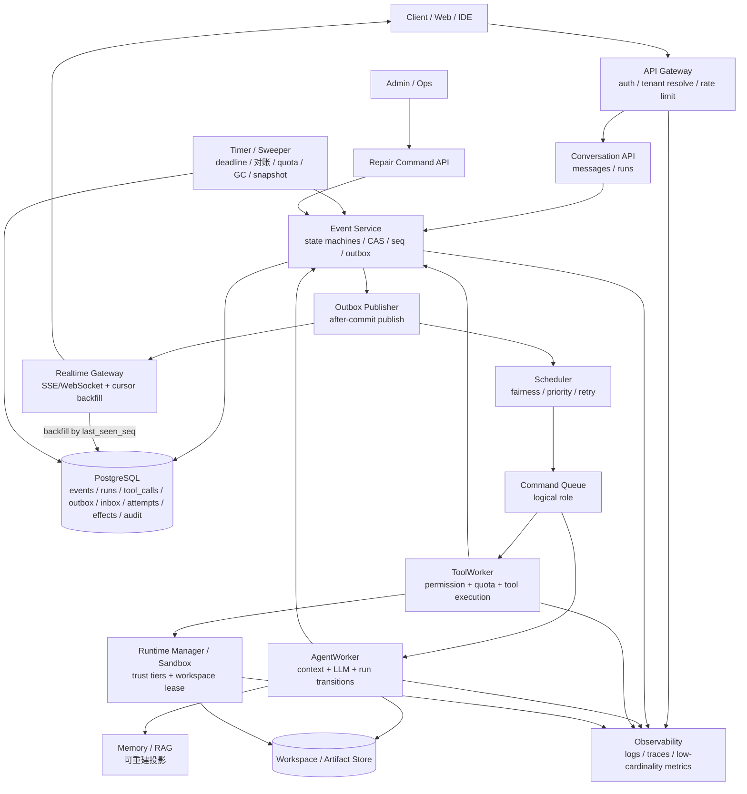

# Lites Cloud Agent 架构设计

Lites 是一个 Lite-first 的 Cloud Agent 平台设计：首版可以用 PostgreSQL、Redis、对象存储和本地 runtime 跑起来，但核心语义必须能平滑迁移到更强的生产基础设施。本文只讨论技术方案，不绑定当前项目的实现状态。

## 文档入口

| 文档 | 建议阅读顺序 | 内容 |
| --- | ---: | --- |
| **本文（architecture.md）** | 1 | 全局心智模型、核心循环、术语、逻辑架构与 Lite v1 部署形态 |
| [state-machines.md](./state-machines.md) | 2 | Run / ToolCall / Command 的状态转换表、取消语义、不变量 |
| [concurrency-and-durability.md](./concurrency-and-durability.md) | 3 | EventStore、append 合约、两级 CAS、`seq`、outbox/inbox、`store_epoch`、snapshot |
| [execution-model.md](./execution-model.md) | 4 | 队列调度、Worker 短事务、副作用能力、effect ledger、LLM 调用、并行 join |
| [tool-system.md](./tool-system.md) | 5 | 工具声明、注册、发现、版本管理、Schema 校验与生命周期 |
| [memory.md](./memory.md) | 6 | 记忆层次、存储、写入时机、向量检索、召回、淘汰与租户隔离 |
| [llm-provider.md](./llm-provider.md) | 7 | LLM 统一接口、Provider 适配、模型路由、降级熔断与成本追踪 |
| [realtime.md](./realtime.md) | 8 | 实时通道、无竞态重连、慢消费者、权限变化、LLM token 流 |
| [runtime-and-sandbox.md](./runtime-and-sandbox.md) | 9 | runtime 威胁模型、隔离等级、secret broker（受控代发服务）、workspace 单写者 |
| [multi-tenancy-and-security.md](./multi-tenancy-and-security.md) | 10 | 租户隔离、权限模型、数据保留、删除与 Repair Command API |
| [operations.md](./operations.md) | 11 | Sweeper、可观测性、故障注入与不变量测试 |
| [capacity-and-scaling.md](./capacity-and-scaling.md) | 12 | 部署替换路径、负载向量、规模化就绪标准 |
| [roadmap.md](./roadmap.md) | 13 | 技术演进顺序 |

## 问题、决策与风险

**问题**：Agent 任务不是一次普通 HTTP 请求。它会排队、调用模型、调用工具、修改 workspace、等待审批、断线重连、被取消、失败重试，还可能在外部副作用发生后崩溃。

**决策**：把系统设计成以 PostgreSQL 为持久化核心的可恢复工作流和 Agent 执行平台。EventStore 记录编排事实和决策过程；命令通过 outbox 发布；Worker 只做短事务占位和短事务提交，中间的长时间 I/O 依靠 CAS、fence 和幂等合约保护。

**为什么不简单做成 API → MQ → Worker → 回写数据库**：这条链路看起来直观，但在重复投递、Worker 崩溃、取消竞态、并行工具完成、外部副作用未知时没有统一事实源，容易出现重复执行、错误续跑或终态被改写。

**忽略后果**：最常见的事故不是“任务失败”，而是“任务看似成功但状态分叉”：同一 run 被续跑两次、已经取消的 run 被工具结果唤醒、未知副作用被盲目重做、实时断线后客户端漏事件。

## 核心循环

核心思想：**每一步先写入数据库，确认“系统现在知道什么、下一步要做什么”，再让后台 Worker 去执行。** HTTP 请求不直接跑长任务；Worker 执行完也不直接改最终结果，而是继续追加事件，让状态机决定下一步。

可以把它理解成一条不断循环的流水线：

```text
用户发起请求
→ 系统把“已发生的事”写成 event
→ 系统把“接下来要做的事”写成 command
→ 后台 Worker 领取 command 并尝试执行
→ Worker 调用 LLM、工具或 sandbox
→ Worker 把执行结果再写成 event
→ 状态机根据新 event 推进 Run
→ 如果还没结束，再生成下一条 command
```

一个例子：用户要求 Agent 修改文件。完整过程不是一次 API 调用内完成，而是拆成多次“记账 + 执行”：

1. 用户提交请求后，API 只做很短的一件事：记录 `RunAccepted`，再登记一条 `StartAgentRun`。然后立即返回 `run_id`，告诉客户端“任务已受理”。
2. AgentWorker 看到 `StartAgentRun` 后开始工作：读取对话、workspace、memory 和策略，组装上下文，然后调用 LLM。
3. 如果 LLM 判断需要改文件，AgentWorker 不直接改文件，而是记录 `ToolCallRequested`，再登记 `ExecuteToolCall`，把执行工具这件事交给 ToolWorker。
4. ToolWorker 领取工具任务后，先检查权限、配额和 secret 访问，再在 sandbox 里真正执行文件修改。
5. 工具执行完，ToolWorker 把结果记录成 `ToolCallSucceeded` 或失败/未知结果。这里用 `tool_call_version` 防止同一个工具调用被重复提交。
6. 如果这一轮需要多个工具并行执行，最后完成且满足 join 条件的 ToolWorker 会尝试恢复 Run。它用 `run_version` 创建 `ResumeAgentRun`，保证同一轮只续跑一次。
7. AgentWorker 再次领取 `ResumeAgentRun` 继续思考。这个循环会一直重复，直到 Run 输出最终回复，或进入失败、取消、过期等终态。

这条链路的重点是：API、AgentWorker、ToolWorker 都只通过 EventStore 交接状态。这样即使请求重试、Worker 崩溃、消息重复投递或客户端断线，系统也能从已提交的 event 继续恢复，而不是依赖某个进程的内存状态。

## 术语表

下面这些英文名会保留在文档里，因为它们最终会成为代码、表名或事件名。阅读时可以先按中文含义理解。

| 术语 | 通俗解释 | 关键规则 |
| --- | --- | --- |
| Event | 已经发生的事实，例如 `ToolCallSucceeded` | 一旦提交，不被普通流程修改 |
| Command | 希望某个消费者去做的意图，例如 `ResumeAgentRun` | 至少一次投递，消费者必须去重 |
| Worker | 后台执行者，负责调用模型或工具 | 不保存长期状态，结果要写回 EventStore |
| Attempt | Worker 对一条 command 的一次执行尝试 | 可以失败、超时、变成无人认领的旧尝试 |
| EventStore | 保存“发生过什么、状态怎么变”的数据库部分 | 不保存 workspace 文件本体 |
| Outbox | 事务内登记“要发出去的 command”的表 | 事务提交后再发布，避免发出回滚事件 |
| Inbox | 消费者登记“这条 command 我处理过”的表 | 用来抵抗重复投递 |
| CAS | Compare-And-Set，只有版本仍是预期值才允许写入 | 防止基于旧状态提交新决策 |
| `run_version` | Run 聚合的 CAS 版本 | 只在 Run 状态转换时递增 |
| `tool_call_version` | ToolCall 聚合的 CAS 版本 | 只在 ToolCall 状态转换时递增 |
| `seq` | conversation 内的提交顺序号 | 只做排序和补拉游标，不做 CAS |
| fence | lease 产生的防过期写令牌 | 旧 Worker 即使醒来也不能覆盖新状态 |
| `effect_key` | 外部副作用的稳定幂等键 | 下游支持幂等时用于避免重复副作用 |
| `outcome_unknown` | 外部调用结果未知，例如超时后不知道资源是否已创建 | 禁止盲目重试，必须先对账或人工裁定 |
| Reconciliation | 对账确认外部副作用到底是否发生 | 用于把未知结果收敛到成功、失败或人工处理 |
| `store_epoch` | EventStore 恢复代次 | 数据库从备份恢复后，用它拒绝旧代次 command |

## 设计目标

- Lite-first：首版优先模块化单体和少量进程，避免过早拆成一堆微服务。
- 生产语义先行：事件顺序、重试、幂等、多租户、权限、持久化、运行时隔离和审计从一开始就定义清楚。
- 基础设施可替换：PostgreSQL job queue、Redis Pub/Sub、本地 Docker 都是可替换实现，业务语义不依赖某个消息队列服务的特殊能力。
- 请求处理器不执行长任务，只提交事实和命令。
- EventStore 是编排状态与决策过程的事实源；实时通道只是通知。
- 用正式状态机和 CAS 保证“一次 run 只能沿合法路径前进”。

## 非目标

- **不承诺通用 exactly-once**：传输层按“至少一次投递”设计；对支持幂等键的外部写操作提供“多次投递但只产生一次有效副作用”的效果；无法幂等的操作必须走对账。
- **不做跨会话事务**：强一致边界止于单个 `conversation_id` 的 append 顺序。
- **不做跨区域 active-active**：Lite 与生产前期采用单区域单写模型。
- **不自动消解所有未知结果**：`outcome_unknown` 可能需要人工裁定；系统只保证不盲目重做。
- **不把实时通道当可靠存储**：可靠性由 EventStore + `last_seen_seq` 补拉提供。

## 逻辑架构

下图描述的是职责边界，不等于首版必须拆出来的网络服务数量。



## Lite v1 部署形态

| 逻辑职责 | Lite v1 建议形态 | 可替换方向 |
| --- | --- | --- |
| Gateway、Conversation、Event Service、Permission、Quota、Scheduler、Sweeper、Repair API | 一个 Control Plane 模块化单体 | 按瓶颈拆独立服务 |
| Command Queue | PostgreSQL jobs + `SKIP LOCKED` | Redis Streams、Kafka、NATS JetStream |
| Outbox Publisher | Control Plane 内后台循环或小型 publisher 进程 | 独立 publisher fleet |
| Realtime | SSE/WebSocket Gateway + Redis Pub/Sub | 托管 Pub/Sub 或 NATS |
| AgentWorker | 独立 worker pool | 按模型/provider/优先级拆池 |
| ToolWorker + RuntimeManager | 独立安全域 | K8s、microVM、隔离节点 |
| Workspace / Artifact | 本地卷、MinIO 或 S3-compatible store | 隔离持久卷或对象存储 workspace |
| Memory | PostgreSQL 表或轻量索引 | 向量数据库或托管 RAG |

Outbox、Scheduler、MQ 是逻辑角色，不要求首版引入独立 MQ。只要保留 enqueue、lease/claim、ack、retry、timeout、dead-letter、去重和 backpressure 语义，PostgreSQL jobs 可以作为 Lite v1 的队列实现。

## 负载向量

不要用一个“万级”标签概括所有规模。需要分别描述：

- `C_conn`：同时存在的 SSE/WebSocket 连接。
- `R_api`：API 请求数/秒。
- `R_event`：持久事件写入数/秒。
- `N_run`：活跃 Agent run。
- `N_llm`：并发模型调用。
- `N_runtime`：活跃 sandbox/runtime session。
- `T_token`：每秒生成或处理的 token。
- `B_artifact`：artifact 与 workspace 的读写带宽。
- `D_retention`：每日事件、日志、artifact 增量。
- `S_hot`：单一热点 tenant 或 conversation 的负载。

“1 万在线连接”和“1 万同时运行的 sandbox”是两种完全不同的系统压力，必须分别容量规划和压测。

## 核心标识

- `tenant_id`：客户边界。
- `user_id`：已认证用户。
- `conversation_id`：事件提交顺序边界。
- `run_id`：一次 Agent 执行或续跑。
- `run_version`：Run 聚合的 CAS 令牌。
- `tool_call_id` / `tool_call_version`：ToolCall 聚合及其 CAS 令牌。
- `event_id` / `seq`：事件唯一标识与 conversation 内提交顺序。
- `command_id`：命令稳定 id，用于 inbox 去重。
- `attempt_id` / `llm_attempt_id`：Worker 尝试与模型调用尝试。
- `effect_key`：外部副作用幂等键。
- `correlation_id` / `causation_id` / `parent_event_id`：因果链路。
- `request_id`：API 请求 trace id。
- `idempotency_key`：请求重放保护 key，必须带 tenant 与 operation scope。
- `reservation_id`：配额预留 id。
- `due_at`：deadline、approval timeout、retry backoff、对账复核等定时唤醒时间。
- `store_epoch`：EventStore 恢复代次。

`seq` 只代表提交顺序，不代表因果顺序，也不是并发控制令牌。因果由 `causation_id` / `parent_event_id` 表达；并发控制由 `run_version` 和 `tool_call_version` 承担。

## 请求流程

1. Client 调用 API Gateway。
2. Gateway 完成认证、租户解析和限流，剥离客户端提交的内部身份 header，并向下游传递签名的短期可信上下文。
3. Conversation API 校验请求，调用 Event Service。
4. Event Service 在同一数据库事务中追加事件、更新对应聚合状态、分配 `seq`、写入 outbox 和 idempotency response。
5. 事务提交后，Outbox Publisher 发布 realtime 通知和 command。
6. Scheduler/Queue 按租户公平、优先级、重试时间和资源类别投递 command。
7. AgentWorker 或 ToolWorker 消费 command，通过 Event Service 写入完成、失败、取消、未知结果或后续 command。

## Do / Don't

| 应该 | 不应该 |
| --- | --- |
| 用 EventStore 回放状态，用 realtime 加速通知 | 把 WebSocket/SSE 当事实源 |
| 用 `run_version` / `tool_call_version` 做 CAS | 用 `seq` 或 `SELECT MAX(seq)+1` 做并发控制 |
| 对 command 做 inbox 去重 | 假设队列只投递一次 |
| 对外部副作用按能力分类 | 对 `outcome_unknown` 直接重试 |
| 通过 Repair Command API 修复 | 直接改终态 run 或直接写 DLQ |
| 按负载向量压测 | 用单个“万级”承诺替代容量模型 |
