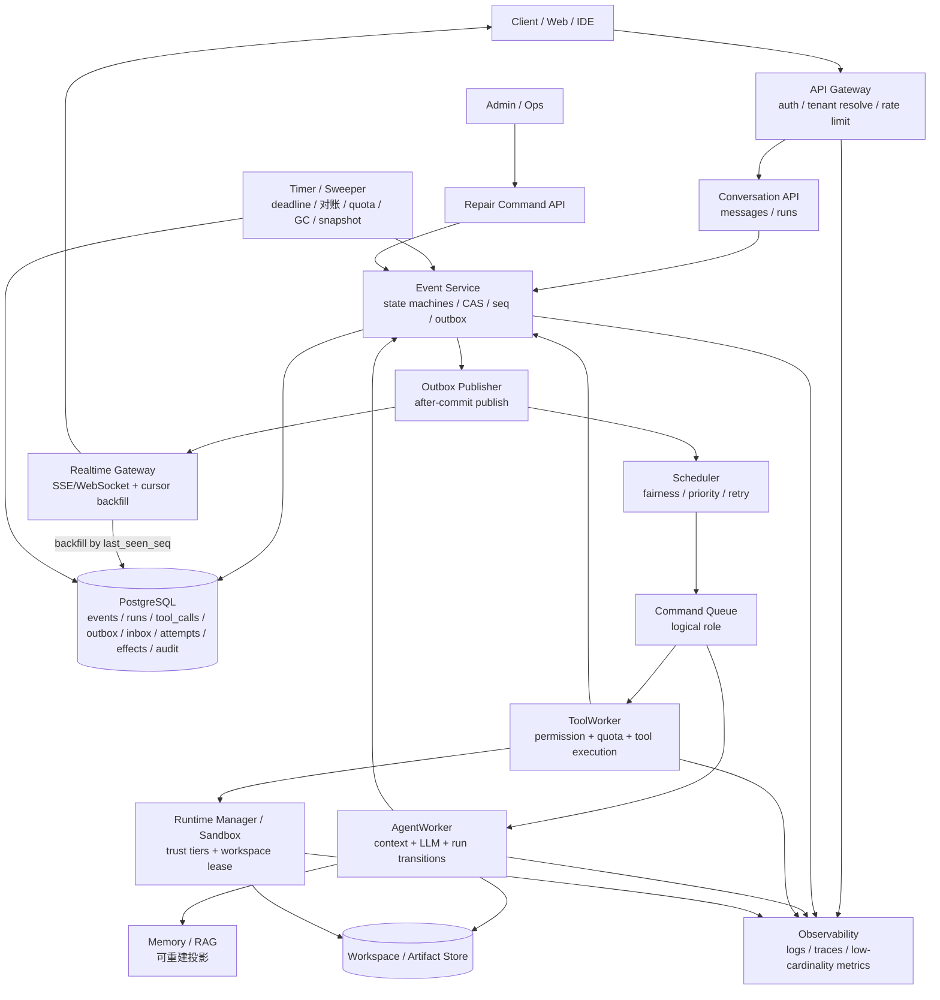

# Lites Cloud Agent 架构设计

Lites 是一个 production-first 的 Cloud Agent 平台设计。它不把 Agent 当成一次“API 调模型”的同步请求，而是把它当成一段会排队、会暂停、会调用工具、会写 workspace、会等待审批、也会失败恢复的长期任务。

本文是总入口，只讲架构方案，不绑定当前项目已经实现到哪一步。第一次阅读时，先看“核心心智模型”和“设计支柱”；真正实现时，再顺着专题文档查状态机、持久化、安全、运行时和容量细节。

## 怎么读这组文档

这组文档分四层。越靠上越应该先读，越靠下越适合在设计或实现对应模块时查。

| 层级 | 文档 | 读它是为了回答 |
| --- | --- | --- |
| 入口 | **本文**、[README.md](./README.md) | 这套架构的地图是什么，哪些文档先读，哪些是深入专题 |
| 主线 | [end-to-end-flow.md](./end-to-end-flow.md)、[state-machines.md](./state-machines.md)、[concurrency-and-durability.md](./concurrency-and-durability.md)、[execution-model.md](./execution-model.md) | 一次 Run 如何从受理、执行、等待、恢复到结束 |
| 能力专题 | [agent-safety-and-guardrails.md](./agent-safety-and-guardrails.md)、[tool-system.md](./tool-system.md)、[memory.md](./memory.md)、[llm-provider.md](./llm-provider.md)、[orchestration-patterns.md](./orchestration-patterns.md)、[realtime.md](./realtime.md) | 安全、工具、记忆、模型、多 Agent 和实时体验怎么设计 |
| 生产边界 | [runtime-and-sandbox.md](./runtime-and-sandbox.md)、[multi-tenancy-and-security.md](./multi-tenancy-and-security.md)、[operations.md](./operations.md)、[capacity-and-scaling.md](./capacity-and-scaling.md) | 代码在哪里跑、租户怎么隔离、事故怎么收敛、容量怎么验收 |

建议阅读路径：

1. **想建立全局心智模型**：本文 → [end-to-end-flow.md](./end-to-end-flow.md)。
2. **想实现执行内核**：[state-machines.md](./state-machines.md) → [concurrency-and-durability.md](./concurrency-and-durability.md) → [execution-model.md](./execution-model.md)。
3. **想评审生产风险**：[agent-safety-and-guardrails.md](./agent-safety-and-guardrails.md) → [runtime-and-sandbox.md](./runtime-and-sandbox.md) → [multi-tenancy-and-security.md](./multi-tenancy-and-security.md) → [operations.md](./operations.md)。
4. **想扩展能力**：[tool-system.md](./tool-system.md)、[memory.md](./memory.md)、[llm-provider.md](./llm-provider.md)、[orchestration-patterns.md](./orchestration-patterns.md)、[realtime.md](./realtime.md) 按需阅读。

## 先记住六件事

1. **先记账，再执行**：系统先把事实和下一步命令写进数据库，再让 Worker 去做慢操作。
2. **Worker 只是执行者，不是事实源**：Worker 可以崩溃、超时、重复收到任务，所以它只能通过 EventStore 提交结果。
3. **外部副作用不能靠猜**：工具可能已经创建资源、写文件或花钱。结果未知时要对账或人工裁定，不能直接重试。
4. **模型只提议，平台来授权**：LLM 可以建议工具调用，但工具、secret、网络、审批和 workspace 权限都由平台策略决定。
5. **正文和事实分开存**：EventStore 像收据，不像仓库；用户输入、模型输出、工具结果和审批 diff 等正文统一走加密 payload envelope。
6. **AI 行为变更要可评测、可回滚**：模型、prompt、tool descriptor、agent profile、policy 变更都要过 eval、红队样本、签核和回滚方案。

## 设计支柱

现阶段生产级 Cloud Agent 的共同方向不是“堆更多 Agent”，而是把自治能力放在可恢复、可审计、可限制的工程框架里。Lites 的架构用以下支柱表达这件事：

| 支柱 | 设计取舍 | 主要文档 |
| --- | --- | --- |
| 可恢复执行 | API 不跑长任务；每一步用 EventStore + outbox/inbox 交接；Worker 用短事务 claim 和短事务提交 | [end-to-end-flow.md](./end-to-end-flow.md)、[execution-model.md](./execution-model.md) |
| 显式状态机 | Run、ToolCall、Command 都有合法转换；终态不被普通流程改写；取消、超时、审批和 join 都是正式状态 | [state-machines.md](./state-machines.md) |
| 持久化并发控制 | `run_version` / `tool_call_version` 做 CAS；`seq` 只做补拉游标；`store_epoch` 处理数据库恢复后的旧命令 | [concurrency-and-durability.md](./concurrency-and-durability.md) |
| 工具和副作用治理 | 工具先声明 schema、权限、effect_class、secret scope 和 runtime；副作用用 effect ledger、幂等键和对账收敛 | [tool-system.md](./tool-system.md)、[execution-model.md](./execution-model.md) |
| 平台级安全边界 | 不可信上下文带来源标签；工具调用双重校验；高风险动作审批；secret broker、egress allowlist 和 sandbox 不是 prompt 的附属品 | [agent-safety-and-guardrails.md](./agent-safety-and-guardrails.md)、[runtime-and-sandbox.md](./runtime-and-sandbox.md) |
| 生产可观测与发布门禁 | trace、audit、低基数 metrics、Sweeper、Repair API、故障注入、AI release gate 和容量向量一起定义上线标准 | [operations.md](./operations.md)、[capacity-and-scaling.md](./capacity-and-scaling.md) |

## 外部基线

本文档结构参考了当前几类公开实践，但不依赖某个供应商运行时：

- [Anthropic: Building effective agents](https://www.anthropic.com/engineering/building-effective-agents)：优先使用简单、可组合模式；只有在简单方案不足时再引入多步 Agent；工具接口要像人机界面一样认真设计。
- [OpenAI Agents SDK Guardrails](https://openai.github.io/openai-agents-python/guardrails/) 与 [Tracing](https://openai.github.io/openai-agents-python/tracing/)：把输入、输出、工具调用和执行轨迹都纳入 Agent 生命周期。
- [Amazon Bedrock AgentCore](https://docs.aws.amazon.com/bedrock-agentcore/latest/devguide/what-is-bedrock-agentcore.html)：生产平台逐步收敛到 runtime、memory、gateway、identity、observability、evaluations、policy、registry 等模块化能力。
- [OWASP Top 10 for LLM Applications 2025](https://genai.owasp.org/llm-top-10/)：prompt injection、supply chain、excessive agency、improper output handling、vector/embedding weakness 和 unbounded consumption 都必须进入架构层，而不是只靠提示词。

## 问题、决策与风险

**问题**：Agent 任务不是一次普通 HTTP 请求。它会排队、调用模型、调用工具、修改 workspace、等待审批、断线重连、被取消、失败重试，还可能在外部副作用发生后崩溃。

**决策**：把系统设计成以 PostgreSQL 为持久化核心的可恢复工作流和 Agent 执行平台。EventStore 记录编排事实和决策过程；命令通过 outbox 发布；Worker 只做短事务占位和短事务提交，中间的长时间 I/O 依靠 CAS、fence 和幂等合约保护。

**为什么不简单做成 API → MQ → Worker → 回写数据库**：这条链路看起来直观，但一旦遇到重复投递、Worker 崩溃、取消竞态、并行工具完成、外部副作用未知，就没有一个统一的地方能回答“系统现在到底知道什么”。结果很容易变成重复执行、错误续跑，或者已经结束的状态又被改掉。

**忽略后果**：最常见的事故不是“任务失败”，而是“任务看似成功但状态分叉”：同一 run 被续跑两次、已经取消的 run 被工具结果唤醒、未知副作用被盲目重做、实时断线后客户端漏事件。

## 核心循环

核心思想：**每一步先写入数据库，确认“系统现在知道什么、下一步要做什么”，再让后台 Worker 去执行。** HTTP 请求不直接跑长任务；Worker 执行完也不直接改最终结果，而是继续追加事件，让状态机决定下一步。

可以把它理解成一条不断循环的流水线：

```text
用户发起请求
→ 系统把“已发生的事”写成 event
→ 系统把“接下来要做的事”写成 command
→ 后台 Worker 领取 command 并尝试执行
→ Worker 调用 LLM、工具或 sandbox
→ Worker 把执行结果再写成 event
→ 状态机根据新 event 推进 Run
→ 如果还没结束，再生成下一条 command
```

一个例子：用户要求 Agent 修改文件。完整过程不是一次 API 调用内完成，而是拆成多次“记账 + 执行”：

1. 用户提交请求后，API 只做很短的一件事：记录 `RunAccepted`，再登记一条 `StartAgentRun`。然后立即返回 `run_id`，告诉客户端“任务已受理”。
2. AgentWorker 看到 `StartAgentRun` 后开始工作：读取对话、workspace、memory 和策略，组装上下文，然后调用 LLM。
3. 如果 LLM 判断需要改文件，AgentWorker 不直接改文件，而是记录 `ToolCallRequested`，再登记 `ExecuteToolCall`，把执行工具这件事交给 ToolWorker。
4. ToolWorker 领取工具任务后，先检查权限、配额和 secret 访问，再在 sandbox 里真正执行文件修改。
5. 工具执行完，ToolWorker 把结果记录成 `ToolCallSucceeded` 或失败/未知结果。这里用 `tool_call_version` 防止同一个工具调用被重复提交。
6. 如果这一轮需要多个工具并行执行，最后完成且满足 join 条件的 ToolWorker 会尝试恢复 Run。它用 `run_version` 创建 `ResumeAgentRun`，保证同一轮只续跑一次。
7. AgentWorker 再次领取 `ResumeAgentRun` 继续思考。这个循环会一直重复，直到 Run 输出最终回复，或进入失败、取消、过期等终态。

这条链路的重点是：API、AgentWorker、ToolWorker 都只通过 EventStore 交接状态。这样即使请求重试、Worker 崩溃、消息重复投递或客户端断线，系统也能从已提交的 event 继续恢复，而不是依赖某个进程的内存状态。

## 术语表

下面这些英文名会保留在文档里，因为它们最终会成为代码、表名或事件名。阅读时可以先按中文含义理解。

| 术语 | 通俗解释 | 关键规则 |
| --- | --- | --- |
| Event | 已经发生的事实，例如 `ToolCallSucceeded` | 一旦提交，不被普通流程修改 |
| Command | 希望某个消费者去做的意图，例如 `ResumeAgentRun` | 至少一次投递，消费者必须去重 |
| Worker | 后台执行者，负责调用模型或工具 | 不保存长期状态，结果要写回 EventStore |
| Attempt | Worker 对一条 command 的一次执行尝试 | 可以失败、超时、变成无人认领的旧尝试 |
| EventStore | 保存“发生过什么、状态怎么变”的数据库部分 | 不保存 workspace 文件本体 |
| Outbox | 事务内登记“要发出去的 command”的表 | 事务提交后再发布，避免发出回滚事件 |
| Inbox | 消费者登记“这条 command 我处理过”的表 | 用来抵抗重复投递 |
| CAS | Compare-And-Set，只有版本仍是预期值才允许写入 | 防止基于旧状态提交新决策 |
| `run_version` | Run 聚合的 CAS 版本 | 只在 Run 状态转换时递增 |
| `tool_call_version` | ToolCall 聚合的 CAS 版本 | 只在 ToolCall 状态转换时递增 |
| `seq` | user 内的提交顺序号（baseline 决策：user-scoped，conversation 只是过滤维度） | 只做排序和补拉游标，不做 CAS；若单用户多会话并行追加成为瓶颈，可下沉为 conversation-scoped，代价是客户端要维护多游标 |
| fence | lease 产生的防过期写令牌 | 旧 Worker 即使醒来也不能覆盖新状态 |
| `effect_key` | 外部副作用的稳定幂等键 | 下游支持幂等时用于避免重复副作用 |
| `outcome_unknown` | 外部调用结果未知，例如超时后不知道资源是否已创建 | 禁止盲目重试，必须先对账或人工裁定 |
| Reconciliation | 对账确认外部副作用到底是否发生 | 用于把未知结果收敛到成功、失败或人工处理 |
| `store_epoch` | EventStore 恢复代次 | 数据库从备份恢复后，用它拒绝旧代次 command |

## 设计目标

- Production-first：文档中的默认形态就是生产安全基线，不再区分弱化版和最终版。
- 生产语义先行：事件顺序、重试、幂等、多租户、权限、持久化、运行时隔离和审计从一开始就定义清楚。
- 基础设施语义解耦：EventStore、durable queue/stream、pub/sub、对象存储、向量检索和 sandbox runtime 都必须满足文档里的语义契约；业务语义不依赖某个基础设施的偶然特性。
- 请求处理器不执行长任务，只提交事实和命令。
- EventStore 是编排状态与决策过程的事实源；实时通道只是通知。
- 用正式状态机和 CAS 保证“一次 run 只能沿合法路径前进”。

## 非目标

- **不承诺通用 exactly-once**：传输层按“至少一次投递”设计；对支持幂等键的外部写操作提供“多次投递但只产生一次有效副作用”的效果；无法幂等的操作必须走对账。
- **不做跨用户事务**：强一致边界止于单个 `user_id` 的 append 顺序（baseline 中 `seq` 为 user-scoped，conversation 只是过滤维度）。
- **不做跨区域 active-active**：默认采用单区域单写模型；跨区域容灾通过备份、恢复演练和 `store_epoch` 收敛。
- **不自动消解所有未知结果**：`outcome_unknown` 可能需要人工裁定；系统只保证不盲目重做。
- **不把实时通道当可靠存储**：可靠性由 EventStore + `last_seen_seq` 补拉提供。

## 逻辑架构

下图描述的是职责边界，不等于必须一比一拆成网络服务。部署可以合并进程，但不能合并安全边界、事务边界和责任边界。



## 生产部署基线

| 逻辑职责 | 生产基线 |
| --- | --- |
| Gateway、Conversation API | 独立对外服务层；负责认证、租户解析、限流、请求校验和可信上下文签发 |
| Event Service、状态机、Permission、Quota、Repair API | Control Plane 内部服务；所有状态推进、审批、修复和审计都经这个入口 |
| Command Queue / Stream | 持久化队列或流系统；支持至少一次投递、延迟投递、lease/claim、ack、retry、dead-letter、去重和 backpressure |
| Outbox Publisher | 独立 publisher fleet；只发布已提交 outbox row，并携带 `store_epoch` |
| Scheduler | 独立调度层；按租户公平、优先级、资源类别、provider/runtime 闸门做准入 |
| Realtime | SSE/WebSocket Gateway fleet + pub/sub bus；可靠性依靠 EventStore cursor backfill |
| AgentWorker | 独立 worker pool；可按模型、优先级、租户 tier 和交互/后台任务拆池 |
| ToolWorker + RuntimeManager | 独立安全域；ToolWorker 只持短期能力，RuntimeManager 负责隔离、网络和 workspace lease |
| Runtime / Sandbox | 根据信任等级使用隔离节点、microVM 或等价强边界；不可信代码默认无网络、无 secret |
| Workspace / Artifact | 版本化 workspace service + S3-compatible artifact store；所有变更记录 revision、diff hash 和 artifact refs |
| Memory / Retrieval | tenant-scoped retrieval service；向量索引是可重建投影，召回必须写入 `context_manifest` |

Outbox、Scheduler、Queue 是逻辑角色，但生产基线必须提供同等的可靠性与隔离语义。EventStore 仍通过事务内 outbox 记录“下一步要做什么”；外部队列只负责投递，不成为业务事实源。

## 负载向量

不要用一个“万级”标签概括所有规模。“1 万在线连接”和“1 万同时运行的 sandbox”是两种完全不同的系统压力，必须分别容量规划和压测。完整的负载向量定义（连接数、事件写入、活跃 run、并发模型调用、runtime session、token 吞吐、热点 tenant/user/conversation 等）以 [capacity-and-scaling.md](./capacity-and-scaling.md) 为准。

## 核心标识

- `tenant_id`：客户边界。
- `user_id`：已认证用户；事件提交顺序边界（user-scoped `seq`）。
- `conversation_id`：会话归属与事件过滤维度。
- `run_id`：一次 Agent 执行或续跑。
- `run_version`：Run 聚合的 CAS 令牌。
- `tool_call_id` / `tool_call_version`：ToolCall 聚合及其 CAS 令牌。
- `event_id` / `seq`：事件唯一标识与 user 内提交顺序。
- `command_id`：命令稳定 id，用于 inbox 去重。
- `attempt_id` / `attempt_key`：Worker 尝试与模型调用尝试（`attempt_key` 即 `llm_attempts.attempt_key`，每次模型调用尝试唯一）。
- `effect_key`：外部副作用幂等键。
- `correlation_id` / `causation_id`：因果链路。
- `request_id`：API 请求 trace id。
- `idempotency_key`：请求重放保护 key，必须带 tenant 与 operation scope。
- `reservation_id`：配额预留 id。
- `due_at`：deadline、approval timeout、retry backoff、对账复核等定时唤醒时间。
- `store_epoch`：EventStore 恢复代次。

`seq` 只代表提交顺序，不代表因果顺序，也不是并发控制令牌。因果由 `causation_id` / `parent_event_id` 表达；并发控制由 `run_version` 和 `tool_call_version` 承担。

## 会话级并发语义

Baseline 中，一个 conversation 同一时间只有一个前台 active Run。active Run 指 `accepted`、`queued`、`executing`、`waiting_tool`、`waiting_child` 或 `waiting_approval` 中尚未终态的根 Run；该 Run 发起的 child Run 不计入新的用户轮次。

用户在 active Run 存在时再次发送消息，API 必须显式选择一种模式，不能隐式注入正在执行的 Run：

| 模式 | 行为 | 适用场景 |
| --- | --- | --- |
| `enqueue`（默认） | 记录用户消息和 `RunPending` / `UserTurnQueued`，等当前根 Run 终态后再创建下一 Run | 普通聊天与连续任务 |
| `interrupt` | 对当前根 Run 发起 cancel，并在取消收敛后基于新消息创建 replacement Run | 用户明确改主意或要求停止当前任务 |
| `feedback` | 只允许当前 Run 处于 `waiting_approval` / checkpoint 时使用，把用户输入作为审批反馈恢复 Run | 阶段检查点、协作编辑、人类接管 |
| `parallel_background` | 只允许产品明确标记的后台 Run；不得写同一 workspace，且实时展示上必须区分 | 后台索引、长耗时只读分析 |

因此“新消息到达”不是 Run 状态机里的隐藏转换。它要么排队成下一轮，要么通过 Cancel API 明确中断，要么作为 approval feedback 进入已有等待点。

## 请求流程

1. Client 调用 API Gateway。
2. Gateway 完成认证、租户解析和限流，剥离客户端提交的内部身份 header，并向下游传递签名的短期可信上下文。
3. Conversation API 校验请求，调用 Event Service。
4. Event Service 在同一数据库事务中追加事件、更新对应聚合状态、分配 `seq`、写入 outbox 和 idempotency response。
5. 事务提交后，Outbox Publisher 发布 realtime 通知和 command。
6. Scheduler/Queue 按租户公平、优先级、重试时间和资源类别投递 command。
7. AgentWorker 或 ToolWorker 消费 command，通过 Event Service 写入完成、失败、取消、未知结果或后续 command。

## 应该 / 避免

| 应该 | 不应该 |
| --- | --- |
| 用 EventStore 回放状态，用 realtime 加速通知 | 把 WebSocket/SSE 当事实源 |
| 用 `run_version` / `tool_call_version` 做 CAS | 用 `seq` 或 `SELECT MAX(seq)+1` 做并发控制 |
| 对 command 做 inbox 去重 | 假设队列只投递一次 |
| 对外部副作用按能力分类 | 对 `outcome_unknown` 直接重试 |
| 通过 Repair Command API 修复 | 直接改终态 run 或直接写 DLQ |
| 按负载向量压测 | 用单个“万级”承诺替代容量模型 |
