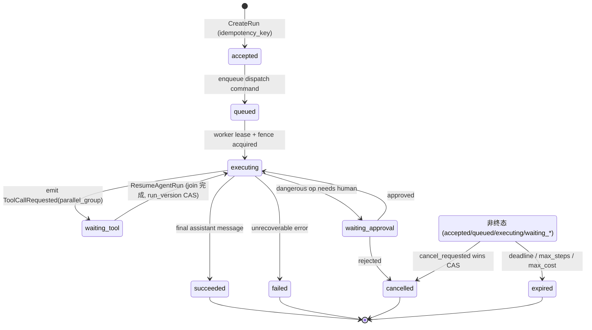
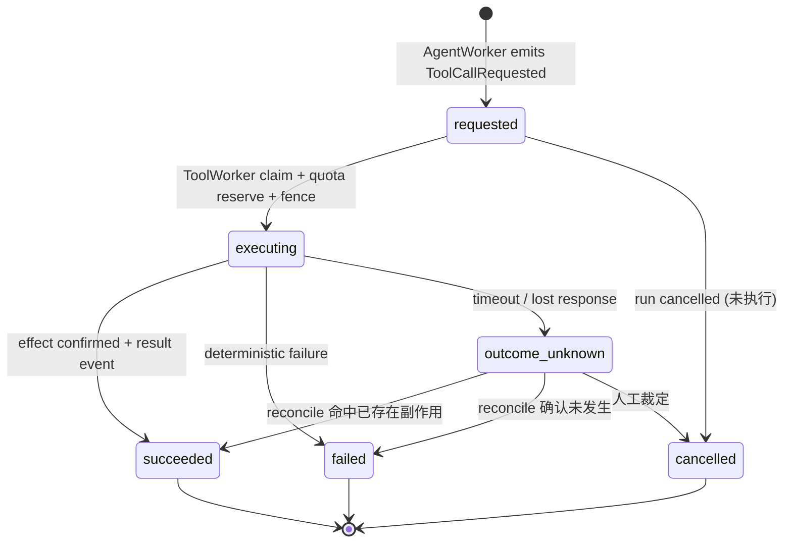
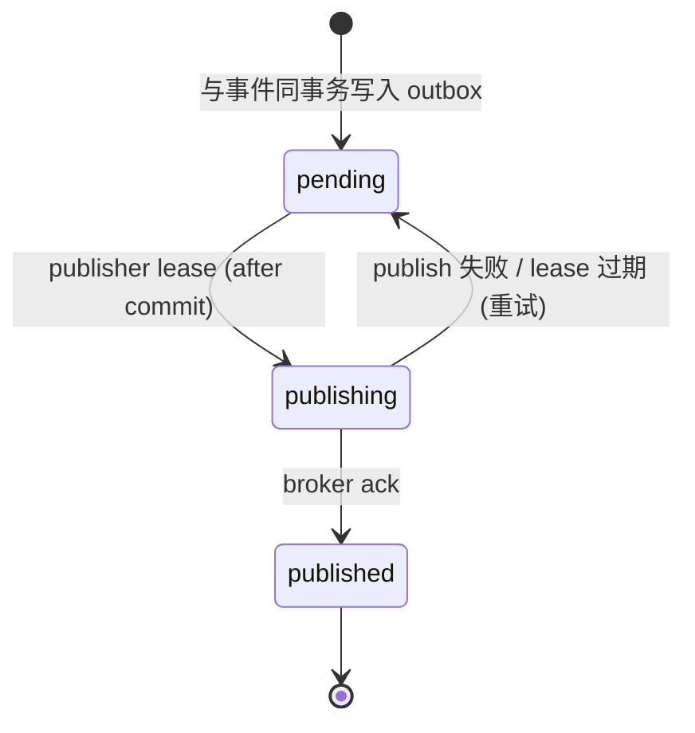
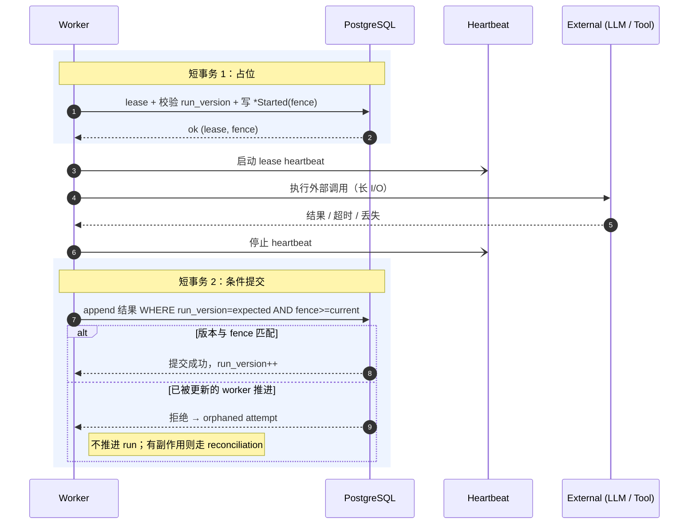
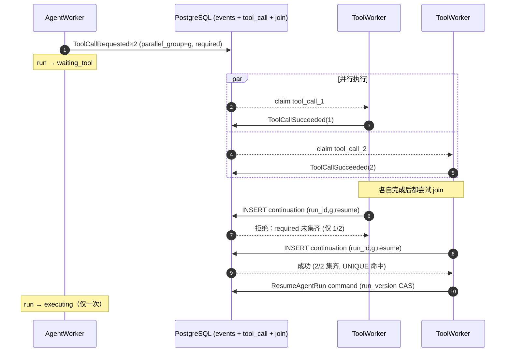
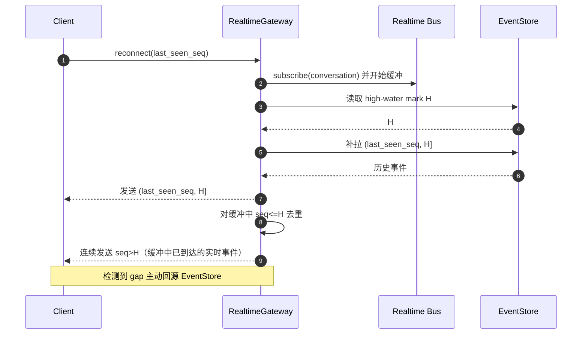

# Lites Cloud Agent 架构设计

Lites 是一个生产级 Cloud Agent 平台的 lite 版本。项目可以从简单的本地组件开始，但架构边界和核心语义需要对齐真实云端部署的要求。

本文档将 "w-level" 理解为万级规模：例如万级并发客户端、万级任务、万级会话或万级租户工作负载。具体能支撑到哪一档，需要通过容量规划、压测和故障演练验证，不能只由架构图承诺。

> 本版本在原有"生产原则清单"之上，补齐了**正确性闭环**：把 `Command → 持久发布 → Attempt → 外部副作用 → 结果事件 → Run 状态转换 → 下一个 Command` 这条链定义成可验证的状态机，并明确乐观并发、幂等、未知结果与修复路径。本质上这是一个**以 PostgreSQL 为持久化核心的简化型 durable workflow / Agent runtime 平台**，而不仅是 "API → MQ → Worker → 回写数据库"。

## 设计目标

- 保持产品足够轻量，方便作为 lite 平台构建和运维（首版优先模块化单体，而非一堆微服务）。
- 保留生产级语义：事件顺序、重试、幂等、多租户、权限、持久化、运行时隔离和审计。
- 让本地简版实现可以在未来替换为托管基础设施，而不需要重写业务逻辑。
- 避免在请求处理器里直接执行长时间运行的 Agent 任务。
- 将 EventStore 作为**编排状态与决策过程**的事实源，将实时通道作为通知通道。
- 用正式状态机 + 乐观并发，使"一次 run 只能沿合法路径前进"可被证明，而不是依赖各组件局部正确。

## 非目标（Non-goals）

明确边界与明确能力同等重要，以下在本版本**不承诺**：

- **通用 exactly-once**：传输层是 at-least-once，只对下游可幂等的操作提供 effectively-once effect，不可幂等的外部操作走 outcome reconciliation（见《broker 不是透明替换件》）。
- **跨会话事务 / 跨会话强一致**：一致性边界止于单个 `conversation_id`（append 在该边界内串行）。
- **跨区域 active-active**：Lite 与生产前期是单区域单写模型，跨区域留到阶段三且需先验证单写站稳（见《实施路线图》）。
- **自动消解一切未知**：`outcome_unknown` 与不可逆副作用最终可能仍需人工裁定，系统只保证不盲目重做，不保证全自动收敛。
- **实时通道可靠投递**：实时是优化而非事实源，可靠性由 EventStore + cursor 补拉保证。

## 更新后的架构


## 核心标识

所有核心记录都应该携带足够的身份信息，用于租户隔离、调试、回放和审计：

- `tenant_id`：客户边界。
- `user_id`：已认证的用户。
- `conversation_id`：会话边界，也是事件的**提交顺序**边界。
- `run_id`：一次 Agent 执行或续跑。
- `run_version`：run 聚合的**乐观并发令牌**（单调递增），用于条件写。
- `event_id`：稳定唯一的事件 id。
- `seq`：会话内单调递增序号，由服务端在提交时**原子分配**，不做全局递增。
- `command_id`：一条命令（意图）的稳定 id，用于消费端去重（inbox）。
- `effect_key`：一次外部副作用的稳定幂等键。
- `attempt_id` / `llm_attempt_id`：一次执行尝试 / 一次模型调用的独立 id。
- `correlation_id` / `causation_id` / `parent_event_id`：事件因果关系。
- `request_id`：一次 API 请求的 trace id。
- `idempotency_key`：客户端或服务端生成的重放保护 key（必须带 `tenant_id` 与 operation scope）。
- `reservation_id`：一次配额预留的 id，用于 settle / release 与崩溃后回收。
- `due_at`：定时唤醒时间（deadline、approval 超时、retry backoff、reconcile 复核），由 Timer / Sweeper 扫描驱动。

`seq` 是 conversation-scoped 的提交顺序游标，避免全局序列热点；它**不是**并发控制令牌——并发控制由 `run_version` 承担（见下）。`seq` 也只代表提交顺序，不等于因果顺序，因果由 `causation_id` / `parent_event_id` 表达。

## 请求流程

1. Client 调用 API Gateway。
2. Gateway 完成认证、租户解析、限流，**剥离客户端提交的所有内部身份 header**，并将签名后的短期可信上下文传给 Conversation Service。
3. Conversation Service 校验请求，并调用 Event Service。
4. Event Service 在同一个数据库事务中：写入事件、按 `run_version` 做条件更新、分配 `seq`、插入 dispatch command 与 realtime 通知到 outbox。
5. Outbox Publisher 在**事务提交之后**发布实时通知与调度命令（避免推送一个最终回滚的事件）。
6. Scheduler 负责租户公平性、优先级、重试时间和队列路由。
7. AgentWorker 或 ToolWorker 消费命令，并通过 Event Service 写入完成、失败或后续事件。

请求处理器只返回任务或 run 的标识，不等待长时间运行的 Agent 任务完成。相同 `idempotency_key` 的重复请求必须返回原 run（idempotency response store）。

## 核心状态机与不变量

正确性的核心是：每个实体只能沿合法状态路径前进，且每个版本最多产生一个有效后继。系统正式定义三个状态机：Run、ToolCall、Command。每次状态转换都是一次带 `expected_run_version`（或 `effect_key` / `command_id`）的条件写，转换失败即拒绝，不存在"绕过状态机"的写路径。

### Run 状态机

一次 Agent 执行的生命周期。`waiting_tool` / `waiting_approval` 是挂起态，由 `ResumeAgentRun` 命令唤醒；`cancelled` / `expired` 可从任一非终态进入。



**不变量**：每个 `run_version` 最多产生一个可执行 continuation；终态（`succeeded`/`failed`/`cancelled`/`expired`）不可被普通流程改写，只能由 Repair Command API 创建 replacement run。

### ToolCall 状态机

一次工具调用的生命周期。`outcome_unknown` 是关键的非终态：当外部调用超时或响应丢失、无法确认副作用是否发生时进入，必须经 reconciliation 才能落到终态，禁止直接重试。



**不变量**：同一 `effect_key` 最多产生一次有效外部副作用；`succeeded` 必须伴随 effect ledger 中 `confirmed` 记录与一条结果事件。

### Command 状态机

outbox 中一条命令（执行意图）的发布生命周期，与业务执行解耦。



**不变量**：outbox 只负责"把命令送达 broker"，不负责业务执行完成；publisher 可能在 ack 后、标记 `published` 前崩溃，因此重复投递必然存在，消费端必须经 inbox（`UNIQUE (tenant_id, consumer_name, command_id)`）去重。

要点：

- **区分事件与命令**。事件表示"已发生的事实"（`ToolCallSucceeded`），命令表示"希望某消费者执行的意图"（`ResumeAgentRun`）。不要让一个对象（旧设计的 `agent.run.requested`）既像事件又像 job。
- **取消是正交标志，不是简单终态**。`cancel_requested` 与完成通过同一个版本条件竞争：完成先提交则取消返回"run 已终态"；取消先提交则后续完成因版本/状态不匹配被拒绝；外部副作用是否已发生交由 reconciliation 处理。**取消还必须传播到正在运行的执行体**：DB 标记 `cancel_requested` 后，在飞 ToolWorker 通过 lease heartbeat 读到取消标志后协作式中止，并对 sandbox 发出 `RuntimeTerminationRequested`（正常路径也复用该命令，不只属于 Repair）。否则取消只改了状态，昂贵的 sandbox / 长工具仍在烧钱运行。
- **失控保护**。每个 run 必须有 `max_steps`、`max_cost`、`deadline` 与循环检测，防止 Agent↔Tool 自激或被注入内容诱导的无限循环。`max_steps` / `max_cost` 在 `executing` 态由 worker 当场判定；但当 run 处于 `waiting_tool` / `waiting_approval` 挂起态时没有任何 worker 在跑，`deadline` 与 approval 超时只能由 **Timer / Sweeper**（见《Timer / Sweeper 与后台巡检》）按 `due_at` 主动触发 `expired` / 超时转换。

## EventStore、乐观并发与 Outbox

在 lite 架构中，PostgreSQL 是事实源。它应存储事件、outbox（发布状态）、job attempt（执行状态）、run state、tool call、inbox、effect ledger、审计事件、快照引用和运维修复元数据。

### Append API 用 `run_version` 做乐观并发

仅靠唯一键和单调 `seq` 只能防止重复编号，**不能防止两个 worker 基于旧状态做出各自合法但相互冲突的决策**（例如都从某状态恢复后，一个决定完成 run、一个又发起 tool call）。因此条件写的并发令牌取 run 聚合版本（`run_version`），而不是 conversation seq：

```text
append(
  tenant_id,
  conversation_id,
  run_id,
  expected_run_version,   -- 乐观并发条件
  fence_token,            -- 排除过期 worker
  events[],
  commands[]
)
```

只有当前 `run_version == expected_run_version` 且 `fence_token` 不低于当前值时才允许写入，写入成功后 `run_version` 递增。

> **为什么用 `run_version` 而不是 `expected_seq`**：一个会话里允许多个 run 并存。用户发来新消息（开新 run）与某个在飞 run 的工具完成，**应当都能成功且互不冲突**；若把 conversation `seq` 当并发条件会造成假冲突。`seq` 由服务端原子分配、只作排序/游标，并发控制只在 run 聚合上做。

### `seq` 的分配

`seq` 通过锁定 conversation 元数据行、递增其 `current_seq`、并在同一事务插入事件来分配。不要用 `SELECT MAX(seq)+1`，也不要为每个 conversation 创建 PostgreSQL sequence。该行锁天然串行化同一会话内的 append，与 `run_version` CAS 配合即可。

### 关键唯一约束

```text
UNIQUE (tenant_id, conversation_id, seq)
UNIQUE (tenant_id, event_id)
UNIQUE (tenant_id, idempotency_scope, idempotency_key)
UNIQUE (tenant_id, consumer_name, command_id)        -- inbox / 命令去重
UNIQUE (tenant_id, tool_call_id, effect_key)         -- 外部副作用去重
UNIQUE (run_id, parallel_group_id, continuation_kind) -- 并行 join 唯一续跑
```

### 分离 outbox 发布状态与 job 执行状态

旧设计让 outbox 同时承载 `pending/leased/published/done/failed/dead_lettered`，在 "outbox → Scheduler → MQ → Worker" 模式下会产生双重事实源。应拆分：

- **`outbox`**：只负责把 command 发到 broker，状态 `pending → publishing → published`；字段含 `command_id`、`topic`、`partition_key`、`available_at`、`publish_attempts`、`lease_owner`、`lease_until`、`published_at`。
- **`job_attempt`**：负责执行过程，状态 `claimed → running → succeeded / failed / timed_out`。
- **`run` / `tool_call`**：负责业务状态。

事件追加、run state 更新与 outbox 写入必须在同一事务完成。publisher 仍可能"发布成功、标记 published 前崩溃"，因此重复投递必须被接受、消费端必须经 inbox 去重。

终态 run state 不应被普通流程修改，只有显式的管理员修复流程可以处理。高容量表按时间、租户或 conversation hash 分区/分片。

## 队列与调度

**首版可以不引入独立 MQ**：在同一事件事务内 `insert jobs`，worker 用 `SELECT ... FOR UPDATE SKIP LOCKED` 竞争领取。`SKIP LOCKED` 提供不一致视图、不适合通用查询，但正适合多消费者竞争队列表，省去 OutboxPublisher、独立 Scheduler 与 MQ，Redis 只做实时通知。当锁竞争、表膨胀、vacuum 压力或调度复杂度成为真实瓶颈，再引入 broker。

无论实现，必须保留生产队列语义：enqueue、lease/claim、ack、retry、timeout、dead-letter；通过 visibility/lease 超时支持崩溃恢复；默认至少一次投递、消费端幂等；queue lag / LLM 延迟 / 数据库压力 / runtime 使用率过高时反压到 API 准入。

### 租户公平是可验证算法，不是接口名

需要对**稀缺资源**公平，而非 job 数量（一次 LLM 调用约 30s，一次工具调用可能 20min，成本与冷启动各不同）：

- 每租户 active concurrency cap + token bucket。
- weighted deficit round robin 或 virtual finish time。
- job 带估算 cost class；interactive 与 background 各自保留最小容量。
- retry 不重置最初 enqueue age；provider、runtime、工具类别各设全局 semaphore。
- 单租户不能占满所有 interactive worker；高优先级也有最大份额，避免后台永久饥饿。

### broker 不是透明替换件

PostgreSQL jobs、Redis Streams、Kafka、NATS JetStream 语义不同（至少一次/去重/exactly-once 边界各异），"统一 job 接口"必须定义为严格的**语义契约**：是否至少一次、ordering key、最大消息大小、延迟执行、visibility/ack timeout、dedupe key 与去重窗口、poison message、redrive、cancellation、ack 必须发生在何种持久化之后、broker 丢失后如何从 EventStore 重建。可信的产品级承诺是：

> 传输 at-least-once；下游支持幂等键时提供 effectively-once effect；对无法幂等的外部操作提供 outcome reconciliation，不承诺通用 exactly-once。

## Worker 执行模型

Worker 是无状态的。持久状态存在于 PostgreSQL、workspace storage、artifact storage、runtime store 和 memory service 中。

**不要在长外部 I/O 期间长期持有锁**——否则用户新消息无法进入、cancel 被阻塞、一个慢 LLM 阻塞整个会话、并行工具几乎无法建模。外部调用发生在两个短事务之间，最终正确性靠提交时的条件写而非持锁时长：



若旧 worker 在 lease 过期后仍完成调用：结果记为 orphaned attempt、不允许推进 run、对有外部副作用的工具走 reconciliation。

AgentWorker 职责：加租约 → 从 snapshot 加增量 events 恢复状态 → 基于 events/memory/workspace/policy 构建上下文并产出 `context_manifest` → 经 LLM Gateway 调用并处理超时/重试/fallback/预算 → 所有消息、工具请求、失败、后续命令通过 Event Service 写入。

ToolWorker 职责：重新加载可信上下文 → 检查权限并 **reserve 配额** → 只经 Secrets Manager/Broker 获取密钥 → 在 RuntimeManager 的 sandbox session 中执行 → 经 effect ledger 写入完成/失败/artifact/后续命令。

## 副作用、幂等与 Reconciliation

**fencing 只能阻止过期写入数据库，不能撤销已经发生的外部副作用。** 假设 worker A 拿 fence 10、调用外部工具创建资源、lease 过期、worker B 拿 fence 11、A 的 DB 写入被拒——数据库安全，但外部资源可能已创建。因此工具必须按副作用性质分类处理重试：

| 工具类别 | 重试策略 |
| --- | --- |
| 纯读取 | 可安全自动重试 |
| 下游支持 idempotency key 的写操作 | 使用稳定 `effect_key` 重试 |
| 可查询结果的写操作 | 超时后先 reconcile，再决定是否重试 |
| 可补偿但不幂等 | 记录 intent、effect 和 compensation |
| 不可逆且结果未知 | 禁止盲目自动重试，进入人工确认或 reconciliation |

引入 effect ledger：

```text
tool_effects
- tenant_id / tool_call_id / effect_key
- request_hash / provider_request_id / external_resource_id
- state: prepared / executing / confirmed / failed / outcome_unknown
- result_event_id
```

**LLM 调用同样不是幂等的**（同 prompt 重试可能不同输出、流式中断重调可能重复计费、fallback 改变语义、响应丢失无法确认）。每次模型调用保存独立 `llm_attempt_id`、输入 manifest、模型配置、provider request id、结果 hash、token 与成本，而不是把多次调用折叠成一次"重试"。

**LLM 的预算与工具配额是两套机制，需对齐到同一租户成本视图**：工具走 Quota 的 `reserve → settle/release`（执行前已知成本量级）；而 token 成本只有调用后才确定，因此 LLM 走"**按估算预扣 → 实际 token 结算**"——调用前按 `max_cost` 剩余额度与本次估算做准入，调用后用真实 token 回写并 settle 到同一租户预算账上。两条路径最终结算进**同一个租户成本/预算视图**；`reserve` 在崩溃后泄漏的预留由 Timer / Sweeper 按 `reservation_id` + TTL 回收（见《Timer / Sweeper 与后台巡检》）。

## Timer / Sweeper 与后台巡检

系统的主链路是事件 / 命令驱动（反应式），但若干不变量**只能靠周期性主动扫描维持**——它们没有"下一条命令"自然触发。因此 Lite 首版就需要一个 **Timer / Sweeper** 后台进程（实现上是一张带 `due_at` 索引的到期表 + `SELECT ... FOR UPDATE SKIP LOCKED` 扫描，或复用 job 队列的延迟投递），统一驱动：

| 巡检项 | 触发条件 | 动作（均经 Event Service 条件写） |
| --- | --- | --- |
| run deadline / 挂起超时 | `waiting_tool` / `waiting_approval` 超过 `due_at` 且无 worker 在跑 | 追加 `expired`（`run_version` CAS） |
| approval 超时 | `waiting_approval` 超过审批时限 | 按策略 `expired` 或升级提醒 |
| `outcome_unknown` 复核 | tool_call 进入 `outcome_unknown` 后到 `due_at` | 调用 reconcile，落 `succeeded` / `failed`，无法判定则升级人工 |
| quota reservation 回收 | `reservation_id` 超 TTL 未 settle/release | 释放预留，防止配额泄漏 |
| lease / orphan GC | lease 过期、attempt 成为 orphaned | 标记回收、释放 run 所有权，有副作用者转 reconcile |
| retry backoff | `available_at` 到期的重试 | 重新入队 |
| snapshot 触发 | 距上一快照事件数 ≥ N 或时间 ≥ T | 触发快照写入 |

**关键纪律**：Sweeper **不绕过状态机**——它和普通 worker 一样，只能通过 Event Service 以 `expected_run_version` / `effect_key` / `command_id` 做条件写，失败即放弃本轮、下轮重试。它驱动的是"到期的合法转换"，不是特权写路径，与 Repair Command API 的人工修复路径互补：Sweeper 自动、有界、无需审批；Repair 人工、可改终态、需 dual approval。`outcome_unknown` 的自动复核也由此有了归属——在引入 Sweeper 之前，这些非终态会无人认领地堆积。

## 锁、顺序、Fencing 与并行 Join

正确性以持久状态和 fencing token 为主要安全机制，普通分布式锁只是"工作所有权提示"。

- 锁粒度为 `conversation_id` 或 `run_id`，不能是全局锁。
- 每个 lease 有 TTL 和 owner token；写事件携带最新 fence token；过期 worker 不能覆盖更新的 run state。

**并行 tool call 需要显式 join 模型**，仅"唯一 id + 完成顺序"不够：

```text
step_id / parallel_group_id / tool_call_id / ordinal
required | optional
join_policy: all | any | quorum
```

join 由**完成那一刻的 ToolWorker 自身内联判定**，不引入单独的 process manager 组件：每个 ToolWorker 写完自己的 `ToolCallSucceeded/Failed` 后，在同一逻辑里检查"该 group 的 join 条件是否已满足 且 run_version 未变 且该 group 尚未创建 continuation"，满足则**唯一地**创建一个 `ResumeAgentRun` 命令。多个 ToolWorker 几乎同时完成时各自都会尝试创建，靠 `UNIQUE (run_id, parallel_group_id, continuation_kind)` 保证只有一个胜出（去中心化竞争，而非中心化裁决）。

join 条件按 `join_policy` 判定：`all` 需全部 required 终态；`quorum` 需达到法定数；`any` 命中首个即可。**`any` / `quorum` 提前满足后，group 内仍在飞的工具必须显式处理**，不能放任：在创建续跑的同一逻辑里对剩余 `tool_call` 发出取消（`RuntimeTerminationRequested` + 标记 `cancelled`），其迟到结果记为 orphaned，并被 `UNIQUE` 续跑约束挡在二次唤醒之外；`optional` 工具不计入 join 门槛，但其结果若在续跑前到达仍应被记录。

下图展示 N=2 的 fan-out/join：两个 ToolWorker 几乎同时完成、都尝试创建续跑，唯一约束保证只有一个胜出，run 只被唤醒一次。



## 实时投递

实时通道是优化，不是事实源（Redis Pub/Sub 为 at-most-once，断线即丢；SSE 原生支持 `Last-Event-ID` 重连）。

- 实时通知与调度命令在**同一事务**写入 outbox，由 publisher 在**提交之后**发送。
- 客户端记录 `last_seen_seq`，断线重连后从 EventStore 补拉。

**无竞态重连协议**（消除"补拉与订阅之间的空窗"）：先订阅并缓冲、再读 high-water mark、用 `H` 切分历史补拉与实时流，避免边补拉边丢新事件。



还需定义：单连接最大发送缓冲、slow consumer 淘汰、heartbeat、auth 到期与权限撤销、多标签页、重复到达、连接级与租户级连接配额。

**不要把每个 LLM token 都写入 EventStore**：`assistant.delta` 走实时临时流，可选粗粒度持久 checkpoint，最终只持久化一个 `AssistantMessageFinalized`，避免一次回答产生数百上千次 DB 写入和 seq 竞争。

## 事实源边界、Context Manifest 与 Snapshot

EventStore 无法单独重建完整世界（上下文还依赖 workspace 文件、git 状态、memory 索引、artifact、prompt/policy 版本、模型配置、tool schema、runtime session）。精确定义：

> EventStore 是 **Agent 编排状态、决策过程和引用关系**的事实源；workspace 和 artifact 是**内容**事实源；memory 向量索引是**可重建投影**；runtime session 不保存业务事实。

memory 作为"可重建投影"有一个前提：**agent 写记忆这件事本身必须流经事件**（如 `MemoryUpserted` / `MemoryDeleted` 事件或其派生），向量索引只是对这些事件的物化。否则索引一旦丢失就无法从事实源重建，"可重建"便不成立；而检索回来的文本仍按不可信输入处理（见《安全与权限》）。

每次 LLM 调用记录不可变 `context_manifest`（`conversation_through_seq`、`snapshot_id`、`workspace_revision/commit_hash`、`memory_document_ids+versions`、`retrieval_chunk_ids`、`prompt_template_version`、`policy_version`、`tool_schema_versions`、`model_id+parameters`），用于事后解释"为什么当时调用了这个工具"。

**Replay 语义**：replay 用于重建状态；不重新调用 LLM、不重新执行工具；使用已记录的外部结果事件；新 worker 只从当前状态继续下一步。

**Snapshot 是优化不是事实**，包含 `through_seq`、`projection_version`、`event_schema_version`、`context_builder_version`、`payload/payload_ref`、`checksum`。checksum 不匹配 / projection 不兼容 / upcaster 不支持 / `through_seq` 越界 / workspace revision 不存在时自动丢弃并从事件重建。Lite 阶段小快照放 PostgreSQL、大快照放对象存储，PG 只存引用、hash 与 `through_seq`（与图中独立 Snapshot Store 统一）。

**快照的写入有明确归属与触发策略**，不是"碰巧存在"：由 AgentWorker 在 run 终态时、以及 Timer / Sweeper 按"距上一快照事件数 ≥ N 或时间 ≥ T"周期性触发写入（条件写、带 `through_seq`、幂等）。没有写者 / 没有触发策略，"replay 不随会话长度线性恶化"这条万级承诺就会悬空。

### Run 内上下文预算与压缩

事件历史是事实源，但**不等于喂给模型的 prompt**：一个会做几十步、读大文件、多轮工具的 run，其累计事件 + 工具输出会很快超过模型上下文窗口。`max_steps` / `max_cost` 只防失控循环，不解决"单次调用装不下"。因此 Context Builder 必须在预算内做**选择与压缩**，而非朴素拼接全量历史：

- 预算分层：system/policy（固定）→ 近期对话与工具结果（保留原文）→ 较早历史（滚动摘要 / 分层压缩）→ 按相关度从 memory/RAG 召回。
- 压缩产物本身是可重建投影：摘要 checkpoint 以事件或带版本的派生记录落库，replay 时可由原始事件 + `context_builder_version` 重新生成，不污染事实源。
- 选择与压缩的决策必须进入 `context_manifest`：记录 `compaction_strategy_version`、被摘要替代的 `seq` 区间、保留原文的 `seq` 集合、召回的 chunk id，才能事后解释"模型当时究竟看到了什么"。

## Runtime 与 Sandbox

RuntimeManager 是代码执行和 workspace 修改的控制平面，runtime session 可丢弃、workspace revision 才是持久状态。

按**信任等级**选择隔离（不能因为"跑在 K8s 里"就认为已有强隔离，seccomp/AppArmor 等需显式配置）：

| 信任等级 | 典型负载 | 隔离要求 |
| --- | --- | --- |
| Trusted | 平台自有工具 | 容器 + 普通 namespace |
| Semi-trusted | 租户配置脚本 | rootless、严格 syscall、网络/文件限制 |
| Untrusted | 用户任意代码 | 更强边界、独立节点或 microVM |
| Privileged | 需敏感网络/密钥 | 专用 pool、审批、强化审计 |

无论哪种 runtime 至少明确：禁止 privileged、drop capabilities、seccomp/AppArmor/SELinux、只读根文件系统、PID/CPU/内存/磁盘/inode 限制、默认拒绝出口、阻止访问云 metadata endpoint、DNS/目标域名策略、workspace mount 权限、artifact 大小/类型、session TTL、kill deadline、审计命令/镜像/网络目的地/文件变更。

**Workspace 并发**采用单写者语义：每个 workspace 同时最多一个可写 lease，并行读允许，并行写用 copy-on-write branch 后显式 merge。每次工具执行产出 `base_workspace_revision`、`result_workspace_revision`、`file_change_manifest`、`git_diff_hash`、`artifact_refs`。

## 多租户

租户隔离是核心设计属性，**不能只依赖代码里的 `WHERE tenant_id = ?`**，采用三层保护：

1. 应用层查询显式限定 tenant。
2. PostgreSQL Row-Level Security 作为第二道防线。
3. 应用连接角色不是表 owner、不持有 `BYPASSRLS`；必要时用 `FORCE ROW LEVEL SECURITY` 让 owner 也受限。

此外：Gateway 删除客户端提交的内部身份 header，向下游传签名短期可信上下文；每个 append 再校验 `tenant_id` 与 aggregate ownership；artifact/workspace/memory retrieval 同样执行 ACL；idempotency key 以 tenant + operation scope 隔离；跨租户管理操作使用完全独立的 admin role。

租户级限制覆盖请求速率、队列深度、runtime session、token budget、存储与 artifact 大小。

### 数据保留与删除

事件溯源系统天然与"删除"冲突：事件不可变，但租户注销、GDPR / 被遗忘权、保留期到期都要求数据可消除。需提前定义，否则生产期必然撞上：

- **保留策略**：事件、审计、artifact、日志各有独立 `retention` 与冷归档路径；`D_retention` 容量模型应反映归档而非无限增长。
- **删除手段**：对必须物理移除的 PII 采用 **crypto-shredding**——敏感载荷以每租户 / 每主体密钥加密存储，删除密钥即让密文不可还原，既满足删除诉求又保住事件序列与因果结构不破。
- **删除也是事件**：删除经 Repair Command API 触发（`SubjectErasureRequested`），留下"已删除"的审计事实，而不是直接 `DELETE` 绕过状态机与审计。
- **投影同步失效**：memory / 快照 / 检索索引作为可重建投影，在源数据删除后必须随之失效并重建。

## 安全与权限

- 默认拒绝。tenant/user 上下文来自认证结果，不信任客户端直接传入的 id。
- 在 API 边界检查权限，在 worker 执行敏感操作前再次检查；tool 权限限定在当前 tenant、workspace 和 run。
- **检索内容与 LLM 输出都是不可信输入**：Permission Service 不能因检索文本或 LLM "声称用户已授权"就放行工具操作，工具权限只来自独立的可信 policy context；危险操作走 human-in-the-loop（`waiting_approval`）。
- secrets 存放在应用配置之外、需要时临时获取；对运行不可信代码的 sandbox 优先用 **broker 代发请求**而非把原始凭证注入 sandbox；不记录 token/credential/原始 secret/敏感 payload。
- 对权限变更、管理员操作、runtime 执行、租户配置、取消、重试和修复记录审计事件。

### Admin 必须经 Repair Command API，不直接写 EventDB

Admin 直连数据库写会绕过状态机、fencing、tenant policy、审计、idempotency 与终态约束。修复路径应为：`Admin UI → Repair Command API（权限 + dual approval）→ EventService → 追加管理事件 + outbox`。例如不要直接 `run.status='running'`，而应追加 `RunRecoveryRequested` / `ReplacementRunCreated` / `DlqCommandRedriveRequested` / `RuntimeTerminationRequested`。终态 run 永不被直接覆盖，修复创建新的 attempt 或 replacement run 并引用旧 run。只读检查可走只读副本或受限查询 API。

## 可观测性与运维

调试异步链路需要足够可见性，但**不要把高基数 ID 放进 metrics label**（`conversation_id`/`run_id`/`user_id` 适合日志字段、trace attribute、audit、exemplar，不适合指标标签）。

指标只用低基数维度：`service`、`region`、`queue_class`、`job_type`、`provider`、`model_family`、`tool_category`、`status`、`error_code`、`tenant_tier`。覆盖：API 延迟/错误率/限流；事件追加延迟与写入量；outbox lag 与发布失败；队列深度/任务年龄/attempts/retries/DLQ；worker 成功率/失败率/lease timeout/job duration；LLM 延迟/超时/token/fallback/provider 错误；runtime cold start/活跃 session/资源/清理失败；Timer/Sweeper 到期积压与处理延迟（outcome_unknown 待复核数、超时未触发的挂起 run、未回收的 reservation）。

定义端到端 **SLO**：API accept latency、queue wait、time to first token、run completion latency、interactive run success rate、realtime gap recovery time、runtime cold-start latency、tool outcome-unknown rate、tenant throttle accuracy。日志与 trace 携带 `tenant_id`、`user_id`、`conversation_id`、`run_id`、job id 与 `request_id`。

Admin/Ops Plane 应支持（经 Repair Command API）：查看 conversation events 与 run state、取消 run、重试失败 job、修复后 redrive DLQ、调整租户配额、查看并清理卡住的 runtime session。

## 故障测试与不变量

故障测试应围绕**不变量**，而非只做压力测试：

| 故障点 | 期望行为 |
| --- | --- |
| DB commit 成功但 API 响应丢失 | 相同 idempotency key 返回原 run |
| broker publish 成功、publisher 标记前崩溃 | 重复 command 被 inbox 去重 |
| 工具副作用成功、worker 完成事件前崩溃 | reconcile 或下游幂等，不盲目重做 |
| lease 过期、旧 worker 恢复 | fence 不匹配，不能推进 run |
| Redis 通知丢失 | 客户端按 cursor 补拉 |
| cancel 与 completed 同时提交 | 只有一个合法 CAS 转换成功 |
| DLQ redrive 时外部效果未知 | 禁止直接重试，先查 effect ledger |
| 部署新事件 schema | 新旧 worker 均可安全读取（upcasting） |
| snapshot 损坏 | 从事件自动重建 |
| DB 恢复到旧时间点 | broker 中更晚的 command 不得反向污染事实源 |

最后一行的缓解机制需具体化：为 EventStore 维护单调的 **`store_epoch`（generation）**，PITR 恢复后递增 epoch；命令在 outbox 中携带其 `store_epoch`，消费端拒绝 epoch 低于当前 store 的命令（视同 stale）。这样"恢复点之后、却来自旧 epoch 的在途命令"被 fence 掉，而不会反向写入已回滚的事实源。

## Lite 首版部署形态

架构边界不等于网络服务边界。首版控制在四类应用进程，避免变成"小规模微服务大杂烩"：

1. **Control Plane（模块化单体）**：Gateway、Conversation API、Event append、run 状态机、Permission、Quota reservation、Scheduler、Timer / Sweeper、Repair API。
2. **Realtime Gateway**：SSE/WebSocket、鉴权、缓冲与 cursor 补拉（极早期可与 Control Plane 同进程）。
3. **Agent Worker Pool**：Agent step、Context Builder、LLM Gateway。
4. **Tool / Runtime Plane**：ToolWorker 与 RuntimeManager 独立进程/独立安全域（更高权限与代码执行能力）。

基础设施保持 PostgreSQL + Redis Pub/Sub + S3/MinIO + Secrets provider + OpenTelemetry collector；首版不引入 Kafka/NATS，PostgreSQL job queue 足以暴露全部关键语义并保证 event/projection/command 的事务一致性。

## Lite 到生产的替换路径

| 关注点 | Lite 实现 | 生产替换 |
| --- | --- | --- |
| EventStore | PostgreSQL | 分区 PostgreSQL 或分片事件存储 |
| Outbox（发布） | PostgreSQL 表 | PostgreSQL outbox + 独立 publisher fleet |
| Queue | PostgreSQL jobs（SKIP LOCKED） | Redis Stream → Kafka 或 NATS JetStream（按语义契约） |
| Scheduler | 进程内 dispatcher | 独立 scheduler service |
| Timer / Sweeper | 进程内周期扫描（PG `due_at` + SKIP LOCKED） | 独立 timer / reconcile service 或 durable timer |
| Realtime | Redis PubSub + SSE/WebSocket | NATS 或托管 pub/sub + gateway fleet |
| Runtime | Docker 本地池 | K8s、microVM（Firecracker）或 E2B，按信任等级 |
| Workspace | 本地或挂载 volume（单写者） | 隔离持久卷或对象存储型 workspace |
| Artifact Store | 本地磁盘或 MinIO | S3-compatible object store |
| Memory | PostgreSQL 表（可重建投影） | 向量数据库或托管 RAG 服务 |
| Secrets | 本地加密文件或 env-backed provider | 云 secrets manager / broker |
| Observability | 结构化日志 | OpenTelemetry、低基数指标、链路追踪、告警 |

## 万级负载向量

架构图本身无法证明万级，必须先确定工作负载模型。至少区分：

| 变量 | 含义 |
| --- | --- |
| `C_conn` | 同时存在的 SSE/WebSocket 连接 |
| `R_api` | API 请求数/秒 |
| `R_event` | 持久事件写入数/秒 |
| `N_run` | 活跃 Agent run |
| `N_llm` | 并发模型调用 |
| `N_runtime` | 活跃 sandbox |
| `T_token` | 每秒生成/处理的 token |
| `B_artifact` | artifact 读写带宽 |
| `D_retention` | 每日事件/日志/artifact 增量 |
| `S_hot` | 单一热点 tenant/conversation 的负载 |

"1 万在线 WebSocket"与"1 万同时运行的 sandbox"几乎是两个不同产品。整体吞吐上限近似：

```text
min(
  DB 可承受事件写入 / 每 run 事件数,
  Scheduler dispatch rate,
  Worker slots / 平均执行时间,
  LLM provider quota,
  Runtime slots / 平均 session 时间,
  Artifact bandwidth
)
```

事件 append 的单写主吞吐是头号扩展瓶颈，分区主要缓解存储与查询，需在 append 路径预留未来分片/换 broker 的接口。

两个常被低估的次级瓶颈需在容量模型里显式计入：其一，`seq` 分配靠锁定 conversation 元数据行，**同一会话内的 append 因此天然全串行**——这是正确性所需，但也意味着 `S_hot`（单一热点会话）的写吞吐被这把行锁钉死，加并行度救不了单会话热点，只能靠减少每步事件数（如 `assistant.delta` 不落库）缓解。其二，万级并发 run 的 **lease heartbeat 写入会叠加到 append 写路径**（heartbeat 频率 × 活跃 run 数），可能与 `R_event` 争抢同一瓶颈；必要时把 lease / heartbeat 移到 Redis，或将其计入 DB 写预算。

## 万级就绪检查清单

在宣称达到万级能力之前，需要用压测和故障测试验证：

- 在预期租户组合与明确负载向量下，事件追加吞吐和 p95 延迟达标。
- worker 或队列故障期间，outbox lag 保持有界。
- 队列重试和 DLQ 在重复投递下行为正确（inbox 去重生效）。
- 租户公平性按稀缺资源（而非 job 数）防止单个租户耗尽 worker 容量。
- conversation replay 使用带 checksum 的 snapshot，不随会话长度线性恶化。
- LLM 超时、provider 故障和 fallback 行为有明确边界，且每次调用可追踪成本。
- runtime cold start 和活跃 session 数满足交互式延迟目标。
- sandbox 隔离按信任等级防止跨租户文件、网络和 secret 泄漏。
- realtime reconnect 通过无竞态协议基于 `last_seen_seq` 补回缺失事件。
- Admin repair 经 Repair Command API 重试/取消/dead-letter，且不破坏不变量。
- 核心表的备份、恢复演练、schema migration 与事件 upcasting 可以正常工作。
- Timer / Sweeper 在挂起 run 超时、outcome_unknown 复核、quota 回收上有界生效，无堆积。
- 数据保留/删除（crypto-shredding 与投影失效）在租户注销与被遗忘权场景下可验证。

## 实施路线图

本节定义上述设计的落地顺序，分三个阶段，每个阶段都交付一个语义自洽、可独立验证的系统。

### 阶段一：正确性闭环（首版即必须具备）

这一阶段全部是 schema + 纪律，几乎不引入额外基础设施，但乐观并发与状态机无法事后补，因此在写第一行业务逻辑之前就定义到位。

- Run、ToolCall、Command 三个正式状态机及其不变量。
- append API 以 `expected_run_version` + 原子 fence 校验做乐观并发，`seq` 由服务端分配。
- outbox 发布状态与 job 执行状态分离。
- inbox、idempotency response store 与 tool effect ledger 落表（去重与 reconciliation 可先定 schema、按需逐步实现）。
- 实时发布 after-commit 与无竞态重连协议。
- Admin 写路径全部经 Repair Command API，移除对 EventDB/DLQ 的直接写。
- cancel、deadline、`max_steps`/`max_cost`、outcome-unknown 与 reconciliation 的判定路径。
- **Timer / Sweeper 后台巡检**：deadline / 挂起超时、outcome_unknown 复核、quota 回收、lease/orphan GC、snapshot 触发——这是上述转换能否闭环的执行体，不能留到后期。
- 取消向在飞执行体 / sandbox 的传播（协作式中止 + `RuntimeTerminationRequested`）。
- 并行 join 的归属与 `any`/`quorum` 残余工具处理（去中心化竞争 + 唯一续跑约束）。
- Run 内上下文预算与压缩策略（决策进入 `context_manifest`）。

### 阶段二：生产加固

在正确性闭环稳定后，补齐多租户、配额、隔离与可观测的生产强度。

- 事件 schema version、causation/correlation 与 context manifest。
- quota reservation 与按稀缺资源公平的调度算法。
- workspace revision 与单写者/copy-on-write 语义。
- PostgreSQL RLS、独立 DB role 与管理权限分离。
- 端到端 SLO、低基数 metrics 与完整故障注入矩阵。
- 数据保留与删除（crypto-shredding、`SubjectErasureRequested`、投影失效重建）。

### 阶段三：规模化演进

仅在真实瓶颈出现、且前两阶段的语义契约已固化后才推进，避免过早引入分布式复杂度。

- 按真实瓶颈引入独立 Scheduler 或 durable broker（先固定语义契约，再替换实现）。
- 按租户信任等级升级到 microVM / 隔离节点。
- 在确认单区域单写模型站稳后，再讨论跨区域 active-active。

> 阶段一是整套架构成立的前提：当 `Command → 持久发布 → Attempt → 外部副作用 → 结果事件 → Run 状态转换 → 下一个 Command` 这条链上的状态、版本、幂等、未知结果与修复路径被精确定义，PostgreSQL + Redis + Docker 的 Lite 实现就足够可靠；反之即使换成昂贵的托管基础设施，仍会出现重复执行、错误续跑、越权修复和不可解释的状态分叉。
