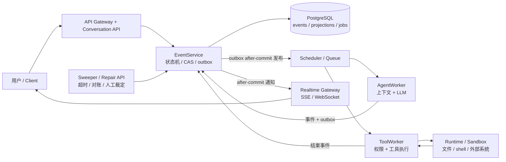
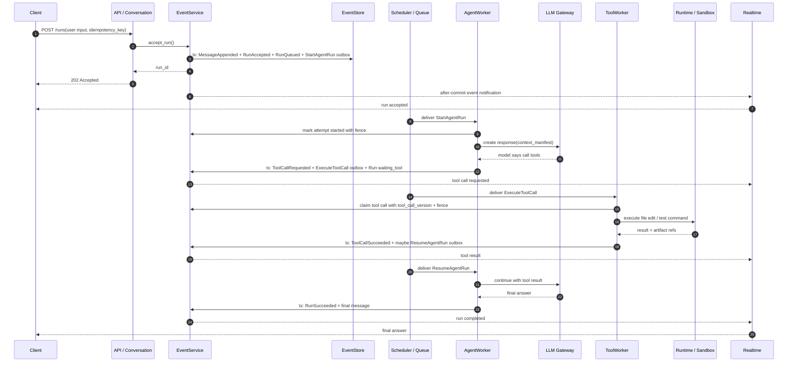
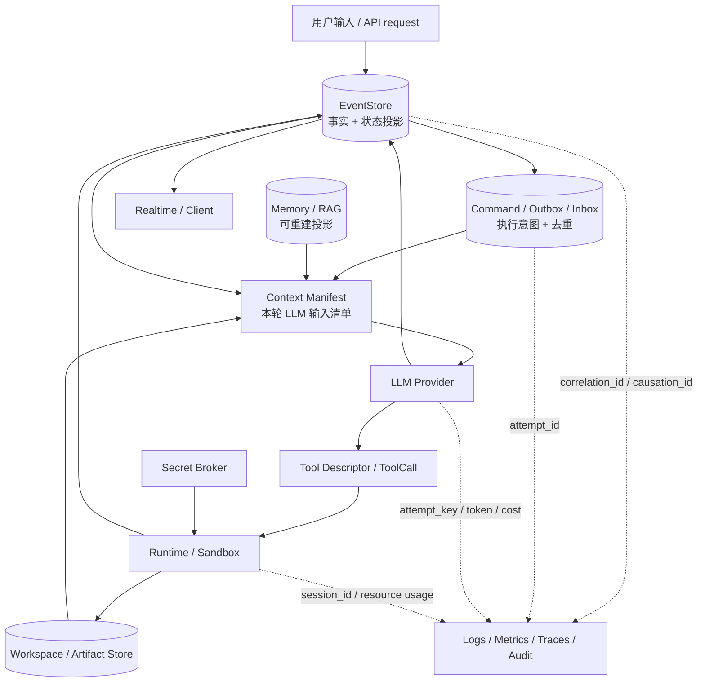
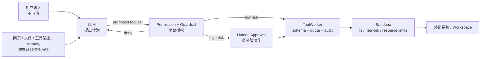

# 端到端架构与任务执行流程

> 本文档是 [architecture.md](./architecture.md) 的补充入口，用一条完整任务解释组件职责、数据流、执行步骤和典型失败路径。详细状态转换见 [state-machines.md](./state-machines.md)，持久化合约见 [concurrency-and-durability.md](./concurrency-and-durability.md)，Worker 细节见 [execution-model.md](./execution-model.md)。

## 为什么需要端到端视角

Cloud Agent 任务通常不是一次同步调用。一个“帮我修复这个 Bug”的请求，可能包含：

- 读历史对话和 memory。
- 调用 LLM 生成计划。
- 读取仓库文件。
- 修改 workspace。
- 运行测试。
- 等待用户审批危险操作。
- 推送实时 token 和状态。
- 在 Worker 崩溃、用户取消或工具超时后恢复。

如果只看单个组件，很容易把系统误解成“API 收请求，Worker 跑完后写结果”。这个模型无法解释重复投递、取消竞态、外部副作用未知、实时断线补拉和人工修复。端到端设计的关键是：所有组件都通过 EventStore 交接事实和下一步命令。

## 一句话架构

Lites Cloud Agent 是一个以 EventStore 为事实源的异步 Agent 执行平台。API 负责受理，EventService 负责状态推进，Worker 负责执行一步，Runtime 负责隔离副作用，Realtime 负责通知，Sweeper 和 Repair API 负责异常收敛。

这张图里的箭头不是网络拓扑，而是职责方向。Lite v1 可以把 API、EventService、Scheduler 和 Sweeper 放在一个 Control Plane 进程里，只要代码边界和写入规则清楚。

## 组件职责

| 组件 | 主要职责 | 不负责什么 |
| --- | --- | --- |
| Client / Web / IDE | 提交用户输入、展示 run 状态、按 `last_seen_seq` 补拉事件 | 不保存事实源，不自行判断 run 是否完成 |
| API Gateway | 认证、租户解析、限流、剥离不可信 header、传递可信上下文 | 不执行 Agent 长任务 |
| Conversation API | 校验请求、创建 message/run、返回 `run_id` | 不直接调用 LLM 或工具 |
| EventService | 追加事件、执行状态机、CAS 检查、写 outbox、分配 `seq` | 不持有长 I/O，不调用外部系统 |
| PostgreSQL EventStore | 保存 events、当前状态投影、outbox、inbox、attempt、effect ledger、audit | 不保存大型 workspace 文件本体 |
| Outbox Publisher | 事务提交后发布 realtime 通知和 command | 不改变业务状态 |
| Scheduler / Queue | 租户公平、优先级、重试、延迟投递、反压 | 不判断业务状态是否合法 |
| AgentWorker | 构建上下文、调用 LLM、解析下一步、请求工具或完成 run | 不绕过 EventService 改状态，不直接执行危险副作用 |
| LLM Gateway | Provider 适配、模型路由、限流、fallback、成本记录 | 不决定业务权限 |
| ToolWorker | 校验工具 schema、权限、配额和 guardrail，执行工具 attempt | 不长期保存工具结果，不跳过 effect ledger |
| Runtime Manager / Sandbox | 隔离文件、shell、网络和资源；管理 workspace lease | 不接收未授权 secret，不跨租户共享状态 |
| Memory / RAG | 保存和召回可重建上下文投影 | 不覆盖 EventStore 事实 |
| Realtime Gateway | 推送事件、token delta、状态变化，支持断线补拉 | 不提供可靠存储，不替代 API 查询 |
| Timer / Sweeper | 处理 deadline、approval timeout、unknown 对账、quota 回收、旧 attempt 清理 | 不直接 update 业务表 |
| Repair Command API | 受控人工修复、终态裁定、DLQ redrive | 不允许运维绕过审计改库 |
| Observability | 日志、指标、trace、审计和告警 | 不把高基数 id 放进 metrics label |

## 任务执行序列

下面是一个“用户要求 Agent 修改文件并运行测试”的典型路径。

这个序列里最重要的不是“谁调用谁”，而是每个长时间动作前后都有持久化边界：

- API 只负责受理，提交事件后就能返回。
- Worker 领取 command 后只拥有一个有期限的 attempt 和 fence。
- LLM 调用、工具执行、runtime session 都可能失败或超时，但结果必须回到 EventService。
- 后续 command 由状态机产生，不由 Worker 私自续跑。

## 数据流

Cloud Agent 里有多种数据，不应该混在同一条链路里。

| 数据类型 | 放在哪里 | 关键规则 |
| --- | --- | --- |
| 事件事实 | EventStore | append-only；普通业务流程不改历史事件 |
| 当前状态 | runs/tool_calls/commands 投影 | 可重建；更新必须由 EventService 事务驱动 |
| 命令 | outbox/job/inbox | 至少一次投递；消费者必须去重 |
| LLM 上下文 | `context_manifest` | 记录哪些 message、memory、artifact、tool schema 进入了上下文 |
| Workspace 文件 | Workspace / Artifact Store | 文件本体不放事件表；事件只存引用、hash 和摘要 |
| Secret | Secret Broker / secrets provider | 尽量不进入 sandbox；必须有租户、工具和用途约束 |
| 工具结果 | ToolCall event + artifact refs | 外部副作用按能力分类；未知结果不能盲目重试 |
| 实时 token | Realtime 通道 + 可选 `run_message_chunks` 短期流日志 | token delta 不作为 EventStore 事实；状态事件靠 EventStore 补拉，token 流靠 run-scoped cursor 补拉 |
| 观测数据 | logs / metrics / traces / audit | metrics 低基数；trace 和 audit 保留 run/attempt 关联 |

## 成功路径

一个成功 run 大致经过这些阶段：

1. **受理**：API 鉴权、限流、校验 idempotency key；EventService 记录 `RunAccepted` 和 `StartAgentRun`。
2. **排队**：Scheduler 按租户、优先级和资源类别投递 command。
3. **思考**：AgentWorker 构建 `context_manifest`，通过 LLM Gateway 调模型。
4. **行动**：模型提出工具调用；平台做 schema、权限、预算、guardrail 和审批检查。
5. **执行**：ToolWorker 在 Runtime/Sandbox 中执行工具，写 artifact 或 workspace。
6. **汇合**：工具结果回到 EventService；并行工具满足 join policy 后只生成一次 `ResumeAgentRun`。
7. **完成**：AgentWorker 继续思考，写最终回复和 `RunSucceeded`。
8. **通知**：Realtime Gateway 推送事件；客户端按 `seq` 展示状态，断线则补拉。

## 失败路径

失败路径不是异常补丁，而是架构的一部分。下面这些场景在 v1 就要定义清楚。

| 场景 | 系统行为 | 依赖的机制 |
| --- | --- | --- |
| API 提交成功但响应丢失 | 客户端用相同 idempotency key 重试，得到同一个 `run_id` | idempotency response |
| Outbox 发布后进程崩溃 | command 可能重复投递，但 inbox 去重 | outbox/inbox |
| AgentWorker 调 LLM 超时 | attempt 失败或重试；不会直接改 run 终态 | attempt + fence + retry policy |
| Worker lease 过期后又醒来 | 旧 Worker 的 fence 不匹配，不能提交新状态 | lease fence |
| 工具已产生外部副作用但写库前崩溃 | 进入对账或用 `effect_key` 查询下游；不能盲目重试 | effect ledger + reconciliation |
| 用户取消 run 时工具刚完成 | ToolCall 事实可以记录，但 run 不再恢复执行 | Run CAS + cancel state |
| 并行两个 ToolWorker 同时完成 | 两个工具结果都保留，只有一个成功写入 `ResumeAgentRun` | join row lock + run_version |
| Realtime 消息丢失 | 客户端重连时用 `last_seen_seq` 补拉 | EventStore cursor |
| Guardrail 服务超时 | 默认拒绝、降级只读或等待审批 | fail closed policy |
| 数据库按时间点恢复后旧 command 仍在外部队列 | 旧 `store_epoch` command 被拒绝 | store_epoch |
| 运维需要修复终态 | 走 Repair Command API，留下审计事件 | repair command + approval |

## 安全边界

Cloud Agent 的安全边界要放在平台层，而不是 prompt 里。

基本规则：

- 模型可以建议工具调用，但不能自己授予权限。
- 工具调用必须有 descriptor、schema、权限、预算、secret 需求和副作用能力声明。
- 不可信上下文必须带来源和信任标签，不能和系统指令混在一起。
- Secret 尽量由 broker 代发，避免直接进入 sandbox。
- 安全检查不可用时保守失败，不默认放行。
- 高风险动作需要审批材料：要做什么、影响什么、为什么需要、如何回滚。

## 部署视角

Lite v1 的四类进程划分（Control Plane、Realtime Gateway、Agent Worker Pool、Tool / Runtime Plane）、基础设施起步组合和替换路径以 [capacity-and-scaling.md](./capacity-and-scaling.md) 为准；逻辑职责与部署形态的对应见 [architecture.md](./architecture.md)。替换基础设施前，先确认现有语义契约已经被测试覆盖。

## 给开发者的实现规则

- API handler 不跑长任务，只写事件和 command。
- 所有状态推进走 EventService，不直接 update 投影表。
- `seq` 只做排序和补拉，不做并发控制。
- command 消费者必须支持重复投递。
- Worker 只能基于当前 fence 和版本提交结果。
- 外部副作用必须先声明能力：可重试、幂等、未知结果如何对账。
- Realtime 只做通知；客户端状态以 EventStore 补拉结果为准。
- 指标 label 不放 `run_id`、`conversation_id`、`user_id` 这类高基数值。
- 运维修复必须留下事件和审计，不直接改数据库。
