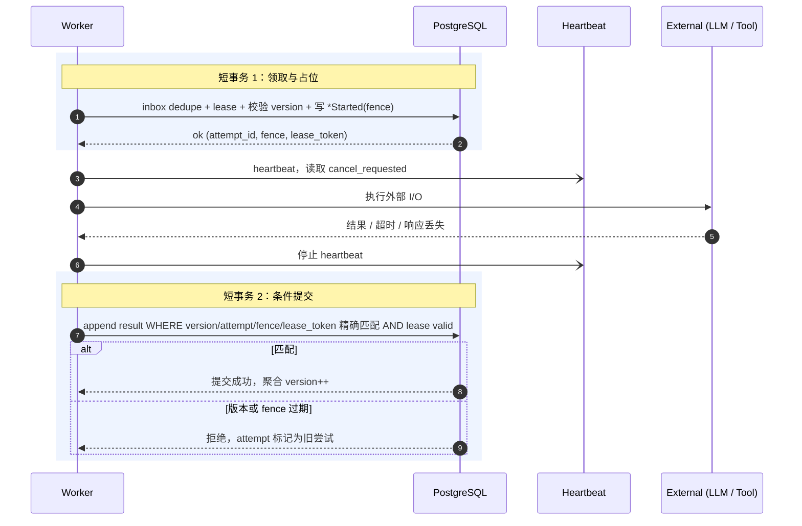

# 执行模型：Worker、调度、副作用与并行 Join

> 定位：主线文档。本文档解释 Worker 怎么安全地做慢操作：任务怎么排队、Worker 怎么领取、外部副作用怎么处理、多个并行工具怎么汇合。

## 问题、决策与风险

**问题**：Worker 做的是慢操作，例如调用 LLM、执行代码、访问第三方 API、写文件。这些操作可能超时、重复、只成功一半，或者成功了但响应丢了。

**决策**：Worker 不长期持有数据库锁。它先用一个短事务领取工作并记录“我开始试一次”，再执行慢操作，最后用另一个短事务提交结果。外部副作用按能力分类处理，不能用同一套“失败就重试”规则。

**为什么不简单让 Worker 一直锁住 run**：一个慢 LLM 或长工具会阻塞用户新消息、cancel、approval、并行工具完成和 Sweeper 修复。锁只能保护很短的数据库检查，不能覆盖外部世界。

**忽略后果**：旧 Worker 可能在 lease 过期后覆盖新状态；工具副作用成功但结果事件丢失时会被重复执行；两个并行工具可能都认为 join 未满足，run 永远卡住。

| 应该 | 不应该 |
| --- | --- |
| 外部 I/O 放在两个短事务之间 | 长时间持有 conversation/run 锁 |
| 按工具能力决定重试、对账或人工处理 | 对所有工具统一自动重试 |
| 对 `outcome_unknown` 先对账 | 直接重放可能已经发生的写操作 |
| join 检查锁定 `parallel_group` 行 | 只靠完成顺序猜测是否续跑 |

## 先用白话说

Worker 的工作方式可以理解成“两次短记账，中间做慢活”：

1. 第一次短事务：领取 command，写下“我开始试一次”，拿到 attempt、fence 和不可猜的 lease token。
2. 中间慢操作：调用 LLM、运行工具、访问第三方系统或写 workspace。
3. 第二次短事务：带着结果回来提交。只有版本、当前 attempt、精确 fence、lease token 和未过期 lease 同时匹配，结果才能推进状态。

这样做的好处是，数据库不会被一次长 LLM 调用或长时间测试命令锁住；取消、超时、审批和并行工具完成仍然能插进来。

## 队列与调度

生产基线使用持久化队列或流系统承载 command 投递。EventStore 仍在事务内写 outbox，Outbox Publisher 在提交后发布到队列；队列只负责投递和执行权管理，不成为业务事实源。

无论底层使用 Redis Streams、Kafka、NATS JetStream、托管队列还是等价系统，都必须保留同一组行为：

- 入队：把 command 放进可执行队列。
- 领取：Worker 拿到一段时间的执行权。
- 确认：Worker 处理完后确认。
- 重试：失败后按策略稍后再执行。
- 超时：Worker 长时间没响应时释放执行权。
- 死信：多次失败后进入人工处理队列。
- 延迟投递：到指定时间后才可执行。
- 去重：同一 command 重复投递也只处理一次。
- 取消：run 被取消时停止后续执行。
- 反压：队列、LLM、runtime 压力过高时限制新请求。
- 重建：消息队列服务丢失后，按聚合 `pending_command_id`、inbox 和 outbox 对账，重投仍需要执行的同一 command；具体合约见 [concurrency-and-durability.md](./concurrency-and-durability.md)。

传输层按“至少一次投递”设计。对支持幂等键的下游写操作，系统提供“多次投递但只产生一次有效副作用”的效果；对无法幂等的操作，必须进入对账或人工裁定。

### 租户公平

公平应按稀缺资源计算，而不是按 job 数：

- 每租户 active concurrency cap + token bucket。
- weighted deficit round robin 或 virtual finish time。
- job 携带估算 cost class。
- interactive 与 background 各自保留最小容量。
- retry 不重置最初 enqueue age。
- provider、runtime、工具类别各有全局并发闸门，避免某一类资源被打满。
- 高优先级 job 也有最大份额，避免后台任务永久饥饿。

## Worker 短事务模型

Worker 是无状态的。持久状态存在于 PostgreSQL、workspace/artifact 存储、runtime 存储和 memory 投影中。



AgentWorker 职责：

- 领取 `StartAgentRun` / `ResumeAgentRun`。
- 从 snapshot + 增量 events 恢复状态。
- 基于 events、memory、workspace、policy 构建上下文，并产出 `context_manifest`（模型输入清单）。
- 通过 LLM Gateway 调用模型；逻辑调用记录 `attempt_key`，每次真实外部请求记录独立 `provider_attempt_id`、Provider request id、token/成本和未知结果。
- 通过 Event Service 写入消息、工具请求、失败、等待审批或终态。

### Start / Resume 的统一领取协议

`StartAgentRun`、`ResumeAgentRun` 和 `ResumeParentRun` 使用同一套 claim。产生这些 command 的事务只把 Run 推进到 `queued` 并保存唯一 `pending_command_id`，不能提前标成 `executing`。AgentWorker 领取匹配的 command 后，EventService 先确认 Run 未请求取消，再在同一个短事务中完成 inbox claim、创建 attempt、安装 fence/lease token，并把 Run 从 `queued` 推进到 `executing`。

首次 Start 写 `RunStarted`；工具、审批或子 Run 之后的 Resume 写 `RunResumed`。重复 command 若 inbox 已 `completed` 则直接忽略；lease 未过期时不得启动第二份 LLM I/O；lease 过期后抢占会创建新 attempt 和更大的 fence，旧 Worker 的 `attempt_id` 或 fence 不再匹配。

ToolWorker 职责：

- 领取 `ExecuteToolCall`。
- 重新加载可信策略上下文。
- 检查权限并 reserve 配额。
- 通过 Secrets Manager / Broker 获取临时能力，不把原始凭证注入不可信 sandbox。
- 在 RuntimeManager 管理的 sandbox session 中执行。
- 通过 effect ledger 和 `tool_call_version` CAS 写入成功、失败或 `outcome_unknown`。
- 在同一事务中执行 join 检查；满足时尝试推进 Run。

Workspace 写工具额外使用 `CommitWorkspaceRevision` command。CommitWorker 是逻辑角色，可以和 ToolWorker 同池，但必须使用新的 command/attempt/fence：它只消费已经有 `WorkspaceRevisionCommitAuthorized` 的 prepared revision，负责 CAS 发布和确认，不能重新生成内容。这样 EventStore 的 durable commit decision 永远先于外部可见 head。

## 执行内核与业务边界

不同业务 Agent 复用的是“可靠执行能力”，不是同一份 prompt、validator 或输出表。run 生命周期、job lease、fence、attempt、幂等和事件追加属于执行内核；业务逻辑只需要通过 handler 插入两个点：

```text
handler 合约
- job_kinds[]        # 声明消费哪些 job kind
- 构建执行请求        # 解析业务 payload，产出 LLM 请求或工具执行计划；只读，不写库
- 解释执行结果        # 把成功 / 失败转成业务事件，给出目标 run 与期望版本
```

内核在提交时补上 actor、fence 和 Run CAS 信息。业务 handler 不接触 fence，也不自己确认 job 完成；这两件事留在内核里，业务 Agent 才不会各自复制一遍最容易出错的生命周期代码。术语上注意区分：业务领域的 task 是领域任务，内核的 job 是执行队列任务，二者不混用。

### 结果提交与消费确认的原子性

Worker 成功时，写结果事件和把 inbox 从 `running` 标记为 `completed` 必须在同一个数据库事务中提交：先通过 EventService 写业务事件和 inbox/attempt 结果，事务提交后再 ack 外部队列消息。拆开会产生两类事故：先确认后写事件，崩溃后已花钱的执行结果永久丢失；先写事件后确认，崩溃后 command 重投、同一结果被重复解释。

如果这次提交让 Worker 当前步骤结束——例如 AgentWorker 进入 `waiting_tool` / `waiting_approval` / `waiting_child` / 终态，或 ToolWorker / PreviewWorker / CommitWorker 提交结果——同一事务还必须在 command、attempt、fence、lease token 精确匹配的条件下完成 `job_attempt`、清除聚合上的 `active_command_id`、`active_attempt_id` 和 lease owner/token/expiry。`current_fence_token` 不回退也不清零，下次 claim 在它之上递增。否则 Run 虽已等待，旧 lease 仍会阻塞合法 Resume。

Inbox 的首次写入只是 claim，不是完成标记。Worker 在 claim 后、执行前或执行中崩溃时，后续重复投递必须能在 lease 过期后重新领取；只有 `completed` 状态的 inbox row 才能让消费者 ack 并忽略。

Run CAS 冲突（例如 Sweeper 或另一次 attempt 已推进 run）时，Worker 不重放业务写入，而是做 attempt-scoped ack：只有当前 inbox claim 仍属于该 attempt 时，才把它收敛到 `completed` 或 `abandoned`；不改变 Run 状态，本次 attempt 记为旧尝试。旧 attempt 不能确认新 owner 的 claim。

### 错误分类

LLM / 业务错误和基础设施错误的处理方向相反：前者应收敛成 run 的失败事件，后者应让 job 保持可重试。

| 位置 | 例子 | 处理 |
| --- | --- | --- |
| payload / 请求构建失败 | job payload 无法解析、缺关键字段 | fail 当前 job，按策略重试或进入死信 |
| LLM Gateway 返回终局错误 | fallback 耗尽后的 provider error、不可修正请求、内容过滤 | 追加 `RunFailed` 业务事件，run 收敛到失败 |
| LLM Gateway 返回等待类错误 | `rate_limited`、可等待的 provider 容量不足 | 按 `Retry-After` 或策略延迟重试；超过 run deadline / 预算后才收敛为终态 |
| 业务输出无效 | 结构化输出不合法、validator 不通过 | 追加 `RunFailed` 业务事件 |
| 业务落库失败 | artifact 存储失败 | fail 当前 job，稍后重试 |
| Run CAS 冲突 | 另一个执行体已推进 run | attempt-scoped ack，不再改 run |
| append 基础设施失败 | DB 错误、fence 无效 | fail 当前 job |

## 副作用能力接口

每个工具必须先说明“失败后能不能安全重试”。这比只暴露一个 handler 更重要，因为不同工具的失败后果完全不同：读文件失败可以重试，创建外部资源失败就不能盲目重试。

```text
tool_capability
- tool_name
- effect_class: read_only | idempotent_write | reconcilable_write | compensatable_write | irreversible_write
- requires_effect_key: bool
- supports_reconcile: bool
- supports_compensation: bool
- side_effect_boundary: before_execute | during_execute | after_commit_callback
- manual_approval_required: bool
- max_attempts
- reconcile_after
```

| 工具能力 | 能否自动重试 | 必须记录什么 | 结果未知时怎么处理 |
| --- | --- | --- | --- |
| `read_only` 纯读取 | 可以 | 请求摘要、attempt | 直接重试或记失败 |
| `idempotent_write` 幂等写 | 可以，但必须带稳定 `effect_key` | effect ledger、provider request id | 用同一 `effect_key` 重试或查询 |
| `reconcilable_write` 可对账写 | 先对账，再决定 | 外部资源 id、查询条件 | 进入 `outcome_unknown` 后对账 |
| `compensatable_write` 可补偿写 | 谨慎重试 | 操作意图、实际效果、补偿方案 | 先确认，再补偿或人工处理 |
| `irreversible_write` 不可逆写 | 不自动重试 | 审批、操作意图、审计记录 | 人工确认或 Repair API |

`read_only` 不需要 effect ledger，因为它不应该产生外部副作用；但它仍然要记录 request summary、attempt、输出校验和审计。只要工具会创建资源、扣费、外发请求、写 workspace 或改变第三方状态，就不能伪装成 `read_only`，必须声明写类 effect 并使用 effect ledger。

`fence` 只能阻止过期 Worker 写数据库，不能撤销已经发生的外部副作用。因此工具一旦越过“副作用边界”（例如已经向第三方发出创建请求），结果丢失时就不能盲目重放，只能先对账。

Effect ledger 至少包含：

```text
tool_effects
- tenant_id
- tool_call_id
- run_id
- provider_id
- tool_name
- effect_scope              # 外部副作用去重域，例如 provider account / workspace / remote resource namespace
- effect_key
- request_hash
- provider_request_id
- external_resource_id
- state: prepared | executing | commit_authorized | confirmed | failed | outcome_unknown | accepted_unknown
- result_event_id
```

去重边界不能只绑定 `tool_call_id`。同一 `(tenant_id, effect_scope, provider_id, tool_name, effect_key)` 在 replacement run、Repair redrive、DLQ 重投或新 ToolCall 中都必须命中同一条 ledger。若 `request_hash` 与已存在记录不同，说明同一个幂等键被用于不同意图，必须拒绝或进入人工裁定。

`accepted_unknown` 是永久的防重放占位，不是“可以重新试一次”的失败。它表示系统和人工都无法证明效果是否发生，只是决定结束自动对账并接受残余风险。任何 replacement run、DLQ redrive 或新 ToolCall 命中它时都必须停止自动执行，除非新的 Repair 流程先根据外部证据把它收敛为可证明的结果。

## LLM 调用与预算

LLM 调用也不是幂等的。同一个 prompt 重试可能得到不同输出；流式中断后重调可能重复计费；fallback 到另一个模型可能改变语义。每次逻辑调用保存独立 `attempt_key` 和输入清单；Gateway 对每一次真实外部请求再创建独立 `provider_attempt_id`，逐次记录 Provider、模型、request id、结果 hash、token、成本和结果是否未知。多个 fallback 不能压成一条“最终成功”记录。

透明 fallback 只允许发生在尚未向客户端发送任何可见 chunk、尚未提交 ToolCall proposal、且前一次 Provider attempt 已停止或被标为结果未知时。一旦有输出对外可见，当前 stream generation 只能正常完成或显式失败；后续模型调用必须使用新的 `attempt_key` / stream generation，并通过 reset/replacement 事件替换展示，禁止把两个模型的 token 串接成一条回复。完整物理 attempt 与计费对账合约见 [llm-provider.md](./llm-provider.md)。

工具配额和 LLM 预算进入同一租户成本视图：

- 工具执行前用 `reserve -> settle/release`。
- LLM 调用前按估算 token/cost 做准入。
- LLM 调用后用真实 token/cost settle。
- 崩溃泄漏的 reservation 由 Timer / Sweeper 回收。

## Run 内上下文预算与压缩

事件历史是事实源，但不等于完整 prompt。Context Builder 必须在模型窗口内做选择和压缩：

- 固定保留 system / policy。
- 近期对话和关键工具结果保留原文。
- 较早历史用滚动摘要或分层压缩。
- memory/RAG 按相关度召回。
- 摘要是可重建投影，不污染事件事实源。
- `context_manifest` 记录压缩策略版本、摘要覆盖的 `seq` 区间、保留原文的 `seq` 集合和召回 chunk id。

## 并行 ToolCall 与 Join

这里的 join 指“多个并行工具的结果怎么汇合成 Run 的下一步”。并行工具需要显式规则，不能靠“谁最后完成”来猜。

```text
parallel_group
- run_id
- step_id
- parallel_group_id
- group_kind: execution | approval_preview
- join_policy: all | any | quorum
- quorum_count
- required_tool_call_ids
- optional_tool_call_ids
- continuation_kind: resume | request_approval
```

### Join policy 语义

Join 判断的是“Run 是否可以离开 `waiting_tool`，继续让 Agent 思考”，不是“所有工具都成功”。

| 规则 | 什么时候可以继续 | 什么时候判定这组失败 | 继续后剩余工具怎么办 |
| --- | --- | --- | --- |
| `all` 全部完成 | 所有 required ToolCall 都进入终态 | 没有单独失败条件；失败结果也交给 Agent 判断 | 没有剩余 required；optional 仍在跑时可取消或标记迟到 |
| `any` 任一成功 | 任一 required ToolCall `succeeded` | 所有 required 都终态且没有成功 | 取消其余未终态工具 |
| `quorum` 达到法定数 | `succeeded` 的 required 数量达到 `quorum_count` | 即使剩余 required 全成功也达不到 quorum | 取消其余不再需要的工具 |

补充规则：

- `outcome_unknown` 不是终态，不能用于满足 join；它必须先对账。
- `resolved_unknown` 是人工接受残余风险后的终态：在 `all` 中算“已结束但未知”，在 `any` / `quorum` 中不算成功。它必须以显式未知结果进入下一步上下文，不能被解释为取消、失败已证实或副作用未发生。
- optional ToolCall 不计入门槛。若在续跑命令创建前完成，结果会进入 Agent 下一步上下文；若在续跑后才完成，只记录迟到事实，不再次唤醒 Run。
- Run 已 `cancel_requested` 时，不再创建新的 continuation；在飞工具按取消语义处理。
- Run 已是 `cancelled`、`expired`、`failed`、`succeeded` 时，ToolCall 事实可以记录，但 join 推进 Run 必须失败。

`approval_preview` group 只用于生成真实 diff/artifact 等审批材料，默认使用 `all`。它的 preview command 必须无外部可见副作用；每个 preview 完成时将对应 ToolCall 推进到 `awaiting_approval` 并结束当前 attempt。group 满足后不恢复 LLM，而是在同一锁序事务中把 Run 从 `waiting_tool` 转为 `waiting_approval`，写批次级 `ApprovalRequested` 并发 `NotifyApproval`。下面的 Resume 提交流程专指 `group_kind = execution`；preview group 复用相同锁和唯一占位纪律，但 continuation 是 `request_approval`。

### Join 提交流程

join 由完成 ToolCall 的 ToolWorker 在同一事务内判定，不额外引入一个专门的流程管理器。关键点：

1. ToolWorker 先用 `tool_call_version` CAS 写入自己的 ToolCall 结果。
2. 锁定 `parallel_group` 行：`SELECT ... FOR UPDATE`。
3. 在锁保护下读取 group 内所有 ToolCall 的当前已提交状态并判断 join。
4. 如果满足，锁定当前 Run 行，在同一事务中读取 `current_run_version`、`status` 和 `cancel_requested_at`。
5. 只有 Run 仍是 `waiting_tool` 且未取消，才创建 `continuation` 的 `preparing` 记录。
6. 生成稳定 `command_id`，用刚刚读取的 `current_run_version` CAS 将 Run 从 `waiting_tool` 推进到 `queued`，并保存 `pending_command_id`。
7. 只有 Run CAS 成功，才把 continuation 标记为 `committed` 并写入 `ResumeAgentRun` outbox。
8. 如果 Run 已取消、过期或不再等待工具，不创建 continuation；只记录 ToolCall 结果事实。CAS 在锁内仍失败时视为可重试的数据库竞争，不得留下唯一键占位阻止后续 join。

```sql
-- ToolWorker 完成事务（伪 SQL）
BEGIN;
  -- EventService 写事务使用 READ COMMITTED。

  -- 先按全局锁顺序锁住本 attempt 的 inbox claim，证明提交者持有当前 lease。
  SELECT state, attempt_id, fence_token, lease_token, lease_expires_at
  FROM command_inbox
  WHERE tenant_id = $tenant_id
  AND consumer_name = $consumer_name
  AND command_id = $command_id
  AND state = 'running'
  AND attempt_id = $attempt_id
  AND fence_token = $worker_fence
  AND lease_token = $worker_lease_token
  AND lease_expires_at > now()
  FOR UPDATE;

  UPDATE tool_calls
  SET    status = $terminal_status,
         tool_call_version = tool_call_version + 1,
         result_event_id = $result_event_id,
         active_command_id = NULL,
         active_attempt_id = NULL,
         lease_owner = NULL,
         lease_token = NULL,
         lease_expires_at = NULL
  WHERE  tenant_id = $tenant_id
  AND    tool_call_id = $tc_id
  AND    status = $expected_active_status -- Execute 用 executing；Workspace commit 用 committing；对账走独立 append
  AND    tool_call_version = $expected_tc_version
  AND    active_command_id = $command_id
  AND    active_attempt_id = $attempt_id
  AND    current_fence_token = $worker_fence
  AND    lease_token = $worker_lease_token
  AND    lease_expires_at > now();
  GET DIAGNOSTICS $updated_rows = ROW_COUNT;

  IF $updated_rows <> 1 THEN
    -- 版本、attempt、精确 fence、lease token 或期限已失效；不得继续写结果或参与 join。
    RAISE stale_attempt;
  END IF;

  UPDATE command_inbox
  SET state = 'completed', completed_at = now()
  WHERE tenant_id = $tenant_id
  AND consumer_name = $consumer_name
  AND command_id = $command_id
  AND state = 'running'
  AND attempt_id = $attempt_id
  AND fence_token = $worker_fence
  AND lease_token = $worker_lease_token;

  UPDATE job_attempts
  SET state = $attempt_terminal_state, completed_at = now()
  WHERE tenant_id = $tenant_id
  AND attempt_id = $attempt_id;

  SELECT * FROM parallel_groups
  WHERE  tenant_id = $tenant_id
  AND    run_id = $run_id
  AND    parallel_group_id = $group_id
  FOR UPDATE;

  -- 在锁内计算 join_satisfied 与 group_outcome。

  IF join_satisfied THEN
    SELECT run_version, status, cancel_requested_at
    INTO   $current_run_version, $run_status, $cancel_requested_at
    FROM   runs
    WHERE  tenant_id = $tenant_id
    AND    run_id = $run_id
    FOR UPDATE;

    IF $run_status = 'waiting_tool' AND $cancel_requested_at IS NULL THEN
      INSERT INTO continuations (
        tenant_id, run_id, parallel_group_id, continuation_kind, status
      )
      VALUES ($tenant_id, $run_id, $group_id, 'resume', 'preparing')
      ON CONFLICT DO NOTHING
      RETURNING continuation_id INTO $continuation_id;

      IF $continuation_id IS NOT NULL THEN
        UPDATE runs
        SET    status = 'queued',
               run_version = run_version + 1,
               pending_command_id = $resume_command_id
        WHERE  tenant_id = $tenant_id
        AND    run_id = $run_id
        AND    status = 'waiting_tool'
        AND    cancel_requested_at IS NULL
        AND    run_version = $current_run_version
        RETURNING run_id INTO $advanced_run_id;

        IF $advanced_run_id IS NOT NULL THEN
          UPDATE continuations
          SET status = 'committed'
          WHERE continuation_id = $continuation_id;

          $emit_resume_agent_run = true;
        ELSE
          RAISE retryable_concurrency_error;
        END IF;
      END IF;
    END IF;
  END IF;

  -- 所有业务状态行和协调行处理完后，再锁 event_cursors 分配 seq。
  INSERT INTO events (...) VALUES (...);

  IF $emit_resume_agent_run THEN
    INSERT INTO outbox (command_id, ...) VALUES ($resume_command_id, ...); -- ResumeAgentRun
  END IF;
COMMIT;
```

事务必须先证明并锁住当前 inbox claim；ToolCall CAS 影响行数不是 1 时立即进入 stale-attempt 分支，不能插入结果事件、完成别人的 inbox 或参与 join。`FOR UPDATE` 防止两个合法完成者都只看到自己的结果而放弃 join。`current_run_version` 必须在锁定 `parallel_group` 之后、同一事务内从 `runs` 读取，不能使用 ToolWorker 领取任务时看到的旧版本。`UNIQUE (tenant_id, run_id, parallel_group_id, continuation_kind)` 是第二道防线，防止异常路径产生重复续跑；它不能被 stale run version 造成的 `skipped` 行永久占住。

## 示例：两个 ToolWorker 同时完成

1. AgentWorker 创建两个 required ToolCall，Run 进入 `waiting_tool`。
2. T1 和 T2 并行执行外部工具，不持有 group 锁。
3. T1 先提交自己的 ToolCall 成功，锁住 group，看到完成数 1/2，不续跑。
4. T2 后提交，锁住 group，能看到 T1 已提交，完成数 2/2。
5. T2 创建 continuation，占位成功后把 Run 推进到 `queued`，并绑定唯一 Resume command。
6. Run CAS 成功才写 `ResumeAgentRun`。
7. AgentWorker claim 该 command，创建新 attempt/fence 后再把 Run 推进到 `executing`。
8. 结果是两个 ToolCall 事实都保留，Run 只续跑一次，且每次续跑都有独立租约。
