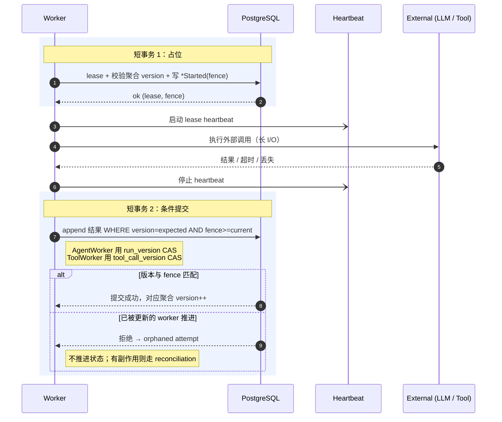
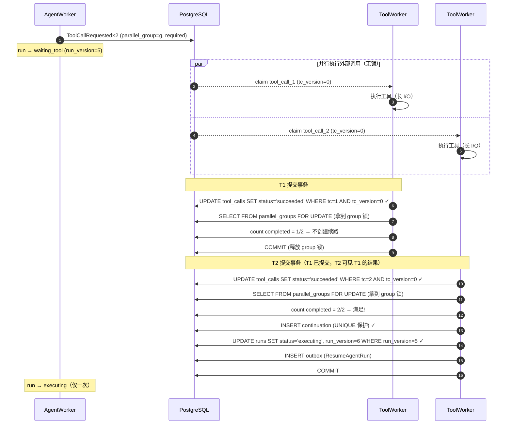

# 执行模型：Worker、调度、副作用与并行 Join

> 本文档是 [architecture.md](./architecture.md) 的子文档，定义任务执行的完整语义：队列调度、Worker 执行模型、副作用处理与并行 tool call 的 join 机制。

## 队列与调度

**首版可以不引入独立 MQ**：在同一事件事务内 `insert jobs`，worker 用 `SELECT ... FOR UPDATE SKIP LOCKED` 竞争领取。`SKIP LOCKED` 提供不一致视图、不适合通用查询，但正适合多消费者竞争队列表，省去 OutboxPublisher、独立 Scheduler 与 MQ，Redis 只做实时通知。当锁竞争、表膨胀、vacuum 压力或调度复杂度成为真实瓶颈，再引入 broker。

无论实现，必须保留生产队列语义：enqueue、lease/claim、ack、retry、timeout、dead-letter；通过 visibility/lease 超时支持崩溃恢复；默认至少一次投递、消费端幂等；queue lag / LLM 延迟 / 数据库压力 / runtime 使用率过高时反压到 API 准入。

### 租户公平是可验证算法，不是接口名

需要对**稀缺资源**公平，而非 job 数量（一次 LLM 调用约 30s，一次工具调用可能 20min，成本与冷启动各不同）：

- 每租户 active concurrency cap + token bucket。
- weighted deficit round robin 或 virtual finish time。
- job 带估算 cost class；interactive 与 background 各自保留最小容量。
- retry 不重置最初 enqueue age；provider、runtime、工具类别各设全局 semaphore。
- 单租户不能占满所有 interactive worker；高优先级也有最大份额，避免后台永久饥饿。

### broker 不是透明替换件

PostgreSQL jobs、Redis Streams、Kafka、NATS JetStream 语义不同（至少一次/去重/exactly-once 边界各异），"统一 job 接口"必须定义为严格的**语义契约**：是否至少一次、ordering key、最大消息大小、延迟执行、visibility/ack timeout、dedupe key 与去重窗口、poison message、redrive、cancellation、ack 必须发生在何种持久化之后、broker 丢失后如何从 EventStore 重建。可信的产品级承诺是：

> 传输 at-least-once；下游支持幂等键时提供 effectively-once effect；对无法幂等的外部操作提供 outcome reconciliation，不承诺通用 exactly-once。

## Worker 执行模型

Worker 是无状态的。持久状态存在于 PostgreSQL、workspace storage、artifact storage、runtime store 和 memory service 中。

**不要在长外部 I/O 期间长期持有锁**——否则用户新消息无法进入、cancel 被阻塞、一个慢 LLM 阻塞整个会话、并行工具几乎无法建模。外部调用发生在两个短事务之间，最终正确性靠提交时的条件写而非持锁时长：



若旧 worker 在 lease 过期后仍完成调用：结果记为 orphaned attempt、不允许推进 run、对有外部副作用的工具走 reconciliation。

AgentWorker 职责：加租约 → 从 snapshot 加增量 events 恢复状态 → 基于 events/memory/workspace/policy 构建上下文并产出 `context_manifest` → 经 LLM Gateway 调用并处理超时/重试/fallback/预算 → 所有消息、工具请求、失败、后续命令通过 Event Service 写入。

ToolWorker 职责：重新加载可信上下文 → 检查权限并 **reserve 配额** → 只经 Secrets Manager/Broker 获取密钥 → 在 RuntimeManager 的 sandbox session 中执行 → 以 `tool_call_version` CAS 经 effect ledger 写入完成/失败/artifact → 在同一事务中串行化 join 检查，若 join 满足则以 `run_version` CAS 创建 `ResumeAgentRun` 命令。

## 副作用、幂等与 Reconciliation

**fencing 只能阻止过期写入数据库，不能撤销已经发生的外部副作用。** 假设 worker A 拿 fence 10、调用外部工具创建资源、lease 过期、worker B 拿 fence 11、A 的 DB 写入被拒——数据库安全，但外部资源可能已创建。因此工具必须按副作用性质分类处理重试：

| 工具类别 | 重试策略 |
| --- | --- |
| 纯读取 | 可安全自动重试 |
| 下游支持 idempotency key 的写操作 | 使用稳定 `effect_key` 重试 |
| 可查询结果的写操作 | 超时后先 reconcile，再决定是否重试 |
| 可补偿但不幂等 | 记录 intent、effect 和 compensation |
| 不可逆且结果未知 | 禁止盲目自动重试，进入人工确认或 reconciliation |

引入 effect ledger：

```text
tool_effects
- tenant_id / tool_call_id / effect_key
- request_hash / provider_request_id / external_resource_id
- state: prepared / executing / confirmed / failed / outcome_unknown
- result_event_id
```

**LLM 调用同样不是幂等的**（同 prompt 重试可能不同输出、流式中断重调可能重复计费、fallback 改变语义、响应丢失无法确认）。每次模型调用保存独立 `llm_attempt_id`、输入 manifest、模型配置、provider request id、结果 hash、token 与成本，而不是把多次调用折叠成一次"重试"。

**LLM 的预算与工具配额是两套机制，需对齐到同一租户成本视图**：工具走 Quota 的 `reserve → settle/release`（执行前已知成本量级）；而 token 成本只有调用后才确定，因此 LLM 走"**按估算预扣 → 实际 token 结算**"——调用前按 `max_cost` 剩余额度与本次估算做准入，调用后用真实 token 回写并 settle 到同一租户预算账上。两条路径最终结算进**同一个租户成本/预算视图**；`reserve` 在崩溃后泄漏的预留由 Timer / Sweeper 按 `reservation_id` + TTL 回收（见 [operations.md](./operations.md)）。

## Run 内上下文预算与压缩

事件历史是事实源，但**不等于喂给模型的 prompt**：一个会做几十步、读大文件、多轮工具的 run，其累计事件 + 工具输出会很快超过模型上下文窗口。`max_steps` / `max_cost` 只防失控循环，不解决"单次调用装不下"。因此 Context Builder 必须在预算内做**选择与压缩**，而非朴素拼接全量历史：

- 预算分层：system/policy（固定）→ 近期对话与工具结果（保留原文）→ 较早历史（滚动摘要 / 分层压缩）→ 按相关度从 memory/RAG 召回。
- 压缩产物本身是可重建投影：摘要 checkpoint 以事件或带版本的派生记录落库，replay 时可由原始事件 + `context_builder_version` 重新生成，不污染事实源。
- 选择与压缩的决策必须进入 `context_manifest`：记录 `compaction_strategy_version`、被摘要替代的 `seq` 区间、保留原文的 `seq` 集合、召回的 chunk id，才能事后解释"模型当时究竟看到了什么"。

## 锁、顺序、Fencing 与并行 Join

正确性以持久状态和 fencing token 为主要安全机制，普通分布式锁只是"工作所有权提示"。

- 锁粒度为 `conversation_id` 或 `run_id`，不能是全局锁。
- 每个 lease 有 TTL 和 owner token；写事件携带最新 fence token；过期 worker 不能覆盖更新的 run state。

**并行 tool call 需要显式 join 模型**，仅"唯一 id + 完成顺序"不够：

```text
step_id / parallel_group_id / tool_call_id / ordinal
required | optional
join_policy: all | any | quorum
```

### 两级 CAS 与 Join 流程

join 由**完成那一刻的 ToolWorker 自身内联判定**，不引入单独的 process manager 组件。关键点是 ToolCall 完成与 Run 状态推进使用**不同聚合的 CAS**：

1. **ToolCall 级 CAS**：每个 ToolWorker 以 `expected_tool_call_version` 写入 `ToolCallSucceeded/Failed`，只竞争自己的 `tool_call_version`，N 个并行 ToolWorker 互不干扰。
2. **`FOR UPDATE` 串行化 join 检查**：写入完成事件后，在同一事务中锁定 `parallel_group` 行（`SELECT ... FOR UPDATE`），然后检查 join 条件。行锁保证同一 group 内的 join 检查串行执行——后提交的事务一定能看到先提交的 ToolCall 完成事件，**消除"两个 worker 都只看到自己、都放弃"的竞态窗口**。
3. **UNIQUE 约束兜底**：`UNIQUE (run_id, parallel_group_id, continuation_kind)` 作为第二道防线，即使 `FOR UPDATE` 因异常未生效，也不会产生重复续跑。
4. **Run 级 CAS**：join 胜出者在同一事务中以 `expected_run_version` 将 Run 从 `waiting_tool` 推进到 `executing`，创建 `ResumeAgentRun` 命令。

```sql
-- ToolWorker 完成事务（伪 SQL）
BEGIN;
  -- 1. ToolCall 级 CAS（各 ToolWorker 独立，无假冲突）
  UPDATE tool_calls
  SET    status = 'succeeded',
         tool_call_version = tool_call_version + 1,
         result_event_id = $result_event_id
  WHERE  tool_call_id = $tc_id
  AND    status = 'executing'
  AND    tool_call_version = $expected_tc_version;
  -- 0 rows → 拒绝（已被完成或取消）

  -- 2. 写入事件（seq 由 conversation 元数据行锁分配）
  INSERT INTO events (...) VALUES (...);

  -- 3. 锁定 parallel_group（串行化 join 检查，毫秒级短锁）
  SELECT * FROM parallel_groups
  WHERE  run_id = $run_id AND group_id = $group_id
  FOR UPDATE;

  -- 4. 在锁保护下检查 join 条件
  SELECT count(*) AS done
  FROM   tool_calls
  WHERE  parallel_group_id = $group_id
  AND    required = true
  AND    status IN ('succeeded', 'failed');

  -- 5. 如果满足，尝试创建唯一续跑
  IF done >= required_count THEN
    INSERT INTO continuations (run_id, group_id, continuation_kind)
    VALUES ($run_id, $group_id, 'resume')
    ON CONFLICT DO NOTHING;  -- UNIQUE 兜底

    IF inserted THEN
      -- 6. Run 级 CAS：推进 Run 状态
      UPDATE runs
      SET    status = 'executing',
             run_version = run_version + 1
      WHERE  run_id = $run_id
      AND    run_version = $expected_run_version
      AND    status = 'waiting_tool';

      INSERT INTO outbox (...) VALUES (...);  -- ResumeAgentRun command
    END IF;
  END IF;
COMMIT;
```

> **为什么需要 `FOR UPDATE` 而不只靠 UNIQUE**：如果 T1 和 T2 在 READ COMMITTED 下并发检查 join 条件，且彼此的写入都未提交，两个都只看到自己完成的那条（1/2），都认为条件未满足、都放弃——run 永远卡在 `waiting_tool`。`FOR UPDATE` 在 `parallel_group` 行上串行化：T1 先拿到锁、检查、提交；T2 等 T1 释放后才检查，此时 T1 的 `ToolCallSucceeded` 已可见，T2 看到 2/2。**这把锁只保护 join 检查（毫秒级 DB 操作），不覆盖外部 I/O（秒级工具执行）**。

### Join Policy

join 条件按 `join_policy` 判定：`all` 需全部 required 终态；`quorum` 需达到法定数；`any` 命中首个即可。**`any` / `quorum` 提前满足后，group 内仍在飞的工具必须显式处理**，不能放任：在创建续跑的同一逻辑里对剩余 `tool_call` 发出取消（`RuntimeTerminationRequested` + 标记 `cancelled`），其迟到结果记为 orphaned，并被 `UNIQUE` 续跑约束挡在二次唤醒之外；`optional` 工具不计入 join 门槛，但其结果若在续跑前到达仍应被记录。

### Cancel 与两级 CAS 的交互

Cancel 是 Run 级操作（`run_version` CAS）。ToolWorker 可以在 Run 已被 cancel 的情况下成功写入 `ToolCallSucceeded`（ToolCall 聚合的事实不因 Run 取消而丢失），但当它尝试 join 并推进 Run 状态时，`UPDATE runs ... WHERE status='waiting_tool'` 会因 status 已是 `cancelled` 而失败——Run 不会被错误恢复。这正是两级 CAS 的好处：**ToolCall 完成的记录保留在 EventStore 中（事实已发生），但不会推进已取消的 Run**。

### 时序图

下图展示 N=2 的 fan-out/join：两个 ToolWorker 各自以 `tool_call_version` CAS 完成独立的 ToolCall（无假冲突），通过 `FOR UPDATE` 串行化 join 检查，join 胜出者以 `run_version` CAS 推进 Run。


