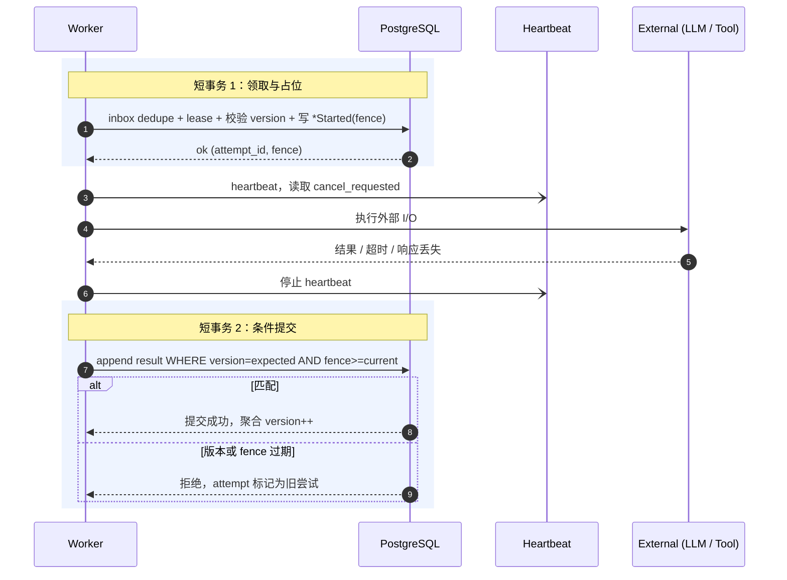

# 执行模型：Worker、调度、副作用与并行 Join

> 本文档是 [architecture.md](./architecture.md) 的子文档，定义 command 如何被调度、Worker 如何执行、外部副作用如何收敛，以及并行 tool call 如何安全 join。

## 问题、决策与风险

**问题**：Worker 做的是慢操作，例如调用 LLM、执行代码、访问第三方 API、写文件。这些操作可能超时、重复、只成功一半，或者成功了但响应丢了。

**决策**：Worker 不长期持有数据库锁。它先用一个短事务领取工作并记录“我开始试一次”，再执行慢操作，最后用另一个短事务提交结果。外部副作用按能力分类处理，不能用同一套“失败就重试”规则。

**为什么不简单让 Worker 一直锁住 run**：一个慢 LLM 或长工具会阻塞用户新消息、cancel、approval、并行工具完成和 Sweeper 修复。锁只能保护很短的数据库检查，不能覆盖外部世界。

**忽略后果**：旧 Worker 可能在 lease 过期后覆盖新状态；工具副作用成功但结果事件丢失时会被重复执行；两个并行工具可能都认为 join 未满足，run 永远卡住。

| 应该 | 不应该 |
| --- | --- |
| 外部 I/O 放在两个短事务之间 | 长时间持有 conversation/run 锁 |
| 按工具能力决定重试、对账或人工处理 | 对所有工具统一自动重试 |
| 对 `outcome_unknown` 先对账 | 直接重放可能已经发生的写操作 |
| join 检查锁定 `parallel_group` 行 | 只靠完成顺序猜测是否续跑 |

## 队列与调度

Lite v1 可以不引入独立 MQ。可以先把待执行任务写在 PostgreSQL 表里，多个 Worker 用 `SELECT ... FOR UPDATE SKIP LOCKED` 抢任务。这个 SQL 不适合普通业务查询，但很适合“谁抢到谁执行”的队列表。Redis 可以只负责实时通知。

无论底层以后换成 PostgreSQL jobs、Redis Streams、Kafka 还是 NATS JetStream，都必须保留同一组行为：

- 入队：把 command 放进可执行队列。
- 领取：Worker 拿到一段时间的执行权。
- 确认：Worker 处理完后确认。
- 重试：失败后按策略稍后再执行。
- 超时：Worker 长时间没响应时释放执行权。
- 死信：多次失败后进入人工处理队列。
- 延迟投递：到指定时间后才可执行。
- 去重：同一 command 重复投递也只处理一次。
- 取消：run 被取消时停止后续执行。
- 反压：队列、LLM、runtime 压力过高时限制新请求。
- 重建：消息队列服务丢失后，仍能从 EventStore 找回还需要执行的 command。

传输层按“至少一次投递”设计。对支持幂等键的下游写操作，系统提供“多次投递但只产生一次有效副作用”的效果；对无法幂等的操作，必须进入对账或人工裁定。

### 租户公平

公平应按稀缺资源计算，而不是按 job 数：

- 每租户 active concurrency cap + token bucket。
- weighted deficit round robin 或 virtual finish time。
- job 携带估算 cost class。
- interactive 与 background 各自保留最小容量。
- retry 不重置最初 enqueue age。
- provider、runtime、工具类别各有全局并发闸门，避免某一类资源被打满。
- 高优先级 job 也有最大份额，避免后台任务永久饥饿。

## Worker 短事务模型

Worker 是无状态的。持久状态存在于 PostgreSQL、workspace/artifact 存储、runtime 存储和 memory 投影中。



AgentWorker 职责：

- 领取 `StartAgentRun` / `ResumeAgentRun`。
- 从 snapshot + 增量 events 恢复状态。
- 基于 events、memory、workspace、policy 构建上下文，并产出 `context_manifest`（模型输入清单）。
- 通过 LLM Gateway 调用模型，记录 `llm_attempt_id`、模型配置、provider request id、token 和成本。
- 通过 Event Service 写入消息、工具请求、失败、等待审批或终态。

ToolWorker 职责：

- 领取 `ExecuteToolCall`。
- 重新加载可信策略上下文。
- 检查权限并 reserve 配额。
- 通过 Secrets Manager / Broker 获取临时能力，不把原始凭证注入不可信 sandbox。
- 在 RuntimeManager 管理的 sandbox session 中执行。
- 通过 effect ledger 和 `tool_call_version` CAS 写入成功、失败或 `outcome_unknown`。
- 在同一事务中执行 join 检查；满足时尝试推进 Run。

## 副作用能力接口

每个工具必须先说明“失败后能不能安全重试”。这比只暴露一个 handler 更重要，因为不同工具的失败后果完全不同：读文件可以重试，创建外部资源就不能盲目重试。

```text
tool_capability
- tool_name
- effect_class: read_only | idempotent_write | reconcilable_write | compensatable_write | irreversible_write
- requires_effect_key: bool
- supports_reconcile: bool
- supports_compensation: bool
- side_effect_boundary: before_execute | during_execute | after_commit_callback
- manual_approval_required: bool
- max_attempts
- reconcile_after
```

| 工具能力 | 能否自动重试 | 必须记录什么 | 结果未知时怎么处理 |
| --- | --- | --- | --- |
| `read_only` 纯读取 | 可以 | 请求摘要、attempt | 直接重试或记失败 |
| `idempotent_write` 幂等写 | 可以，但必须带稳定 `effect_key` | effect ledger、provider request id | 用同一 `effect_key` 重试或查询 |
| `reconcilable_write` 可对账写 | 先对账，再决定 | 外部资源 id、查询条件 | 进入 `outcome_unknown` 后对账 |
| `compensatable_write` 可补偿写 | 谨慎重试 | 操作意图、实际效果、补偿方案 | 先确认，再补偿或人工处理 |
| `irreversible_write` 不可逆写 | 不自动重试 | 审批、操作意图、审计记录 | 人工确认或 Repair API |

`fence` 只能阻止过期 Worker 写数据库，不能撤销已经发生的外部副作用。因此工具一旦越过“副作用边界”（例如已经向第三方发出创建请求），结果丢失时就不能盲目重放，只能先对账。

Effect ledger 至少包含：

```text
tool_effects
- tenant_id
- tool_call_id
- effect_key
- request_hash
- provider_request_id
- external_resource_id
- state: prepared | executing | confirmed | failed | outcome_unknown
- result_event_id
```

## LLM 调用与预算

LLM 调用也不是幂等的。同一个 prompt 重试可能得到不同输出；流式中断后重调可能重复计费；fallback 到另一个模型可能改变语义。每次调用都保存独立 `llm_attempt_id`、输入清单、模型配置、provider request id、结果 hash、token 和成本。

工具配额和 LLM 预算进入同一租户成本视图：

- 工具执行前用 `reserve -> settle/release`。
- LLM 调用前按估算 token/cost 做准入。
- LLM 调用后用真实 token/cost settle。
- 崩溃泄漏的 reservation 由 Timer / Sweeper 回收。

## Run 内上下文预算与压缩

事件历史是事实源，但不等于完整 prompt。Context Builder 必须在模型窗口内做选择和压缩：

- 固定保留 system / policy。
- 近期对话和关键工具结果保留原文。
- 较早历史用滚动摘要或分层压缩。
- memory/RAG 按相关度召回。
- 摘要是可重建投影，不污染事件事实源。
- `context_manifest` 记录压缩策略版本、摘要覆盖的 `seq` 区间、保留原文的 `seq` 集合和召回 chunk id。

## 并行 ToolCall 与 Join

这里的 join 指“多个并行工具的结果怎么汇合成 Run 的下一步”。并行工具需要显式模型，不能靠“谁最后完成”来猜。

```text
parallel_group
- run_id
- step_id
- parallel_group_id
- join_policy: all | any | quorum
- quorum_count
- required_tool_call_ids
- optional_tool_call_ids
- continuation_kind: resume
```

### Join policy 语义

Join 判断的是“Run 是否可以离开 `waiting_tool`，继续让 Agent 思考”，不是“所有工具都成功”。

| 规则 | 什么时候可以继续 | 什么时候判定这组失败 | 继续后剩余工具怎么办 |
| --- | --- | --- | --- |
| `all` 全部完成 | 所有 required ToolCall 都进入终态 | 没有单独失败条件；失败结果也交给 Agent 判断 | 没有剩余 required；optional 仍在跑时可取消或标记迟到 |
| `any` 任一成功 | 任一 required ToolCall `succeeded` | 所有 required 都终态且没有成功 | 取消其余未终态工具 |
| `quorum` 达到法定数 | `succeeded` 的 required 数量达到 `quorum_count` | 即使剩余 required 全成功也达不到 quorum | 取消其余不再需要的工具 |

补充规则：

- `outcome_unknown` 不是终态，不能用于满足 join；它必须先对账。
- optional ToolCall 不计入门槛。若在续跑命令创建前完成，结果会进入 Agent 下一步上下文；若在续跑后才完成，只记录迟到事实，不再次唤醒 Run。
- Run 已 `cancel_requested` 时，不再创建新的 continuation；在飞工具按取消语义处理。
- Run 已是 `cancelled`、`expired`、`failed`、`succeeded` 时，ToolCall 事实可以记录，但 join 推进 Run 必须失败。

### Join 提交流程

join 由完成 ToolCall 的 ToolWorker 在同一事务内判定，不额外引入一个专门的流程管理器。关键点：

1. ToolWorker 先用 `tool_call_version` CAS 写入自己的 ToolCall 结果。
2. 锁定 `parallel_group` 行：`SELECT ... FOR UPDATE`。
3. 在锁保护下读取 group 内所有 ToolCall 的当前状态并判断 join。
4. 如果满足，创建 `continuation` 的 `preparing` 记录作为唯一占位，意思是“我准备续跑，但还没真正发出命令”。
5. 用 `run_version` CAS 将 Run 从 `waiting_tool` 推进到 `executing`。
6. 只有 Run CAS 成功，才把 continuation 标记为 `committed` 并写入 `ResumeAgentRun` outbox。
7. 如果 Run CAS 失败，把 continuation 标记为 `skipped`，不写 outbox，避免错误续跑。

```sql
-- ToolWorker 完成事务（伪 SQL）
BEGIN;
  UPDATE tool_calls
  SET    status = $terminal_status,
         tool_call_version = tool_call_version + 1,
         result_event_id = $result_event_id
  WHERE  tenant_id = $tenant_id
  AND    tool_call_id = $tc_id
  AND    status IN ('executing', 'outcome_unknown')
  AND    tool_call_version = $expected_tc_version
  AND    $worker_fence >= current_fence_token;
  -- 0 rows: 版本或 fence 过期，attempt 变为旧尝试

  INSERT INTO events (...) VALUES (...);

  SELECT * FROM parallel_groups
  WHERE  tenant_id = $tenant_id
  AND    run_id = $run_id
  AND    group_id = $group_id
  FOR UPDATE;

  -- 在锁内计算 join_satisfied 与 group_outcome。

  IF join_satisfied THEN
    INSERT INTO continuations (
      tenant_id, run_id, group_id, continuation_kind, status
    )
    VALUES ($tenant_id, $run_id, $group_id, 'resume', 'preparing')
    ON CONFLICT DO NOTHING
    RETURNING continuation_id INTO $continuation_id;

    IF $continuation_id IS NOT NULL THEN
      UPDATE runs
      SET    status = 'executing',
             run_version = run_version + 1
      WHERE  tenant_id = $tenant_id
      AND    run_id = $run_id
      AND    status = 'waiting_tool'
      AND    cancel_requested_at IS NULL
      AND    run_version = $expected_run_version
      RETURNING run_id INTO $advanced_run_id;

      IF $advanced_run_id IS NOT NULL THEN
        UPDATE continuations
        SET status = 'committed'
        WHERE continuation_id = $continuation_id;

        INSERT INTO outbox (...) VALUES (...); -- ResumeAgentRun
      ELSE
        UPDATE continuations
        SET status = 'skipped', reason = 'run_cas_failed_or_cancelled'
        WHERE continuation_id = $continuation_id;
      END IF;
    END IF;
  END IF;
COMMIT;
```

`FOR UPDATE` 防止两个 Worker 都只看到自己的完成结果而放弃 join。`UNIQUE (tenant_id, run_id, parallel_group_id, continuation_kind)` 是第二道防线，防止异常路径产生重复续跑。

## 示例：两个 ToolWorker 同时完成

1. AgentWorker 创建两个 required ToolCall，Run 进入 `waiting_tool`。
2. T1 和 T2 并行执行外部工具，不持有 group 锁。
3. T1 先提交自己的 ToolCall 成功，锁住 group，看到完成数 1/2，不续跑。
4. T2 后提交，锁住 group，能看到 T1 已提交，完成数 2/2。
5. T2 创建 continuation，占位成功后推进 Run。
6. Run CAS 成功才写 `ResumeAgentRun`。
7. 结果是两个 ToolCall 事实都保留，Run 只续跑一次。
