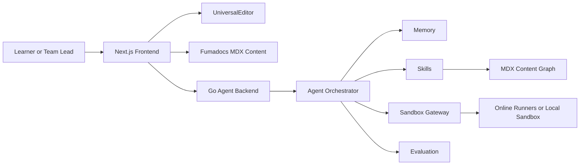

# LangShift Agent 技术方案

## 1. 产品定位

LangShift Agent 是一个面向开发者的技术栈扩展学习 Agent。它不是简单的语言转栈工具，也不是通用聊天 Agent，而是基于 LangShift 现有对比学习内容、在线编辑器和可运行示例，帮助用户从已掌握的技术出发，逐步扩展到新的语言、框架或工程领域。

核心主张：

> Expand your tech stack with runnable, side-by-side Agent learning.

LangShift Agent 的优势来自四个方面：

- **结构化内容底座**：现有 MDX 学习内容作为稳定、可审核、可搜索的概念来源。
- **对比交互体验**：通过 `UniversalEditor` 展示熟悉技术与目标技术的并排代码。
- **在线运行实验**：用户可以直接编辑、运行、观察输出和错误。
- **Agent 个性化闭环**：通过 memory、skills、sandbox、evaluation 形成持续学习路径。

## 2. 学习分层

LangShift Agent 不应该为每个用户重新生成基础课程。基础概念应优先复用现有 MDX 内容，Agent 负责个性化编排、解释、练习和反馈。

### Level 1: Concept Learning

- 现有 MDX 是概念学习的权威来源。
- Agent 根据用户背景推荐具体章节，而不是重新生成课程正文。
- MDX 内容逐步补充概念标签、难度、前置知识、适用场景和关联练习。

### Level 2: Runnable Comparison

- 使用 `UniversalEditor` 做并排代码比较。
- 左侧是用户熟悉的技术表达，右侧是目标技术表达。
- Agent 解释概念差异、设计取舍、常见误区和代码输出。

### Level 3: Guided Practice

- Agent 基于概念节点生成小任务。
- 任务从补全代码、修复错误、模式改写，逐步进入小功能实现。
- 每个任务绑定概念节点和验收标准。

### Level 4: Agent Review

- Agent 检查运行结果、代码质量、惯用写法和概念掌握度。
- 反馈不只告诉用户对错，还要说明目标技术的思维方式。

### Level 5: Memory Driven Path

- Agent 根据用户历史表现更新 memory。
- 下一步推荐来自已学概念、薄弱点、练习结果和目标场景。
- 同一套机制可以服务个人学习，也可以扩展为团队任务包。

## 3. 系统架构

项目采用 Next.js 前端加 Go Agent Backend 的架构。Next.js 继续承载内容站、文档路由、编辑器和交互体验；Go 后端承载 Agent 编排、memory、skills、sandbox gateway 和 evaluation。



### Frontend

- Next.js 15 App Router。
- Fumadocs 继续负责文档内容和 SEO。
- `UniversalEditor` 作为 Agent Lab 的核心交互组件。
- 新增 Agent Workspace，用于画像、推荐、对比、练习、评审和 memory 展示。

### Go Backend

- 新增服务目录：`services/agent`。
- 默认本地端口：`8080`。
- 通过 Next.js rewrite 暴露为 `/agent-api/*`。
- Go 服务负责所有 Agent 核心逻辑，避免把编排逻辑散落在前端。

### Content Graph

- 从现有 MDX 文件生成内容索引。
- Go 后端读取 `content-index.json`，作为推荐概念和生成练习的基础。
- 第一版可以用构建脚本离线生成，后续再接入向量检索或搜索索引。

## 4. Go 后端模块设计

建议目录结构：

```text
services/agent/
├── cmd/server/
│   └── main.go
├── internal/agent/
│   ├── orchestrator.go
│   └── session.go
├── internal/content/
│   ├── graph.go
│   └── index_loader.go
├── internal/eval/
│   └── evaluator.go
├── internal/memory/
│   ├── memory.go
│   ├── file_store.go
│   └── sqlite_store.go
├── internal/sandbox/
│   ├── runner.go
│   └── gateway.go
├── internal/skills/
│   ├── recommend_concepts.go
│   ├── generate_comparison.go
│   ├── create_practice_task.go
│   ├── review_submission.go
│   └── update_memory.go
└── go.mod
```

### Orchestrator

Orchestrator 是 Agent 的决策中心，负责：

- 读取用户画像、当前任务和 memory。
- 选择需要调用的 skills。
- 控制 Concept Learning、Comparison、Practice、Review 的流程。
- 组织流式事件，向前端暴露 Agent 正在做什么。

### Memory

Memory 分三层：

- `Profile Memory`：用户熟悉技术、目标技术、经验水平、学习目的、解释偏好。
- `Learning Memory`：已学概念、薄弱点、练习得分、最近错误类型、下一步建议。
- `Session Memory`：当前任务、代码提交、运行结果、Agent 反馈历史。

MVP 可以先使用本地文件或 SQLite。接口必须抽象，后续可以替换为 Postgres、Redis 或团队空间数据库。

### Skills

Skills 是可测试、可替换的 Agent 能力模块：

- `RecommendConcepts`：从 Content Graph 中推荐概念节点。
- `GenerateComparison`：生成熟悉技术与目标技术的并排示例。
- `CreatePracticeTask`：基于概念节点生成渐进练习。
- `RunCode`：调用 sandbox gateway 执行代码。
- `ReviewSubmission`：评估代码正确性、惯用写法和概念理解。
- `UpdateMemory`：把学习结果写入 memory。

Skills 要避免变成黑盒 prompt。每个 skill 都应该有明确输入、输出和测试样例。

### Sandbox Gateway

Sandbox Gateway 统一封装代码运行能力：

- 第一版可代理现有在线运行服务。
- 支持语言按能力分级：可运行、只可静态检查、只可解释。
- 返回统一结构：`stdout`、`stderr`、`exitStatus`、`durationMs`、`timeout`、`language`。
- 后续可升级为 Docker 或更强隔离方案。

### Evaluation

Evaluation 负责把运行结果和 Agent Review 变成结构化反馈：

- 正确性：是否通过运行或测试。
- 概念掌握度：是否使用了目标概念。
- 惯用程度：是否符合目标技术社区习惯。
- 下一步：推荐复习内容或新练习。

## 5. API 设计

前端通过 `/agent-api/*` 调用 Go 后端。建议 Go 后端真实路径使用 `/v1/*`。

| Method | Endpoint | 用途 |
| --- | --- | --- |
| `GET` | `/v1/healthz` | 服务健康检查 |
| `POST` | `/v1/sessions` | 创建学习会话 |
| `GET` | `/v1/sessions/{id}` | 获取会话、memory 和当前状态 |
| `POST` | `/v1/sessions/{id}/plan` | 生成概念学习路径 |
| `POST` | `/v1/sessions/{id}/compare` | 生成并排代码和解释 |
| `POST` | `/v1/sessions/{id}/tasks` | 生成下一组练习任务 |
| `POST` | `/v1/sessions/{id}/submissions` | 提交练习代码并获得 review |
| `POST` | `/v1/run` | 单独运行代码 |
| `GET` | `/v1/sessions/{id}/events` | SSE 返回 Agent 进度事件 |

### Session 请求示例

```json
{
  "knownTech": ["TypeScript", "React"],
  "targetTech": ["Go", "HTTP services"],
  "goal": "扩展后端服务开发能力",
  "level": "intermediate",
  "mode": "individual"
}
```

### Run 结果示例

```json
{
  "language": "go",
  "stdout": "hello\n",
  "stderr": "",
  "exitStatus": 0,
  "durationMs": 421,
  "timeout": false
}
```

### Review 结果示例

```json
{
  "correctness": "pass",
  "idiomaticScore": 0.78,
  "conceptScore": 0.85,
  "feedback": "代码能正确运行，错误处理也比较清晰。下一步可以练习使用 interface 抽象依赖。",
  "nextConceptIds": ["js2go/module-03-types-interfaces", "js2go/module-06-error-handling"]
}
```

## 6. 前端集成方案

### Agent Workspace

新增页面用于承载完整学习闭环：

- 学习画像表单：已掌握技术、目标技术、目标场景、当前水平。
- 推荐概念区：展示来自 MDX Content Graph 的章节。
- Compare & Run Lab：复用 `UniversalEditor` 做并排代码、运行和输出。
- Practice Panel：展示任务、提示、提交入口和验收标准。
- Review Panel：展示 Agent 评审、错误解释和改进建议。
- Memory Panel：展示已掌握概念、薄弱点和下一步。

### 与 MDX 内容的关系

- 静态文档继续提供稳定概念学习和 SEO。
- Agent 不重写基础课程，只引用、组合、解释和出题。
- MDX 中的 `UniversalEditor` 示例可逐步沉淀为练习模板。

### 与 UniversalEditor 的关系

- 代码比较场景继续优先使用 `UniversalEditor`。
- Agent Lab 可以复用现有语言配置和运行逻辑。
- 逐步把运行请求迁移到 Go 后端的 `/v1/run`，统一 sandbox 行为。

## 7. MDX Content Graph

现有内容需要逐步补充可被 Agent 使用的 metadata。建议最小字段：

```yaml
agent:
  sourceTech: ["JavaScript", "TypeScript"]
  targetTech: ["Go"]
  concepts: ["error-handling", "interfaces", "http-service"]
  difficulty: "intermediate"
  prerequisites: ["syntax-basics", "functions"]
  runnable: true
  practiceTypes: ["comparison", "guided-refactor", "review"]
```

Content Graph 的节点可以来自 MDX frontmatter，也可以由离线脚本从文件路径和标题中提取。MVP 优先使用轻量索引，避免一开始就引入复杂检索系统。

## 8. MVP 路线图

### Phase 1: 文档和内容索引

- 写入本技术方案。
- 设计 Content Graph JSON 格式。
- 为少量高质量 MDX 页面补充 agent metadata。

### Phase 2: Go Agent Backend

- 建立 `services/agent`。
- 实现 session、memory、content graph loader 和 health check。
- 实现基础 skills：推荐概念、生成任务、更新 memory。

### Phase 3: Compare & Run Lab

- 新增 Agent Workspace 页面。
- 将 `UniversalEditor` 接入 Agent 任务流。
- `/v1/run` 统一代理可运行语言。

### Phase 4: Agent Review

- 实现 submission review。
- 将运行结果、静态规则和 Agent 反馈合并为结构化结果。
- 根据 review 更新 memory 和下一步推荐。

### Phase 5: 面试级展示

- 准备一条完整 demo 路径：创建画像、推荐内容、运行对比、完成练习、得到评审、memory 更新。
- 在 README 中说明该项目展示的 agent engineering primitives。

## 9. 测试方案

### Go 后端

- `memory` adapter 单元测试。
- `content graph` 加载和查询测试。
- `skills` 输入输出快照测试。
- `sandbox` 返回结构归一化测试。
- API 集成测试覆盖 session、plan、compare、tasks、submissions、run。

### 前端

- Agent Workspace 表单和状态流测试。
- `UniversalEditor` 在 Agent Lab 中的并排展示测试。
- 运行失败、超时和不支持语言的 UI 状态测试。
- Memory Panel 的刷新恢复测试。

### 产品闭环

必须能演示：

1. 用户输入已掌握技术和目标技术。
2. Agent 推荐现有 MDX 概念内容。
3. Agent 生成并排代码并解释差异。
4. 用户运行代码并提交练习。
5. Agent 给出 review。
6. Memory 更新并推荐下一步。

## 10. 面试展示亮点

这个项目可以展示完整的 Agent 产品工程能力：

- **Product Thinking**：从静态课程站升级为技术栈扩展学习 Agent。
- **Agent Architecture**：具备 orchestrator、memory、skills、sandbox、evaluation。
- **Full-stack Engineering**：Next.js 前端加 Go 后端，职责清晰。
- **Content Engineering**：把 MDX 内容沉淀为 Content Graph，而不是让模型每次从零生成。
- **Interactive Learning UX**：对比编辑、在线运行、反馈和个性化路径闭环。
- **Scalable Design**：MVP 使用轻量实现，但接口可扩展到数据库、团队空间和更强 sandbox。

最终目标是让 LangShift.dev 不只是一个学习内容网站，而是一个可以清楚讲解、现场演示、持续演进的 Agent 产品工程项目。
