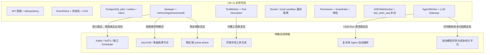

# Lite v1 MVP 范围与取舍

> 本文档定义 Cloud Agent **平台** v1 的交付边界。简单说：当 v0 已经证明用户愿意每天用之后，我们再把哪些平台能力补齐，哪些继续先不碰。路线图见 [roadmap.md](./roadmap.md)，部署容量见 [capacity-and-scaling.md](./capacity-and-scaling.md)。
>
> **注意：这不是第一个要实现的版本。** 第一个版本看 [v0-product-slice.md](./v0-product-slice.md)：目标是让一个真实用户连续跑通 14 天 daily loop。本文描述的是 v0 验证产品价值之后，再按信号补齐的平台形态。

## v1 目标

Lite v1 的目标是交付一个“小规模也能认真运行”的 Cloud Agent 平台：任务不会乱重跑，崩溃后能恢复，出了问题能追查，危险动作有边界。

更具体地说，v1 要能回答：

- 用户提交任务后，系统如何受理、排队、执行和完成。
- Worker 崩溃、消息重复、工具超时、用户取消时，状态如何收敛。
- LLM 提议工具调用时，平台如何检查权限、schema、预算和安全策略。
- Runtime 修改 workspace 或访问外部系统时，如何隔离租户、限制网络和处理 secret。
- 运维如何知道系统卡在哪里、如何修复、修复是否留下审计。

v1 不追求“大规模、多区域、任意复杂编排”。先把一条任务链路做稳：能开始、能暂停、能失败、能恢复、能审计。这个基础不稳，越高级的基础设施只会把问题放大。

## v1 范围图

## v1 必须做

| 能力 | v1 做到什么程度 | 为什么必须现在做 |
| --- | --- | --- |
| 请求受理 | `POST /runs` 支持 idempotency key，提交后返回 `run_id` | 防止 API 成功但响应丢失后重复创建 run |
| EventStore | events、run/tool_call 当前状态、outbox、inbox、attempt、effect ledger、audit 放在 PostgreSQL | 需要一个统一事实源和事务边界 |
| 状态机 | Run、ToolCall、Command 有合法转换表和终态规则 | 防止取消后续跑、失败后改成功、旧 Worker 覆盖新状态 |
| CAS 版本 | Run 用 `run_version`，ToolCall 用 `tool_call_version` | 同一 run 内并行操作需要可解释的冲突规则 |
| Command 投递 | PostgreSQL jobs + `SKIP LOCKED`，至少一次投递，inbox 去重 | 简单可落地，不提前引入消息队列复杂度 |
| Worker attempt | attempt 有 lease、heartbeat、fence、timeout 和 retry policy | Worker 崩溃和旧 attempt 是常态，不是罕见异常 |
| LLM Gateway | 统一 provider adapter、逻辑模型名、基本限流、token/cost 记录 | 未来换模型或 provider 时不改 Agent 状态机 |
| Tool Descriptor | 工具有 schema、权限、secret 需求、副作用能力、版本 | 模型调用工具前，平台必须能判断能不能执行 |
| Runtime 基线 | Docker 或本地隔离池，限制文件、网络、资源和 workspace lease | 工具执行接触用户文件和外部系统，不能和 Control Plane 混跑 |
| Guardrails | 输入、工具调用、工具输出、最终输出都有检查点；失败保守处理 | prompt injection 和工具越权不能只靠系统提示词 |
| 人工审批 | 高风险工具进入 `waiting_approval`，审批超时可恢复 | 删除、部署、外发、付费调用等动作需要人类确认 |
| Realtime | after-commit 推送，客户端用 `last_seen_seq` 补拉 | 实时通道可能断线，不能当事实源 |
| Sweeper | deadline、approval timeout、unknown 对账、quota 回收、旧 attempt 清理、runtime cleanup | 没有新事件触发时，系统也要能自己收敛 |
| Observability | 结构化日志、低基数指标、trace、audit、关键 SLO | 运维必须知道任务卡在队列、LLM、工具、runtime 还是事件写入 |
| Repair API | 取消、redrive、unknown 裁定、终态修复都走受控命令 | 避免运维直接改库破坏不变量 |
| 数据删除 | 删除主体数据时失效 memory、snapshot、search index、artifact 派生物 | 多租户系统不能把派生数据忘在角落里 |

## v1 可以简化

| 关注点 | v1 简化方式 | 保留的未来扩展点 |
| --- | --- | --- |
| 服务拆分 | Control Plane 做模块化单体 | 模块边界按 EventService、Permission、Scheduler、Sweeper 划清 |
| 队列 | PostgreSQL jobs | Command 语义独立，未来可换 Redis Streams、Kafka 或 NATS |
| Runtime | Docker/local pool | RuntimeManager 接口保留 trust tier 和 session 生命周期 |
| Memory | PostgreSQL 表或轻量向量索引 | `memory_document_id` 和 embedding version 进入 manifest |
| Guardrail 分类器 | 规则 + 轻量模型 + 策略表 | 事件记录 guardrail 决策，未来可替换模型 |
| 多 Agent | 只支持基础 Child Run，或先不开放复杂模式 | Run 状态机保留 `waiting_child` 和 budget/depth 字段 |
| Realtime | SSE 优先，WebSocket 可选 | 协议统一使用 `seq` cursor 和补拉 |
| Admin | 简单内部控制台 | 写操作全部经 Repair Command API |

简化不等于“先随便写”。比如队列可以先用 PostgreSQL，但哪些任务可能重复、怎么去重、超时后怎么办、重试几次、积压时怎么限流，都必须说清楚。

## v1 明确不做

| 暂不做 | 原因 | 触发演进的信号 |
| --- | --- | --- |
| 通用 exactly-once | 分布式系统里成本高且仍不能覆盖外部副作用 | 下游支持幂等键时提供 effectively-once 效果；否则对账 |
| 跨区域 active-active | 会显著放大事件顺序、租户隔离、冲突合并和 secret 管理复杂度 | 单区域 SLO、备份恢复和 `store_epoch` 演练稳定后再讨论 |
| Kafka/NATS 作为首版必需依赖 | PostgreSQL jobs 足够表达 v1 语义，少一个系统少一类故障 | DB 队列成为明确瓶颈，且替换实现能满足现有语义契约 |
| microVM 作为唯一 runtime | 安全更强，但运维成本更高，不适合在语义未稳定前强绑 | 有不可信代码高风险需求或 Docker 隔离无法满足合规 |
| 完整工具市场 | 工具生态需要审核、版本、签名、计费和租户策略 | 平台内置工具稳定后，再开放租户自定义和市场工具 |
| 自动任意深度多 Agent 自治 | 预算、权限、递归、workspace 合并都容易失控 | Child Run 原语稳定，有真实复杂协作需求 |
| 自动根因分析和复杂告警编排 | 容易高噪声，初期更需要简单可懂的 SLO 和 runbook | 基础指标稳定，有足够事故数据后再自动化 |
| token delta 全量持久化 | 写放大高，通常不值得 | 有审计或回放产品需求时再按采样或分层存储设计 |
| 任意外部网络访问 | 安全和成本风险高 | 通过 egress allowlist、broker 和审批逐步开放 |
| 模型自动成本优化平台 | 早期样本少，过早自动化会掩盖质量问题 | 有稳定评测集和成本归因后再做 |

## v1 Definition of Done

v1 不是“能跑一个 demo”。下面条件满足后，才算具备可交付的 Cloud Agent 基线：

- Happy path：用户能创建 run，看到实时状态，Agent 能调用 LLM 和至少一个工具，最终完成。
- Idempotency：API 成功后响应丢失，重试不会创建第二个 run。
- Worker crash：AgentWorker 或 ToolWorker 在关键点崩溃后，系统不会重复推进终态。
- Duplicate command：同一 command 投递两次，inbox 和版本检查生效。
- Tool unknown：外部副作用结果未知时进入对账或人工裁定，不盲目重试。
- Cancel race：用户取消和工具完成同时发生时，Run 不会被错误唤醒。
- Realtime reconnect：客户端断线后能用 `last_seen_seq` 补齐事件。
- Guardrail fail closed：安全检查超时或策略缺失时，不默认执行危险工具。
- Tenant boundary：跨租户数据、secret、workspace、memory 和 runtime session 不能互相访问。
- Observability：每个 run 能从 API request 追到 command、attempt、LLM attempt、tool call 和 runtime session。
- Sweeper：deadline、approval timeout、lease timeout、quota reservation 和 runtime cleanup 有测试覆盖。
- Repair audit：人工修复和 DLQ redrive 留下可追踪事件和审批记录。
- Backup restore：按时间点恢复后 `store_epoch` 能拒绝旧 command。

## 演进原则

只有在“语义已稳定、瓶颈可度量、替换收益明确”时才升级基础设施。

| 如果遇到 | 先做 | 再考虑 |
| --- | --- | --- |
| 队列延迟高 | 看 DB job 索引、job age、worker slots、租户公平 | 独立 Scheduler、Redis Streams、Kafka、NATS |
| runtime 冷启动慢 | 预热池、镜像缓存、session TTL、资源配额 | K8s runtime pool、microVM、隔离节点 |
| 单 conversation 变热点 | 减少事件写入、合并 token、拆分产品交互 | 更复杂的事件分区或 shard |
| LLM 成本失控 | 预算准入、模型别名、token/cost 归因、fallback 策略 | 自动路由和评测驱动优化 |
| 安全告警多 | 明确策略、减少误报、补审批材料和审计 | 专用安全模型或自动化响应 |
| 运维修复频繁 | 找状态机或 Worker 合约漏洞，补故障测试 | 更强自动 repair 或复杂 runbook |

v1 的核心标准是：简单，但每个失败点都有明确归宿。系统可以慢，可以拒绝危险动作，可以需要人工裁定；但不能悄悄重复副作用、越权执行、丢失事实或让状态无限卡住。
