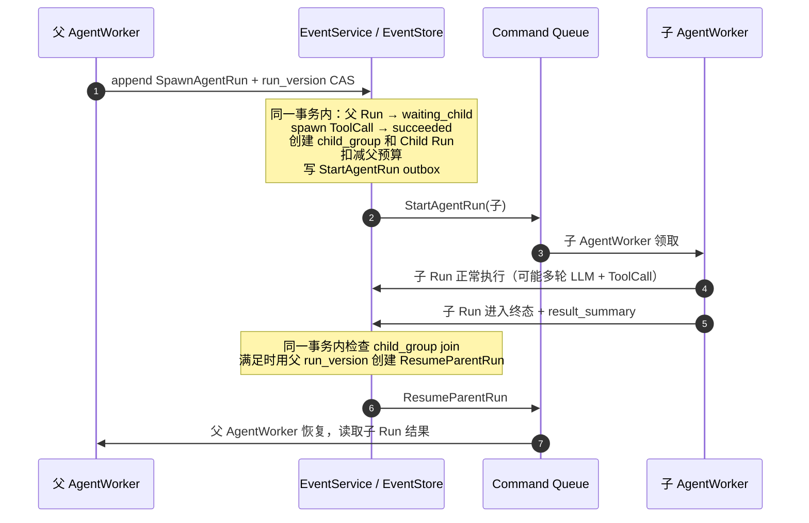
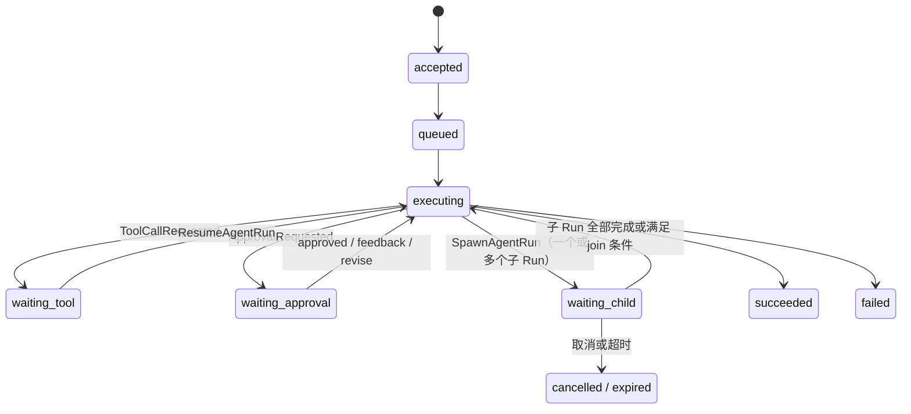
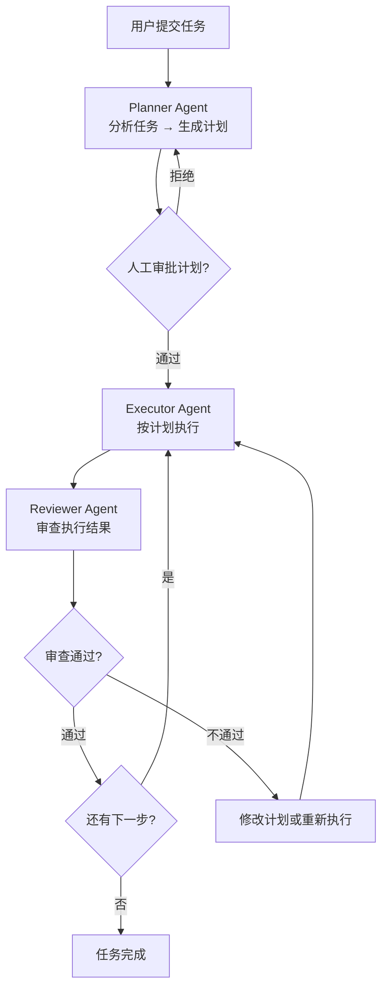

# Agent 编排模式

> 定位：进阶能力专题。本文档解释多个 Agent 怎么协作。核心做法不是引入另一套工作流系统，而是在现有 Run 之上增加 Child Run：父 Run 派出子 Run，等待结果，再继续推进。单 Run 生命周期见 [state-machines.md](./state-machines.md)，Worker 执行与并行 join 见 [execution-model.md](./execution-model.md)。

## 问题、决策与风险

**问题**：现实任务往往超出单个 Agent Run 的能力范围。一个"帮我重构这个模块"的请求，可能需要先分析代码结构、再制定方案、再执行修改、最后审查结果。这些步骤可能需要不同的专长（规划、编码、审查）、不同的工具集、不同的模型，甚至需要人在中间多次介入。如果把所有逻辑塞进一个 Run 的无限循环里，上下文会爆炸、错误会扩散、人无法在关键节点介入。

**决策**：在现有 Run 原语之上引入 **Child Run**（子 Run）作为多 Agent 编排的基本单元。父 Run 可以发起子 Run，子 Run 独立执行、独立有状态机和 CAS 版本，完成后结果回传父 Run。所有编排模式——委派、监督、DAG 工作流、人机协作——都建立在 Run 之间的父子关系上，复用现有的 EventStore、状态机、CAS 和调度机制。

本文把 `waiting_child` 视为核心 Run 状态机的正式扩展，状态口径以 [state-machines.md](./state-machines.md) 为准。Child Run、child group join、取消传播、预算划拨、权限不升级和结果审查都是生产基线语义。

**为什么不引入独立的"工作流引擎"**：独立引擎意味着一套新的状态管理、新的持久化、新的并发控制和新的恢复语义。Lites 已经有 EventStore、CAS、outbox/inbox、Sweeper 和 Repair API。编排应该是这些原语的组合，不是一套平行系统。

**忽略后果**：没有编排原语，用户会在应用层自己拼——用多次 API 调用串联 Run，在客户端维护状态，自己处理失败和重试。这会导致状态散落在客户端和服务端之间，崩溃后无法恢复，取消和超时无法传播。

| 应该 | 不应该 |
| --- | --- |
| 用 Child Run 表达 Agent 间的委派和协作 | 在一个 Run 里用无限循环模拟多步工作流 |
| 通过 EventStore 传递 Run 间的输入输出 | 让 Agent 通过外部 API 互相调用 |
| 用父 Run 的取消传播到所有子 Run | 只取消父 Run，子 Run 继续跑 |
| 在编排层控制步骤数和成本上限 | 让每个子 Run 各自管预算，总成本失控 |
| 编排模式用声明式描述，执行用现有 Worker | 为每种编排模式写专用 Worker |

## 先用白话说

可以把父 Run 理解成一个项目经理，Child Run 是它派出去的小任务。父 Run 不需要把所有事都塞进自己的上下文窗口，而是把明确的小任务交给更合适的子 Agent。

- 父 Run 负责拆任务、分预算、限制权限、等待结果。
- 子 Run 负责独立完成某个明确的小任务，比如“审查这段代码”或“分析这个模块”。
- 子 Run 不能拿到比父 Run 更多的工具、secret、网络出口或 workspace 权限。
- 子 Run 完成后，只把结果和必要引用交回父 Run，父 Run 再决定下一步。
- 如果父 Run 被取消、超时或预算用完，所有还在跑的子 Run 都要一起停下来。
- 整个过程仍然只靠 EventStore、Run 状态机、outbox/inbox 和 Worker，不引入另一套工作流系统。

## 核心概念

### Child Run

Child Run 是编排的原子单元。它和普通 Run 共享完全相同的状态机（`accepted → queued → executing → ...`），区别在于：

- 它有一个 `parent_run_id`，指向发起它的父 Run。
- 它有一个 `spawn_tool_call_id`，关联到父 Run 中创建它的那次"发起子任务"操作。
- 它的结果会作为父 Run 的输入，触发父 Run 从 `waiting_child` 状态恢复。
- 父 Run 的取消、超时和预算会传播到子 Run。

```text
child_run_fields（在 Run 基础上新增）
- parent_run_id?              # 父 Run id，顶层 Run 为空
- root_run_id                 # 整棵编排树的根 Run id
- spawn_tool_call_id?         # 父 Run 中发起此子 Run 的 ToolCall id
- depth                       # 在编排树中的深度，根 Run = 0
- inherited_budget            # 从父 Run 分配的预算份额
- result_summary?             # 子 Run 完成后写入的结果摘要，供父 Run 使用
```

### 发起子 Run 的流程

父 Agent 通过一个平台内置工具 `spawn_agent_run` 来发起子 Run。这个工具和普通工具一样经过 schema 校验、权限检查和 guardrail 评估，区别在于它的 handler 不在 sandbox 里跑代码，也不先排队给 ToolWorker 再创建子 Run。它是 **inline platform tool**：EventService 在同一事务里创建一条已成功的 ToolCall 记录，并创建子 Run。

关键规则：父 Run 进入 `waiting_child`、创建 `child_group`、创建 `spawn_tool_call_id` 对应的 ToolCall（直接 `succeeded`）、创建 Child Run、分配预算、写入 `StartAgentRun` outbox，必须由 EventService 在同一个数据库事务中提交。不能先让父 Run 等待，再异步去创建子 Run；否则中间崩溃会留下一个永远等不到结果的父 Run。

`spawn_agent_run` 的 ToolCall 生命周期使用 [state-machines.md](./state-machines.md) 中的 `InlinePlatformToolCommitted` 转换：

- 不产生 `ExecuteToolCall` command，也不经过 ToolWorker claim。
- `tool_call_version` 初始化为 1，`status = succeeded`，`result_event_id` 指向 `ChildRunSpawned` / `ToolCallSucceeded` 事件。
- 如果父 Run 的 `run_version` CAS 失败，整笔事务失败；不能留下 child Run 或预算划拨。

```text
spawn_agent_run 工具的 input_schema
- task_description              # 子任务的自然语言描述
- agent_profile?                # 期望的 Agent 角色（如 "code_reviewer"）
- model_ref?                    # 期望的模型（如 "reasoning-high"），不指定则继承父 Run
- tool_set_filter?              # 子 Run 可用的工具子集，不能超出父 Run 的工具集
- workspace_access?             # read | read_write，不能超出父 Run 的权限
- budget                        # 子 Run 的 token/cost 上限，从父 Run 预算扣除
- context_passing               # 传递给子 Run 的上下文
    - parent_messages_range?    # 父 Run 对话中需要传递的 seq 区间
    - explicit_context?         # 父 Agent 组织的结构化上下文
    - include_workspace_state?  # 是否传递当前 workspace 状态
- result_instruction?           # 告诉子 Agent 如何组织返回结果
```



### Run 状态机扩展

如 [state-machines.md](./state-machines.md) 所示，Run 状态机包含 `waiting_child` 状态。它和 `waiting_tool` 语义类似：父 Run 暂停执行，等待子 Run 完成后恢复。



`waiting_child` 与 `waiting_tool` 的关键区别：

| 维度 | `waiting_tool` | `waiting_child` |
| --- | --- | --- |
| 等待对象 | ToolCall（通常秒级到分钟级） | 子 Run（可能分钟级到小时级） |
| 完成判定 | ToolWorker 写入结果 + parallel_group join | 子 Run 进入终态 + child_group join |
| 取消传播 | 终止 sandbox session | 对子 Run 递归发出 cancel_requested |
| 预算控制 | 工具配额 | 从父 Run 预算中划拨 |

### Child Group 与 Join

多个子 Run 的汇合复用 `parallel_group` 的 join 机制（见 [execution-model.md](./execution-model.md)），只是 group 成员从 ToolCall 变成了 Child Run。

```text
child_group（复用 parallel_group 结构）
- run_id                        # 父 Run id
- group_id                      # 这批子 Run 的组 id
- join_policy: all | any | quorum
- quorum_count?
- required_child_run_ids[]
- optional_child_run_ids[]
- continuation_kind: resume
```

join 判定规则与 ToolCall 一致：子 Run 进入终态时，在同一事务中锁定 `child_group` 行，检查是否满足继续条件或失败收敛条件，满足则用 `run_version` CAS 将父 Run 从 `waiting_child` 推进到 `executing`。父 Run 恢复后再由 Agent 判断是继续、重试、降级还是报错。

| 规则 | 什么时候可以继续 | 继续后剩余子 Run 怎么办 |
| --- | --- | --- |
| `all` | 所有 required 子 Run 都进入终态 | 没有剩余 required；optional 子 Run 可取消或标记迟到 |
| `any` | 任一 required 子 Run 成功 | 取消其余未终态子 Run；已完成但来晚的结果只记事实 |
| `quorum` | 成功的 required 子 Run 数达到 `quorum_count` | 取消不再需要的未终态子 Run；迟到结果不再次唤醒父 Run |

提前满足 `any` 或 `quorum` 后，父 Run 已经可以继续。剩余子 Run 默认收到取消传播，避免继续消耗预算或并发写 workspace。若某个子 Run 已经越过外部副作用边界，取消不能抹掉已经发生的事，仍按 effect ledger 对账；它之后写回的结果只能作为迟到事实保存，不能第二次恢复父 Run。

如果所有 required 子 Run 都进入终态但没有满足 `any` 或 `quorum`，父 Run 仍会恢复一次，让父 Agent 根据失败结果决定报错、降级、重试或请求人工帮助。

### 取消传播

取消必须从根向叶递归传播：

1. 对父 Run 发起取消，设置 `cancel_requested`。
2. EventService 查找该 Run 的所有非终态子 Run，对每个子 Run 也设置 `cancel_requested` 并发出中断命令。
3. 子 Run 如果也有子 Run，继续递归。
4. 每个子 Run 的 AgentWorker / ToolWorker 通过 heartbeat 看到 `cancel_requested` 后协作式中止。
5. 所有子 Run 收敛到终态后，父 Run 的 child_group join 要么因 `cancel_requested` 跳过续跑，要么因子 Run 终态满足 join 后续跑时发现父 Run 已取消。

超时传播规则相同：父 Run 的 `due_at` 是整棵编排树的最终期限。子 Run 的 `due_at` 取 `min(自身期限, 父 Run 剩余时间)`。

### 预算传播

```text
budget_allocation
- root_budget                   # 根 Run 的总预算（token + cost）
- parent_remaining              # 父 Run 当前剩余
- child_allocation              # 分配给子 Run 的份额
- child_remaining               # 子 Run 实际剩余

规则：
- child_allocation 从 parent_remaining 中扣除
- 子 Run 完成后，未用完的 child_remaining 回收到 parent_remaining
- 子 Run 不能超出 child_allocation，即使父 Run 还有余额
- 预算回收由子 Run 终态事件触发，在同一事务中完成
- Sweeper 回收泄漏的预算（子 Run 超时但预算未释放）
```

### 深度限制

编排树有最大深度限制（建议默认 `max_depth = 5`），防止 Agent 无限递归发起子任务。`spawn_agent_run` 工具在 guardrail 检查时验证 `depth + 1 <= max_depth`，超出则拒绝。

---

## 编排模式

以下模式都建立在 Child Run 原语之上。平台不强制使用某种模式——每种模式只是 `spawn_agent_run` 的不同用法。开发者通过 Agent Profile 和 Prompt 配置来实现模式，平台负责执行、持久化和恢复。

### 模式一：委派（Delegation）

最简单的编排：父 Agent 把一个子任务交给专门的子 Agent，等结果回来后继续。

```text
用户: "帮我分析这个 PR 的性能影响"

┌─ 主 Agent (通用助手) ─────────────────────────┐
│  1. 理解用户意图                                 │
│  2. spawn_agent_run(                           │
│       task: "分析 PR #42 的性能影响",             │
│       agent_profile: "perf_analyst",           │
│       tool_set_filter: ["git_diff", "profiler"]│
│     )                                          │
│  3. 等待子 Run 完成                              │
│  4. 读取子 Run 的 result_summary                 │
│  5. 组织回复给用户                                │
└────────────────────────────────────────────────┘
         │
         ▼
┌─ 性能分析 Agent ──────────────────────────────┐
│  独立 Run，独立 tool_set_snapshot               │
│  1. 用 git_diff 获取变更                        │
│  2. 用 profiler 跑基准测试                       │
│  3. 输出分析报告作为 result_summary              │
└────────────────────────────────────────────────┘
```

**适用场景**：任务边界清晰、子任务可以独立完成、不需要和父 Agent 来回沟通。

**关键约束**：子 Agent 的工具集不能超出父 Agent 的权限；子 Agent 不知道父 Agent 的完整对话历史，只看到传递给它的上下文。

### 模式二：监督（Supervisor）

父 Agent 不只是等结果，还会审查子 Agent 的输出，决定接受、要求修改或放弃。

```text
┌─ 监督 Agent ──────────────────────────────────────┐
│  loop (max_iterations):                            │
│    1. spawn_agent_run(                             │
│         task: "按方案修改 auth 模块",                 │
│         context: { plan: ..., feedback: ... }      │
│       )                                            │
│    2. 等待子 Run 完成                                │
│    3. 审查子 Run 的 result_summary 和 workspace diff │
│    4. if 满意 → 接受，结束循环                        │
│       if 不满意 → 组织反馈，回到步骤 1                 │
│       if 超过最大次数 → 失败或交给人工                  │
└────────────────────────────────────────────────────┘
```

这里的"循环"不是 while(true)。每次迭代都是一个新的子 Run，父 Agent 在每次子 Run 完成后做一次 LLM 调用来评审，然后决定下一步。迭代次数受 `max_iterations`（步骤限制）和预算双重约束。

**适用场景**：代码修改需要审查、生成内容需要质量把关、复杂推理需要验证。

**与 ToolCall 重试的区别**：ToolCall 重试是同一个操作因技术原因失败后重做。监督循环是父 Agent 对子 Agent 输出做语义级判断后决定是否要求重做，每次给出不同的反馈。

### 模式三：分治并行（Fan-out / Fan-in）

父 Agent 把任务分解成多个独立子任务，并行发给多个子 Agent，汇合后综合结果。

```text
┌─ 协调 Agent ─────────────────────────────────────────┐
│  1. 分析任务，拆成 N 个子任务                             │
│  2. 一次发起多个 spawn_agent_run (形成 child_group)      │
│     ┌──────────┐  ┌──────────┐  ┌──────────┐         │
│     │ 子 Run A  │  │ 子 Run B  │  │ 子 Run C  │         │
│     │ 分析前端   │  │ 分析后端   │  │ 分析数据库  │         │
│     └────┬─────┘  └────┬─────┘  └────┬─────┘         │
│          │             │             │                │
│          └─────────────┼─────────────┘                │
│                        ▼                              │
│  3. child_group join (policy: all)                    │
│  4. 读取所有子 Run 的 result_summary                    │
│  5. 综合分析，输出最终报告                                │
└──────────────────────────────────────────────────────┘
```

**join 策略选择**：

| 策略 | 场景 | 举例 |
| --- | --- | --- |
| `all` | 所有子任务的结果都需要 | 多模块代码审查，每个模块都要看完 |
| `any` | 只要一个子任务成功就够 | 用多种方法尝试修复 bug，第一个成功的就采用 |
| `quorum` | 多数一致即可 | 用多个 Agent 独立回答同一个问题，取多数一致结果 |

**与 parallel ToolCall 的关系**：如果子任务只是"调用一个工具"，用并行 ToolCall 就够了。当子任务需要多轮 LLM 思考、需要不同工具集、需要独立上下文或需要不同模型时，才需要子 Run。

### 模式四：流水线（Pipeline）

多个 Agent 按顺序执行，前一个的输出是后一个的输入。和监督不同，这里每个阶段做不同的事，不是反复修改同一件事。

```text
用户: "帮我把这个 Python 脚本重构成一个 CLI 工具"

阶段 1: 分析 Agent
  → 输出: 代码结构分析、依赖关系、公共接口清单

阶段 2: 设计 Agent
  → 输入: 阶段 1 的分析结果
  → 输出: CLI 接口设计、模块划分方案

阶段 3: 实现 Agent
  → 输入: 阶段 2 的设计方案 + 原始代码
  → 输出: 重构后的代码 (workspace 修改)

阶段 4: 审查 Agent
  → 输入: 阶段 3 的 workspace diff
  → 输出: 审查意见、问题清单
```

流水线通过父 Agent 串联实现：父 Agent 依次 `spawn_agent_run`，每次把上一个子 Run 的 `result_summary` 作为下一个子 Run 的 `explicit_context` 传入。

```text
┌─ Pipeline Agent ──────────────────────────────┐
│  for stage in stages:                          │
│    result = spawn_agent_run(                   │
│      task: stage.task,                         │
│      agent_profile: stage.profile,             │
│      context: { previous_result: last_result } │
│    )                                           │
│    last_result = result.result_summary         │
│                                                │
│    // 阶段间检查点：可选人工审批                    │
│    if stage.requires_checkpoint:               │
│      request_approval(stage_result_summary)    │
│  end                                           │
└────────────────────────────────────────────────┘
```

**适用场景**：明确的多阶段流程、每个阶段的输入输出格式可定义、前置阶段完成后才能开始下一阶段。

### 模式五：层级式 Agent（Planner → Executor → Reviewer）

这是委派、监督和流水线的组合，专门用于复杂的、需要规划和验证的任务。

```text
┌─ Planner Agent ──────────────────────────────────────┐
│  1. 分析任务，生成执行计划                                 │
│     plan = { steps: [...], success_criteria: [...] }  │
│                                                       │
│  2. 提交计划给用户审批（可选）                               │
│     → waiting_approval                                │
│                                                       │
│  3. 审批通过后，逐步或并行发起 Executor                     │
│     for step in plan.steps:                           │
│       spawn_agent_run(                                │
│         agent_profile: "executor",                    │
│         task: step.description,                       │
│         tool_set_filter: step.required_tools          │
│       )                                               │
│                                                       │
│  4. 每个 Executor 完成后，发起 Reviewer                   │
│     spawn_agent_run(                                  │
│       agent_profile: "reviewer",                      │
│       task: "审查步骤执行结果",                            │
│       context: {                                      │
│         plan: step,                                   │
│         execution_result: executor.result_summary,    │
│         workspace_diff: ...                           │
│       }                                               │
│     )                                                 │
│                                                       │
│  5. Reviewer 通过 → 继续下一步                            │
│     Reviewer 不通过 → 重新执行或修改计划                    │
│     超过重试限制 → 失败或升级人工                            │
└──────────────────────────────────────────────────────┘
```



**与简单委派的区别**：Planner 不只是分配任务，它维护一份可变的执行计划。每次 Executor/Reviewer 完成后，Planner 可以根据结果调整后续计划。这种"边做边调整"的能力是层级编排的核心价值。

---

## Workspace 共享与隔离

多个子 Run 需要读写同一个 workspace 时，必须遵守 [runtime-and-sandbox.md](./runtime-and-sandbox.md) 定义的单写者语义。编排层不能绕过这个约束。

### 并行子 Run 的 Workspace 策略

| 策略 | 做法 | 适用场景 |
| --- | --- | --- |
| 串行写 | 子 Run 按顺序执行，前一个释放写租约后下一个才获取 | 流水线、有顺序依赖的步骤 |
| 分区写 | 每个子 Run 只写 workspace 的特定子目录，互不重叠 | 多模块并行修改，各改各的目录 |
| Copy-on-Write | 每个子 Run 在 workspace 的独立分支上工作，最后由父 Run 合并 | 并行修改可能冲突的文件 |
| 只读 | 子 Run 只读 workspace，结果通过 result_summary 返回 | 分析、审查、检索任务 |

平台在 `spawn_agent_run` 时根据 `workspace_access` 参数分配策略。如果多个并行子 Run 都请求 `read_write` 且未指定分区规则，平台应拒绝或降级为串行执行。

### Workspace 合并

Copy-on-Write 模式下，父 Run 恢复后需要合并多个分支：

```text
workspace_merge
- 自动合并：无冲突的文件修改直接合并
- 冲突检测：同一文件被多个子 Run 修改时标记冲突
- 冲突处理：
    - 由父 Agent 用 LLM 尝试解决
    - 或交给人工审批
    - 或 spawn 一个专门的 merge Agent
```

---

## 复杂 Human-in-the-Loop 模式

`waiting_approval` 是“Run 暂停等待可信人类输入”的状态，不只表示危险工具的 yes/no。不同 approval kind 支持不同决策集合：普通危险工具审批只支持 approve / reject；阶段检查点可以支持 approve / approve_with_feedback / revise / abort。

### 阶段检查点（Stage Checkpoint）

在流水线或层级编排中，每个阶段完成后暂停，等人工确认后再继续。

```text
checkpoint_request
- checkpoint_id
- run_id                          # 当前 Run（通常是编排父 Run）
- stage_name                      # "设计方案已完成"
- stage_result_summary            # 阶段产出的脱敏展示摘要
- stage_result_payload_ref?       # 完整阶段结果；可能含敏感内容时必须使用
- workspace_diff_summary?         # 如果有 workspace 修改，给审批人看的脱敏摘要
- workspace_diff_ref?             # 完整 diff / patch / artifact 引用
- artifacts[]                     # 阶段产出的制品
- next_stage_preview              # 下一阶段要做什么
- checkpoint_kind                 # safety_approval | product_review | progress_notice
- options                         # 审批选项
    - approve                     # 继续下一阶段
    - approve_with_feedback       # 继续，但带上修改意见
    - revise                      # 回到当前阶段，带上修改要求
    - abort                       # 终止整个编排
- timeout_policy                  # reject | cancel | escalate | continue_if_non_security
- expires_at
```

和单次审批的区别：

- 审批人可以选择"继续但带反馈"——不是简单的 yes/no，而是把意见传给下一阶段。
- 审批人可以选择"回退重做"——当前阶段重新执行，带上新的要求。
- 审批界面不只展示"要不要执行这个工具"，而是展示阶段性成果和下一步计划。
- 检查点材料遵守 payload envelope：摘要可以给 UI 展示，完整阶段结果和 diff 用 `payload_ref` / artifact ref；打开原文时重新做 ACL、DLP 和 guardrail 检查。
- `checkpoint_kind = safety_approval` 或涉及工具副作用、secret、外部请求、workspace 写入时，timeout policy 只能是 `reject`、`cancel` 或 `escalate`，不能自动继续。

决策映射：

| 决策 | Run 转换 | 语义 |
| --- | --- | --- |
| `approve` | `waiting_approval -> executing` | 继续下一阶段 |
| `approve_with_feedback` | `waiting_approval -> executing` | 继续下一阶段，feedback 进入下一次 LLM 上下文 |
| `revise` | `waiting_approval -> executing` | 回到当前阶段重做，revision 要求进入上下文；不表示拒绝整个 Run |
| `abort` | `waiting_approval -> cancelled` | 终止整个编排 |

### 协作编辑（Collaborative Editing）

人和 Agent 交替编辑同一份内容。Agent 生成草稿，人修改，Agent 根据修改继续。

```text
┌─ 编排 Agent ──────────────────────────────────┐
│  1. spawn 写作 Agent → 生成初稿                 │
│  2. 进入 waiting_approval，展示初稿给用户         │
│  3. 用户编辑初稿（workspace 修改）               │
│  4. 用户点击"继续"，带上编辑后的版本               │
│  5. spawn 写作 Agent → 基于用户编辑继续完善        │
│  6. 重复直到用户满意                             │
└────────────────────────────────────────────────┘
```

这个模式的关键是 `approve_with_feedback` 中的 feedback 可以是结构化的——不只是一段文字，还可以是 workspace 的修改记录。父 Run 恢复后，把用户的修改作为上下文传给下一个子 Run。

### 多角色审批

某些操作需要多个不同角色的人审批，或需要人工专家介入特定步骤。

```text
multi_approval_policy
- policy_id
- required_approvals[]
    - role: "tech_lead"
      scope: "代码修改"
    - role: "security_reviewer"
      scope: "权限变更"
    - role: "product_owner"
      scope: "用户可见变更"
- approval_order: parallel | sequential
- expires_at
- escalation_after                # 超时后升级到谁
```

多角色审批复用现有的 `ApprovalRequested` / `ApprovalGranted` 事件，但审批完成条件从"一个人批准"变成"满足 policy 中定义的所有角色都批准"。判定逻辑类似 child_group join：每个审批事件写入后检查是否满足 policy，满足则推进 Run。

### 人工接管（Human Takeover）

当 Agent 遇到无法处理的情况时，可以把整个任务交给人。

```text
escalation_request
- run_id
- reason: confidence_low | repeated_failure | safety_concern | out_of_scope
- context_summary                 # Agent 到目前为止做了什么；脱敏展示摘要
- context_payload_ref?            # 完整上下文引用，可能含用户内容、工具输出或模型正文
- workspace_state                 # 当前 workspace 状态
- suggested_next_steps?           # Agent 的建议（可选）
```

人工接管后，Run 进入一种特殊的 `waiting_approval` 状态。人类操作者可以：

- 申请 workspace 写 lease，提交人工修改；系统产出 `base_workspace_revision`、`result_workspace_revision`、`file_change_manifest`、`git_diff_hash` 和 artifact refs，并通过 EventService 写入 `HumanWorkspaceChangeApplied` / `WorkspaceRevisionCommitted` 后，才能标记 Run 完成。
- 给出指导意见，让 Agent 用新的上下文继续；feedback 必须经过 schema / DLP / trust label 检查，并以 `ApprovalGrantedWithFeedback` 恢复 Run。
- 取消 Run。

人工接管不能绕过 Runtime / Workspace 的单写者语义，也不能由管理员或客户端直接改库标记成功。若人工修改需要外部副作用、secret 或网络出口，仍按普通工具审批、effect ledger 和审计规则处理。

---

## Agent Profile

Agent Profile 是对"一种 Agent 角色"的声明式描述。它不是代码，而是配置，定义 Agent 的行为边界。

```text
agent_profile
- profile_id                      # 例如 "code_reviewer"、"planner"、"executor"
- display_name
- system_prompt_template          # 该角色的 system prompt 模板
- model_ref                       # 默认使用的模型
- tool_set_policy                 # 可用工具的白名单或黑名单
- workspace_access                # 默认 workspace 权限
- max_steps                       # 单次 Run 的最大步骤数
- max_child_depth                 # 该角色最多再往下发起几层子 Run
- can_spawn_children: bool        # 是否允许发起子 Run
- approval_policy                 # 该角色的审批策略
- budget_policy                   # 预算限制
```

Agent Profile 的来源和 Tool 类似（见 [tool-system.md](./tool-system.md)）：

- **平台内置**：`planner`、`executor`、`reviewer`、`general_assistant`。
- **租户自定义**：租户通过管理 API 创建，绑定自定义 system prompt 和工具策略。
- **版本管理**：Profile 变更通过 append-only snapshot 管理，Run 创建时锁定 `profile_snapshot_id` 和 `profile_hash`。历史 Run 不能只引用可变的当前 profile 记录；被引用的 system prompt、tool policy、model、workspace 权限、预算和审批策略必须可回溯校验。

---

## 编排与 EventStore 的关系

所有编排状态都持久化在 EventStore 中，不引入独立存储。

### 新增事件类型

| 事件 | 时机 | 关键字段 |
| --- | --- | --- |
| `ChildRunSpawned` | 父 Run 创建子 Run | `parent_run_id`, `child_run_id`, `spawn_tool_call_id`, `agent_profile`, `budget` |
| `ChildRunCompleted` | 子 Run 进入终态 | `child_run_id`, `terminal_status`, `result_summary`, `result_payload_ref?`, `payload_hmac` |
| `ChildGroupJoined` | 子 Run 组满足 join 条件 | `group_id`, `join_policy`, `completed_children[]` |
| `BudgetTransferred` | 预算从父到子或回收 | `from_run_id`, `to_run_id`, `amount`, `direction` |
| `CheckpointRequested` | 阶段检查点等待人工 | `checkpoint_id`, `stage_name`, `options` |
| `CheckpointResolved` | 人工完成检查点 | `checkpoint_id`, `decision`, `feedback?` |
| `EscalationRequested` | Agent 请求人工接管 | `run_id`, `reason`, `context_summary`, `context_payload_ref?` |

### 查询编排树

```text
get_orchestration_tree(root_run_id)
→ 返回：
  {
    run_id, status, depth, agent_profile,
    children: [
      { run_id, status, depth, agent_profile, children: [...] }
    ]
  }
```

这是一个只读投影，由 EventStore 中的 `parent_run_id` 关系构建。用于运维界面、调试和审计。

### Context Manifest 扩展

编排场景下的 `context_manifest` 需要额外记录：

```text
context_manifest.orchestration
- parent_run_id?
- root_run_id
- depth
- agent_profile_snapshot_id + agent_profile_hash
- inherited_context_refs[]            # 从父 Run 传入的上下文引用
- sibling_results[]                   # 兄弟 Run 的结果引用（并行场景）
```

---

## 安全与 Guardrails

编排引入了新的攻击面。除了 [agent-safety-and-guardrails.md](./agent-safety-and-guardrails.md) 定义的规则外，编排场景需要额外约束。

### 权限不能升级

子 Run 的权限不能超过父 Run：

- 子 Run 的工具集是父 Run 工具集的子集。
- 子 Run 的 workspace 权限不能高于父 Run。
- 子 Run 的 secret scope 不能超出父 Run。
- 子 Run 的网络出口不能超出父 Run。
- 子 Run 的信任等级不能高于父 Run。

违反这些规则的 `spawn_agent_run` 请求会被 guardrail 拒绝。

### 递归保护

- `max_depth` 限制编排树深度。
- 每层子 Run 的预算递减，防止组合爆炸。
- 同一父 Run 的并发子 Run 数量有上限（建议默认 `max_concurrent_children = 10`）。
- Agent 不能 spawn 一个和自己完全相同的子 Run（检测 task description + profile 的相似度），防止无意义递归。

### 子 Run 输出审查

子 Run 的 `result_summary` 是不可信数据（和 tool output 一样），因为子 Run 的 LLM 可能被注入。父 Agent 收到子 Run 结果后，平台对 `result_summary` 应用与 tool output 相同的 guardrail 规则：标为 `external_untrusted`、不能提升为授权来源、不能直接触发高风险操作。

完整子 Run 输出默认通过 `result_payload_ref` 保存，事件里只放脱敏摘要、hash、敏感标签和引用。父 Agent 需要读取完整输出时，先通过 ACL、DLP、trust label 和输出 guardrail；读取后仍只能把它当作外部不可信上下文，而不是当作系统指令或审批依据。

---

## 运维与可观测性

### 指标

| 指标 | 含义 |
| --- | --- |
| `child_run_spawned_total` | 子 Run 创建总数，按 agent_profile 和 depth |
| `child_run_duration` | 子 Run 执行时长，按 agent_profile 和 terminal_status |
| `child_group_join_duration` | 从第一个子 Run 完成到 join 满足的时长 |
| `orchestration_tree_depth` | 编排树实际深度分布 |
| `budget_utilization_ratio` | 子 Run 预算使用率 |
| `checkpoint_wait_duration` | 人工检查点等待时长 |
| `escalation_total` | Agent 请求人工接管次数，按 reason |

### Sweeper 任务

编排相关的定时巡检加入现有 Sweeper（见 [operations.md](./operations.md)）：

| 巡检 | 触发条件 | 动作 |
| --- | --- | --- |
| 孤儿子 Run | 子 Run 活跃但父 Run 已终态 | 取消子 Run |
| 检查点超时 | `CheckpointRequested` 超过 `expires_at` | 安全/高风险审批默认拒绝、取消或升级；只有明确标记为非安全 checkpoint 的低风险产品确认流，才允许按策略继续 |
| 预算泄漏 | 子 Run 终态但预算未回收 | 回收到父 Run |
| 深度异常 | 编排树深度接近 `max_depth` | 告警 |

---

## 故障场景

| 场景 | 期望行为 |
| --- | --- |
| 子 Run 全部失败，join policy 是 `all` | 父 Run 恢复后看到所有失败结果，由父 Agent 决定重试、降级或报错 |
| 父 Run 被取消，子 Run 正在执行 | 取消递归传播到所有子 Run；已发生的外部副作用走 effect ledger 对账 |
| 子 Run 成功但父 Run 已超时 | 子 Run 结果记录为事实，但 child_group join 推进父 Run 时因父 Run 已终态而失败 |
| 子 Run 在写 workspace 时 Worker 崩溃 | workspace 写租约过期，新 Worker 重新领取子 Run 的命令继续 |
| 并行子 Run 的 workspace 合并冲突 | 父 Run 恢复后发现冲突，进入审批或 spawn merge Agent |
| Agent 无限递归 spawn 子 Run | `max_depth` 限制阻止，超出后 spawn 工具调用被拒绝 |
| 子 Run 的 result_summary 包含注入指令 | 父 Run 的 guardrail 将其标为 `external_untrusted`，不提升为授权来源 |
| 检查点审批超时 | Sweeper 按 fail-closed 处理安全/高风险审批：拒绝、取消或升级；低风险且非安全 checkpoint 才能按显式策略继续 |
| 预算用尽但子 Run 正在执行 LLM 调用 | LLM Gateway 拒绝新调用；当前调用完成后，下一次预算检查让子 Run 按 `max_cost` 进入 `expired` |

---

## 生产基线

| 能力 | 基线要求 |
| --- | --- |
| Child Run | 复用 Run 创建流程，记录 `parent_run_id`、`root_run_id`、`depth`、`spawn_tool_call_id` 和预算 |
| `waiting_child` | Run 状态机正式状态；join 逻辑复用 `parallel_group` / `child_group` 语义 |
| Agent Profile | Profile Registry 以不可变 snapshot 版本化 system prompt、tool policy、model、workspace 权限、预算和审批策略；Run 锁定 snapshot id 和 hash |
| Workspace 合并 | 支持串行写、分区写、只读和 copy-on-write；并行写冲突必须显式 merge / approval |
| 阶段检查点 | 复用 `waiting_approval`，用 approval kind 限定 approve / feedback / revise / abort |
| 协作编辑 | 人类修改通过 API / workspace lease 进入事件链，feedback 恢复 Run 时记录 revision 和 diff |
| 编排可视化 | 提供 orchestration tree 查询，展示父子 Run、状态、预算、权限和等待点 |
| 递归保护 | `max_depth`、并发子 Run 上限、预算递减、相似任务检测和租户资源闸门 |

编排模式可以按产品场景启用，但不能为某种模式另建一套状态机或持久化系统。委派、监督、分治、流水线和 human-in-the-loop 都必须复用 Run、Child Run、EventStore、CAS、outbox/inbox、预算和 guardrail 原语。

---

## 与其他文档的关系

- [architecture.md](./architecture.md)：定义核心循环和术语；本文在 Run 原语上扩展编排能力。
- [state-machines.md](./state-machines.md)：定义 Run 状态机；本文解释 `waiting_child` 的编排语义和取消传播规则。
- [execution-model.md](./execution-model.md)：定义 Worker 短事务和并行 join；本文的 child_group join 复用相同机制。
- [tool-system.md](./tool-system.md)：定义 Tool Descriptor；`spawn_agent_run` 作为平台内置工具遵循相同规范。
- [agent-safety-and-guardrails.md](./agent-safety-and-guardrails.md)：定义安全边界；本文补充编排场景的权限不升级、递归保护和子 Run 输出审查。
- [runtime-and-sandbox.md](./runtime-and-sandbox.md)：定义 workspace 单写者；本文定义多子 Run 的 workspace 共享策略。
- [concurrency-and-durability.md](./concurrency-and-durability.md)：定义 CAS 和 EventStore 合约；本文的所有编排状态都走相同合约。
- [operations.md](./operations.md)：定义 Sweeper；本文补充编排相关的巡检任务。

## 应该 / 避免

| 应该 | 不应该 |
| --- | --- |
| 用 Child Run 分解复杂任务 | 用一个超长 Run 硬做所有事 |
| 子 Run 的权限是父 Run 的子集 | 子 Run 获得比父 Run 更多的工具或 secret |
| 子 Run 的结果当 `external_untrusted` 处理 | 把子 Run 的输出当可信指令 |
| 取消和超时从根递归传播 | 只取消父 Run，不管子 Run |
| 预算从父到子划拨，用完回收 | 每个子 Run 独立计费，总成本无人管 |
| 阶段检查点展示完整产出和下一步计划 | 检查点只弹"继续吗？" |
| 编排状态存 EventStore | 编排状态存另一个独立系统 |
| 用同一组 Run / Child Run 原语承载不同编排模式 | 为每种模式另建一套状态机或持久化系统 |
