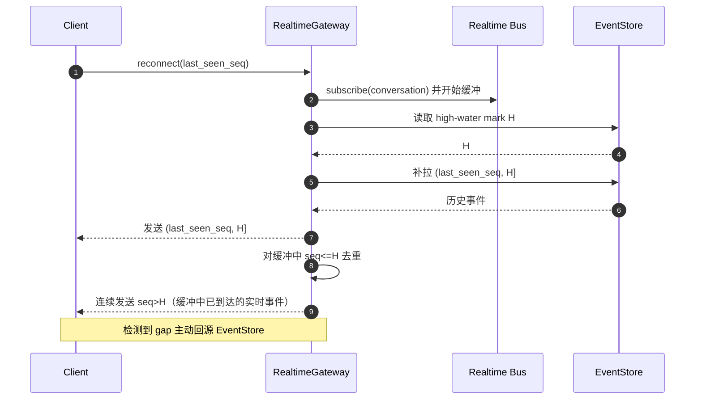

# 实时投递

> 本文档是 [architecture.md](./architecture.md) 的子文档，定义实时通道的投递语义与重连协议。

实时通道是优化，不是事实源（Redis Pub/Sub 为 at-most-once，断线即丢；SSE 原生支持 `Last-Event-ID` 重连）。

- 实时通知与调度命令在**同一事务**写入 outbox，由 publisher 在**提交之后**发送。
- 客户端记录 `last_seen_seq`，断线重连后从 EventStore 补拉。

## 无竞态重连协议

消除"补拉与订阅之间的空窗"：先订阅并缓冲、再读 high-water mark、用 `H` 切分历史补拉与实时流，避免边补拉边丢新事件。

## 待定义项

还需定义：单连接最大发送缓冲、slow consumer 淘汰、heartbeat、auth 到期与权限撤销、多标签页、重复到达、连接级与租户级连接配额。

## LLM token 流

**不要把每个 LLM token 都写入 EventStore**：`assistant.delta` 走实时临时流，可选粗粒度持久 checkpoint，最终只持久化一个 `AssistantMessageFinalized`，避免一次回答产生数百上千次 DB 写入和 seq 竞争。
