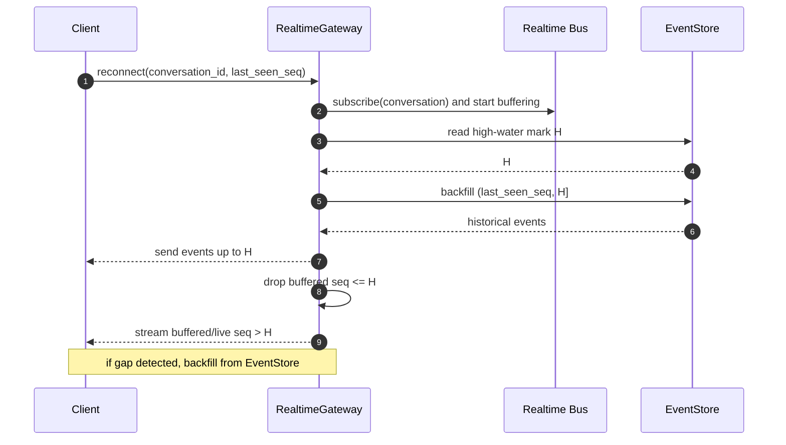

# 实时投递

> 本文档是 [architecture.md](./architecture.md) 的子文档，定义实时通道的投递语义、重连协议和连接治理。

## 问题、决策与风险

**问题**：客户端需要实时看到 token、状态和工具结果，但 WebSocket/SSE 连接会断，Redis Pub/Sub 会丢消息，浏览器可能多标签页同时打开。

**决策**：实时通道只做加速通知，不做事实源。客户端以 `last_seen_seq` 为游标，断线后从 EventStore 补拉。实时通知和调度 command 一样，必须在事件事务提交后发布。

**为什么不把实时流当可靠队列**：连接断开、网关重启、客户端消费太慢和权限撤销都会让实时流中断。可靠性只能来自 EventStore。

**忽略后果**：客户端会漏事件、重复展示消息、看到已撤销权限下的数据，或者因为慢连接拖垮网关内存。

| 应该 | 不应该 |
| --- | --- |
| 用 `last_seen_seq` 补拉缺口 | 假设 WebSocket 永不丢消息 |
| 对重复 `seq` 去重 | 把重复到达当新事件 |
| 对消费太慢的连接断开，并要求重连补拉 | 无限扩大连接缓冲 |
| 只持久化最终 assistant message | 把每个 token delta 写进 EventStore |

## 投递语义

- 实时通知是“尽力发送”：能实时到达最好，丢了也不作为数据丢失。
- EventStore 是事实源。
- 每条可补拉事件都有 conversation-scoped `seq`。
- 客户端记录每个 conversation 的 `last_seen_seq`。
- RealtimeGateway 可以发送重复事件，客户端必须按 `seq` 去重。
- Gateway 检测到 `seq` gap 时，主动回源 EventStore 补拉。

## 无竞态重连协议

消除“补拉与订阅之间的空窗”：网关先订阅并临时缓冲新消息，再读取当前最大序号 `H`。`H` 就是一条分界线：`H` 之前的从数据库补，`H` 之后的从实时缓冲继续发。

示例：客户端最后看到 `seq=10` 后断线。重连时网关先订阅并缓冲，再读取 `H=15`，补发 11 到 15。订阅后马上到达的 16 会先被缓冲，补拉完成后再发给客户端，因此不会丢 16。

## 连接治理

| 场景 | 规则 |
| --- | --- |
| 单连接发送缓冲 | 设置最大缓冲字节数和事件数；超过即断开，要求客户端按 `last_seen_seq` 重连 |
| 客户端消费太慢 | 连续 N 次心跳周期内无法清空缓冲则断开；不丢事实，因为客户端可补拉 |
| 心跳 | Gateway 定期发送 ping/heartbeat；客户端超时后主动重连 |
| 登录态到期 | 短期 token 到期前发送 `reauth_required`；未刷新则断开 |
| 权限撤销 | Gateway 收到权限版本变化后停止发送相关 conversation，并要求重新鉴权；敏感事件补拉也要重新 ACL 检查 |
| 多标签页 | 每个连接独立维护游标；服务端可按 user/tenant 限制连接数；客户端可自行选一个主标签页减少连接 |
| 重复到达 | 客户端和 Gateway 都按 `(conversation_id, seq)` 去重 |
| 租户配额 | 限制 tenant/user 的连接数、订阅 conversation 数、推送速率、补拉 QPS |

RealtimeGateway 不保存业务状态。它可以保存短期连接状态、订阅列表、缓冲队列和最近发送的 cursor，但这些都可丢弃。

## LLM token 流

不要把每个 LLM token 写入 EventStore。`assistant.delta` 走实时临时流，可选粗粒度 checkpoint。最终只持久化：

- `AssistantMessageFinalized`
- 最终文本或 artifact 引用
- token/cost 统计
- `llm_attempt_id`
- `context_manifest` 引用

如果 token 流中断，客户端重连后从 EventStore 只能拿到已持久化 checkpoint 和最终消息。未持久化的临时 token 可以丢弃。
