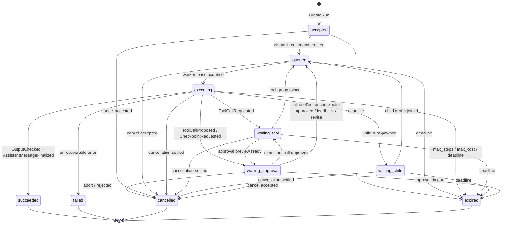
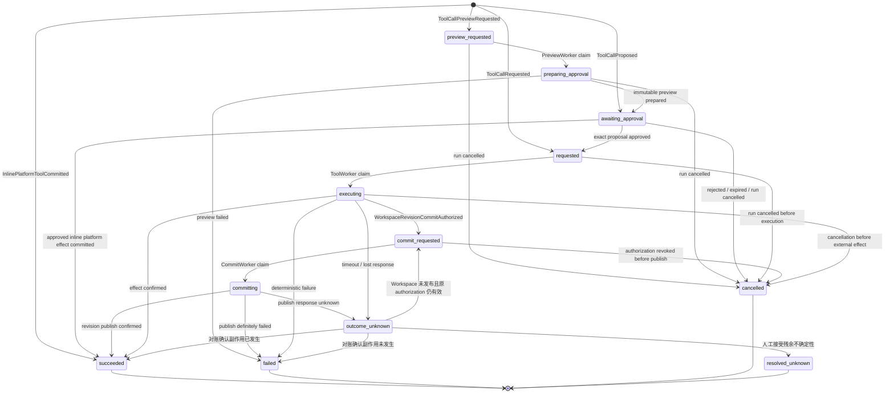
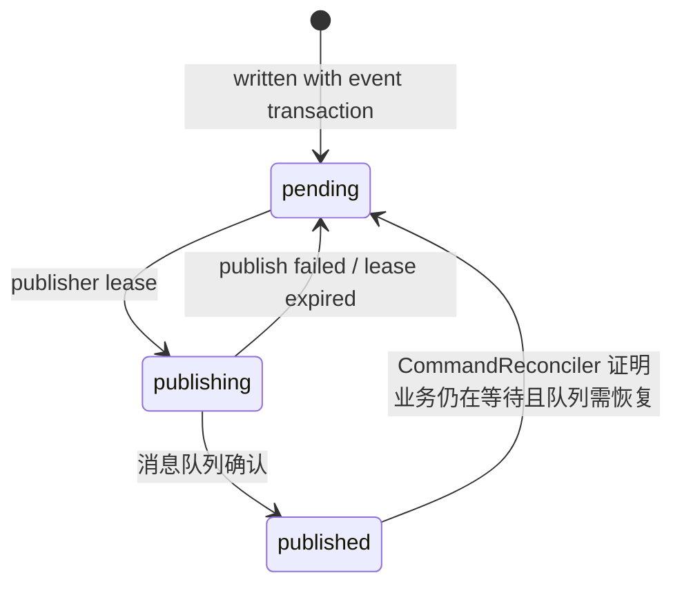

# 核心状态机与不变量

> 定位：主线文档。本文档定义 Run、ToolCall 和 Command 能怎么变。可以把它当成“状态交通规则”：哪些路能走，走之前要检查什么，走完要写哪些事件。多 Agent 编排里的 `waiting_child` 也是 Run 状态机的一部分，具体模式见 [orchestration-patterns.md](./orchestration-patterns.md)。

> 命名权威：本文档是核心 Run / ToolCall / Command 生命周期事件与命令的命名基准（如 `RunAccepted`、`RunResumeQueued`、`ToolCallProposed`、`ToolCallRequested`、`ResumeAgentRun`、`ResumeParentRun`、`ChildRunSpawned`、`CancelRemainingChildRuns`、`PropagateRunCancellation`、`CommandRedeliveryRequested`、`ReconcileToolEffect`、`RuntimeTerminationRequested`、`ToolCallManuallyResolved`）。领域事件由各自专题文档拥有：`Memory*` 见 [memory.md](./memory.md)，`Guardrail*` / `SecuritySignal*` 见 [agent-safety-and-guardrails.md](./agent-safety-and-guardrails.md)，`Checkpoint*` / `Escalation*` / `BudgetTransferred` 见 [orchestration-patterns.md](./orchestration-patterns.md)。其他文档引用这些名字即可，不要另立新名；核心名的新增或改名先在这里落地，再被别处引用。

## 问题、决策与风险

**问题**：一次 Agent 执行会跨过 API、队列、Worker、模型、工具和后台巡检。只看一列 `status` 不够：两个 Worker 可能都拿着旧状态，同时写出彼此冲突的新结果。

**决策**：Run、ToolCall、Command 都用显式状态机表达。每次转换必须说明：谁发起、前置条件、检查哪个版本、写入什么事件、是否发出 command、失败后怎么处理。

**为什么不简单让 Worker 直接改状态**：Worker 可能重复收到 command，也可能在租约过期后才完成；取消、超时、并行工具完成也可能同时发生。直接改状态会让终态被覆盖，或让同一 run 被续跑多次。

**忽略后果**：取消的 run 可能被迟到工具结果唤醒；并行工具可能没人续跑；未知副作用可能被重做；管理员修复可能绕过审计和不变量。

## 通用规则

- Event 表示已经发生的事实，Command 表示希望某个消费者执行的下一步动作。
- Run 状态转换检查 `run_version`；ToolCall 状态转换检查 `tool_call_version`；Command 发布检查 `command_id` 去重。
- `seq` 只做 tenant-user 内提交顺序，不做并发控制；conversation 只是过滤维度。
- 终态 run 不被普通流程改写；修复必须创建替代 run 或新的执行尝试。
- `cancel_requested` 是中断标志，不是终态；`cancelled` 才是最终状态。
- `queued` 表示已经有一条 Start / Resume command，但还没有 AgentWorker 持有有效执行租约；首次启动和每次恢复都必须经过 `queued -> executing` 的统一 claim。
- Worker 提交必须同时匹配当前 `command_id`、`attempt_id`、精确相等的 fence、不可猜的 lease token 和未过期 lease；不能只比较 fence 数字大小。

| 应该 | 不应该 |
| --- | --- |
| 把状态转换写成带版本检查的条件写 | 先读状态再无条件 update |
| 把取消传播给正在运行的执行体 | 只把 DB 状态改成 cancelled |
| 把迟到结果记录为事实或旧尝试 | 用迟到结果恢复已取消 run |
| 通过 Repair Command API 修复终态 | 直接改终态 run state |

## 怎么读转换表

每张转换表都按同一套问题展开：

- **当前状态**：对象现在在哪里。
- **触发方**：是谁想推动它往前走。
- **允许条件**：什么时候可以走这一步。
- **检查什么**：用哪个版本、fence 或唯一键防并发写错。
- **写入什么**：状态变化后必须留下哪些事件和投影。
- **发出什么命令**：是否需要异步唤醒 Worker。
- **如果失败**：版本过期、重复投递或权限不够时怎么收敛。

## Run 状态机

Run 表示一次 Agent 执行。它可以等待工具、等待子 Run、等待审批、被取消、过期、失败或成功。



### Run 转换表

| 当前状态 | 触发方 | 允许条件 | 检查什么 | 写入什么 | 发出什么命令 | 如果失败 |
| --- | --- | --- | --- | --- | --- | --- |
| 无 | API 创建 run | 已认证；租户拥有会话；幂等 key 没用过或命中同一请求 | 幂等唯一键 | 用户消息 `MessageAppended`、`accepted`、`RunAccepted`、幂等响应 | 无；继续同一受理事务登记调度 | 相同 key 返回原 run；key 相同但请求体不同则拒绝 |
| `accepted` | EventService 登记调度 | run 已受理；该转换与 accept 在同一数据库事务、对外提交前完成 | `run_version` | `queued`、`RunQueued`，保存新 `StartAgentRun` 的 `pending_command_id` | `StartAgentRun` | 任一步失败整笔受理事务回滚，不暴露只有 accepted 而无 command 的 Run |
| `queued` | AgentWorker 领取 Start / Resume command | inbox claim 成功；Run 的 `pending_command_id` 等于当前 command；Run 未请求取消；原 active lease 不存在或已过期；EventService 原子创建新 attempt、递增 fence 并签发 lease token | `run_version`、`command_id` | `executing`，把 pending command 移为 `active_command_id`；首次写 `RunStarted`，恢复写 `RunResumed`，并写 `JobAttemptStarted` | 无 | `completed` command 被忽略；取消中的 Run 拒绝新 claim；未过期 claim 等待；抢占后旧 attempt 的提交因 attempt/fence/lease token 不匹配被拒绝 |
| `executing` | AgentWorker 请求工具 | 工具计划有效；权限 schema 已知；并行组未打开 | `run_version`、active command/attempt、精确 fence/lease token、未过期 lease | `waiting_tool`、`ToolCallRequested`；每个 ToolCall 保存唯一 `pending_command_id` | 每个工具一条 `ExecuteToolCall` | 执行权或版本过期则丢弃这次 LLM 尝试，不推进 run |
| `executing` | AgentWorker 发起子 Run | `spawn_agent_run` 通过 schema、权限、guardrail、深度和预算检查；child group 尚未打开 | `run_version`、active command/attempt、精确 fence/lease token、未过期 lease | `waiting_child`、`ToolCallSucceeded`、`ChildRunSpawned`、child group、预算划拨 | 每个子 Run 一条 `StartAgentRun` | 执行权或版本过期则丢弃这次 spawn 计划；不得只让父 Run 等待而不创建子 Run |
| `executing` | AgentWorker 请求危险工具审批 | ToolCall 候选已通过 schema 和规范化；策略要求审批 | `run_version`、active command/attempt、精确 fence/lease token、未过期 lease | 创建不可变 `awaiting_approval` ToolCall，保存规范化参数 hash、descriptor/policy snapshot、workspace base revision；Run 写 `waiting_approval`、`ToolCallProposed`、`ApprovalRequested` | `NotifyApproval`，不发 `ExecuteToolCall` | 执行权或版本过期则整笔事务失败，不留下无主 proposed ToolCall |
| `executing` | AgentWorker 请求需要真实 diff/preview 的工具审批 | 候选已规范化；预览过程本身被限制为无网络、无 secret、不可发布 workspace head | `run_version`、active command/attempt、精确 fence/lease token、未过期 lease | 创建 `preview_requested` ToolCall 并保存 preview `pending_command_id`；Run 写 `waiting_tool`、`ToolCallPreviewRequested` | `PrepareToolPreview` | 执行权或版本过期则整笔失败；preview command 不得越过真实副作用边界 |
| `waiting_tool` | ToolWorker 完成审批预览组 | 所有 required preview ToolCall 已进入 `awaiting_approval`；prepared revision/artifact 仍不可见；审批材料 hash 已生成 | `run_version`、每个 `tool_call_version`、preview group lock | Run `waiting_approval`；写批次级 `ApprovalRequested` | `NotifyApproval`；不发 Resume 或 Execute | 预览失败按策略失败或重新规划；不得把未审批 revision 发布为 head |
| `executing` | AgentWorker 请求阶段检查点 | checkpoint 材料和选项有效；不代表某个待执行工具 | `run_version`、active command/attempt、精确 fence/lease token、未过期 lease | `waiting_approval`、`CheckpointRequested` / `ApprovalRequested`，`approval_kind = stage_checkpoint` | `NotifyApproval` | 执行权或版本过期则丢弃这次 checkpoint 请求 |
| `waiting_tool` | ToolWorker 完成并赢得汇合 | 并行组条件满足；已锁住 `parallel_group`；run 仍在等待工具 | `run_version` | `queued`、`ToolGroupJoined`、`RunResumeQueued`，保存 `pending_command_id` | `ResumeAgentRun` | 如果 run 已取消/过期，只记录跳过，不发续跑命令 |
| `waiting_child` | Child Run 完成并赢得汇合 | child group 条件满足；已锁住 `child_group`；run 仍在等待子 Run | `run_version` | `queued`、`ChildGroupJoined`、`RunResumeQueued`、必要时回收预算，保存 `pending_command_id` | `ResumeParentRun`；提前满足 `any` / `quorum` 时同事务登记唯一 `CancelRemainingChildRuns`，后台按稳定 cursor 分批创建其余子 Run 的 cancellation barrier | 如果 run 已取消/过期，只记录迟到事实，不发续跑命令；清理 command 重投复用同一 work id，不得产生第二个 continuation |
| `waiting_approval` | Approval API 批准危险 Worker 工具 | `approval_kind = tool_execution`；proposal 的 `execution_mode = worker_runtime`；审批人有权限；审批未过期；proposed ToolCall、参数 hash、tool/policy snapshot、workspace base revision 都仍匹配 | `run_version`、每个 `tool_call_version`、approval scope hash | proposed ToolCall `awaiting_approval -> requested` 并保存各自 `pending_command_id`；Run `waiting_tool`；写 `ApprovalGranted`、`ToolCallRequested` 和 parallel group | 每个已批准 ToolCall 一条 `ExecuteToolCall`；不发 `ResumeAgentRun` | 任一参数、版本、revision 或 scope 变化则整笔拒绝并要求重新审批 |
| `waiting_approval` | Approval API 批准 inline platform tool | `approval_kind = tool_execution`；proposal 的 `execution_mode = inline_platform`；精确 scope 仍匹配；平台效果能在 EventStore 同一事务完成 | `run_version`、`tool_call_version`、approval scope hash | 原子提交平台效果、ToolCall `succeeded`、`ApprovalGranted`、`ToolCallSucceeded`；Run `queued`、`RunResumeQueued`，保存 `pending_command_id` | `ResumeAgentRun`；不发 `ExecuteToolCall`，也不重新调用模型生成参数 | 任一校验或平台效果失败则整笔回滚，proposal 保持等待或按策略失败 |
| `waiting_approval` | Approval API 批准阶段检查点 | `approval_kind = stage_checkpoint`；审批人有权限；审批未过期 | `run_version` | `queued`、`ApprovalGranted`、`RunResumeQueued`，保存 `pending_command_id` | `ResumeAgentRun` | 如果已过期/取消，拒绝这次审批 |
| `waiting_approval` | Approval API 带反馈批准阶段检查点 | `approval_kind = stage_checkpoint`；feedback 通过 schema / DLP 检查 | `run_version` | `queued`、`ApprovalGrantedWithFeedback`、`RunResumeQueued`，保存 `pending_command_id` | `ResumeAgentRun`，feedback 进入下一步上下文 | 危险工具审批不允许 feedback；状态或版本变化则拒绝 |
| `waiting_approval` | Approval API 要求 revise 阶段检查点 | `approval_kind = stage_checkpoint` 且支持 revise | `run_version` | `queued`、`ApprovalRevisionRequested`、`RunResumeQueued`，保存 `pending_command_id` | `ResumeAgentRun`，revision 要求进入当前阶段上下文 | 危险工具审批不允许 revise，只能批准或拒绝 |
| `waiting_approval` | Approval API 拒绝 / abort | 审批人有权限；run 仍在等待审批 | `run_version`；工具审批还检查 proposed `tool_call_version` | `cancelled`、`ApprovalRejected` / `RunCancelled`；工具审批同时把所有 `awaiting_approval` ToolCall 标为 `cancelled` | 需要时发 `RuntimeTerminationRequested` | 如果已终态，返回当前终态 |
| `executing` | AgentWorker 输出最终回复 | 最终回复已生成；预算未越界；`OutputChecked` 对最终消息和渲染目的地返回 `allow` 或 `redact` | `run_version`、active command/attempt、精确 fence/lease token、未过期 lease、`output_check_id` | `succeeded`、`OutputChecked`、`AssistantMessageFinalized`、`RunSucceeded` | 只发实时通知 | 执行权或版本过期则把输出视为旧尝试结果；输出检查失败则重写、隔离或转 `failed` / `waiting_approval` |
| 任一非终态 | AgentWorker 或策略失败 | 错误不可恢复，或重试次数已耗尽 | `run_version`；AgentWorker 提交还检查 active command/attempt、精确 fence/lease token 和未过期 lease | `failed`、`RunFailed` | 无 | 执行权或版本过期说明别的转换先赢 |
| 任一非终态 | Cancel API | 调用者有权限；run 还不是终态 | `run_version`、cancel idempotency key | 设置 `cancel_requested_at`、递增 `cancel_generation`、创建 cancellation barrier、使当前 Run fence 失效；barrier 已为空时同事务进入 `cancelled` | `RuntimeTerminationRequested`、工具终止命令、需要时 `PropagateRunCancellation` | 重复请求返回同一 generation；如果已终态，直接返回当前状态 |
| 任一非终态 | Timer / Sweeper | 到了 `due_at`；没有合法 Worker 还能继续推进 | `run_version` | `expired`、`RunExpired` | 需要时终止 runtime | 版本过期说明 Worker 或取消先赢 |

**Run 不变量**：每个 `run_version` 最多产生一个可执行的下一步。任何 Start / Resume 都先把 Run 放入 `queued` 并绑定唯一 `pending_command_id`，只有成功 claim 这条 command 的 AgentWorker 才能把它推进到 `executing`。AgentWorker 把 Run 从 `executing` 推到等待态或终态时，必须在同一事务完成当前 inbox/attempt 并释放 active lease，但保留单调 fence 计数器。`succeeded`、`failed`、`cancelled`、`expired` 是终态，普通流程不能再推进。需要修复时创建新事件或 replacement run，不直接篡改终态。

## 取消语义

取消使用持久化 cancellation barrier，不能靠进程内计数猜测“是不是都停了”。

```text
run_cancellation
- tenant_id
- run_id
- cancellation_id
- root_cancellation_id
- parent_cancellation_id?
- cancel_generation
- state: requested | terminating | settled
- requested_by + requested_at + reason
- propagation_command_id?
- settled_at?
```

流程：

1. Cancel API 用 `run_version` CAS 设置 `cancel_requested_at`，递增 `cancel_generation`，创建带稳定 `cancellation_id/root_cancellation_id` 的 barrier，并使 Run 当前 fence 失效。这个事务同时登记当前 Agent attempt、在飞 ToolCall/runtime 的终止命令，以及需要时的 `PropagateRunCancellation`；重复取消返回同一 cancellation id 和 generation。
2. 任何新的 Start / Resume / Execute claim 都必须检查 Run 及祖先没有 `cancel_requested_at`。正在运行的 Worker 通过 heartbeat 或下一次短事务看到取消后协作式中止；RuntimeManager 终止 sandbox 并写 termination acknowledgement。
3. ToolCall 在副作用边界前停止时进入 `cancelled`；已经或可能越过边界时进入 `succeeded`、`failed` 或 `outcome_unknown`，不能用取消抹掉事实。子 Run 通过有界、逐层的 command 传播取消，不在一个数据库事务里递归锁整棵树。
4. CancellationReconciler 锁定 barrier 和 Run，重新读取 EventStore 中的 active attempt、非终态 ToolCall、未确认终止的 runtime 和非终态直属 Child Run。只有这些集合全部为空，且没有 `outcome_unknown` 尚待裁定时，才能用 `run_version` CAS 写 `RunCancelled`，把 barrier 标为 `settled`。
5. barrier 未满足时 Run 保持 `cancel_requested`；到期巡检继续终止、使旧 fence 失效或对账，不得提前伪装成 `cancelled`。任何完成/终止事件都会幂等触发一次 barrier 复核，避免只能靠轮询收敛。

这一区分很重要：`cancel_requested` 表示“不要再开始新的工作，并尽快停下”；`cancelled` 表示“EventStore 已证明所有执行权和子任务都已收敛”。ToolCall 和 Child Run 的迟到事实仍可记录，但 join 在看到取消 generation 后不得恢复父 Run。

## ToolCall 状态机

ToolCall 表示一次工具调用。`awaiting_approval` 保存等待人类批准的精确操作；`commit_requested` / `committing` 用于 Workspace 这类需要先在 EventStore 留下 durable commit authorization、再发布外部可见 revision 的写入；`outcome_unknown` 是非终态，表示外部效果是否发生还不知道；`resolved_unknown` 是人工停止自动对账并接受残余不确定性后的终态，不代表外部效果未发生。系统必须保留对应风险记录，并阻止同一 effect key 再次执行。



### ToolCall 转换表

下表为可读性简写“精确 fence、未过期 lease”时，始终同时要求不可猜的 `lease_token` 精确匹配；claim 安装 lease 时也必须原子签发并保存该 token。完整条件以 [concurrency-and-durability.md](./concurrency-and-durability.md) 的 append 合约为准。

| 当前状态 | 触发方 | 允许条件 | 检查什么 | 写入什么 | 发出什么命令 | 如果失败 |
| --- | --- | --- | --- | --- | --- | --- |
| 无 | AgentWorker | Run 正在执行；工具 schema 有效；权限类型已知 | 父 Run 的 `run_version`、active command/attempt、精确 fence、未过期 lease | `requested`、`ToolCallRequested`、`pending_command_id`，必要时记录副作用意图 | `ExecuteToolCall` | 父 Run 执行权或版本过期则丢弃工具请求 |
| 无 | AgentWorker | 工具审批必须展示真实 diff/preview；preview 自身没有外部可见效果 | 父 Run 的 `run_version`、active command/attempt、精确 fence、未过期 lease | `preview_requested`、`ToolCallPreviewRequested`、preview `pending_command_id`；保存 normalized input/hash 和 base revision | `PrepareToolPreview` | 父 Run 执行权或版本过期则整笔事务失败 |
| 无 | AgentWorker | Run 正在执行；工具候选已规范化；策略要求人工审批 | 父 Run 的 `run_version`、active command/attempt、精确 fence、未过期 lease | `awaiting_approval`、`ToolCallProposed`；保存不可变 normalized input/hash、descriptor/policy snapshot、workspace base revision 和 effect intent | `NotifyApproval` | 父 Run 执行权或版本过期则整笔事务失败 |
| 无 | EventService 内联平台工具 | Run 正在执行；平台工具 schema / 权限 / guardrail 通过；所有效果都在同一 EventStore 事务内完成 | 父 Run 的 `run_version`；由 AgentWorker 请求时还检查 active command/attempt、精确 fence 和未过期 lease | `succeeded`、`ToolCallSucceeded`、平台效果事件；`tool_call_version = 1` | 平台效果需要的 outbox，例如 `StartAgentRun` | 父 Run 执行权或版本过期则整笔事务失败，不创建半截平台效果 |
| `awaiting_approval` | Approval API | 审批准确覆盖此 ToolCall；参数、tool/policy snapshot、workspace base revision 未变化 | `tool_call_version`、approval scope hash | `requested`、`ApprovalGranted`、`ToolCallRequested`、`pending_command_id` | `ExecuteToolCall` | 任一内容变化则拒绝并创建新审批；不得修改原 proposed ToolCall |
| `awaiting_approval` | Approval API / EventService | 审批准确覆盖此 inline platform ToolCall；平台效果能在同一 EventStore 事务完成 | 父 Run `run_version`、`tool_call_version`、approval scope hash | 平台效果、`succeeded`、`ApprovalGranted`、`ToolCallSucceeded` 一次提交；父 Run `queued` 并保存 `pending_command_id` | `ResumeAgentRun` | 任何失败整笔回滚，不留下半截平台效果 |
| `preview_requested` | ToolWorker 领取 | inbox claim 成功；父 Run 仍在等待此 preview；ToolCall `pending_command_id` 匹配；拿到新 attempt/fence/lease | `tool_call_version`、command id | `preparing_approval`，pending command 移为 `active_command_id`；写 `ToolCallPreviewStarted`、`JobAttemptStarted` | 无 | 重复和抢占遵循普通 command claim；旧 attempt 不能提交 preview |
| `preparing_approval` | ToolWorker | preview 在隔离环境完成；prepared revision/artifact 不可外部可见；输出检查通过 | `tool_call_version`、active command/attempt、精确 fence、未过期 lease | `awaiting_approval`、`ToolCallProposed`、preview/diff hash、prepared effect ref | preview group 满足时 `NotifyApproval` | 执行权或版本过期则 prepared 内容保持不可见并等待 GC/对账 |
| `preparing_approval` | ToolWorker / 取消传播 | preview 确定失败，或父 Run 已取消 | `tool_call_version`；Worker 结果还检查 active command/attempt、精确 fence 和未过期 lease | `failed` 或 `cancelled`，记录 preview 错误或取消事实 | preview group 按失败策略收敛 | prepared 内容保持不可见，按引用和 TTL 安全回收 |
| `awaiting_approval` | 拒绝、过期或取消传播 | approval 被拒绝/过期，或父 Run 已取消 | `tool_call_version` | `cancelled`、`ToolCallCancelled` | 无 | 如果已经进入 `requested`，按正常取消/执行竞态处理 |
| `requested` | ToolWorker 领取 | inbox claim 成功；ToolCall `pending_command_id` 匹配；配额已预留；EventService 安装新 attempt/fence/lease | `tool_call_version`、command id | `executing`，pending command 移为 `active_command_id`；写 `ToolCallStarted`、`JobAttemptStarted` | 无 | `completed` 重复命令被忽略；未过期 claim 等待或延迟重投；配额失败则写失败或重试命令 |
| `requested` | 取消传播 | 父 Run 已 `cancel_requested`；工具还没开始 | `tool_call_version` | `cancelled`、`ToolCallCancelled` | 无 | 如果已执行，走 runtime 终止路径 |
| `executing` | ToolWorker 请求提交 Workspace revision | prepared revision 已持久化；需要时 approval 精确覆盖其 hash；revision 尚不可见 | `tool_call_version`、active command/attempt、精确 fence、未过期 lease | `commit_requested`、`WorkspaceRevisionCommitAuthorized`、ledger `commit_authorized`、commit `pending_command_id`；完成当前 attempt/inbox 并释放 lease | `CommitWorkspaceRevision` | 任一校验失败则不授权；不得先发布 revision 再补授权 |
| `commit_requested` | CommitWorker 领取 | inbox claim 成功；pending command 和 authorization event 匹配；父 Run 仍允许工具收敛；取得新的 workspace write lease/capability | `tool_call_version`、command id、authorization id | `committing`，安装 active command/attempt/fence/lease，写 `WorkspaceRevisionCommitStarted` | 无 | 重复/抢占遵循统一 claim；authorization 或 workspace lease 不匹配则拒绝 |
| `commit_requested` | 取消传播 / policy revoke | revision 尚未发布；授权允许撤销 | `tool_call_version`、authorization id | `cancelled`、`WorkspaceRevisionCommitRevoked`、`ToolCallCancelled` | 无 | 如果发布可能已经开始，不能取消，转 `outcome_unknown` |
| `committing` | CommitWorker 发布成功 | Workspace Service 返回同一 authorized revision 已成为 head | `tool_call_version`、active command/attempt、精确 fence、未过期 lease、authorization id | `succeeded`、ledger `confirmed`、`WorkspaceRevisionCommitted`、`ToolCallSucceeded`；完成 attempt/inbox 并释放 lease | 汇合胜出时可能发 `ResumeAgentRun` | EventStore 提交失败只重试确认；不得再次生成或发布 revision |
| `committing` | CommitWorker 确定发布失败 | CAS 冲突或 Workspace Service 证明未发布且不可继续 | 同上 | `failed`、ledger `failed`、`ToolCallFailed`；完成 attempt/inbox 并释放 lease | 可能触发 join | 响应不确定时不能走此分支 |
| `committing` | 发布超时或响应丢失 | 无法证明 authorized revision 是否成为 head | 同上 | `outcome_unknown`、ledger `outcome_unknown`、`ToolCallOutcomeUnknown`；完成 attempt/inbox 并释放 lease | `ReconcileToolEffect` | 禁止创建另一 revision 或用新 effect key 重做 |
| `executing` | ToolWorker 成功 | `read_only` 工具已完成输出校验和 attempt 记录；非 Workspace 外部副作用工具已确认效果且 effect ledger 为 `confirmed` | `tool_call_version`、active command/attempt、精确 fence、未过期 lease | `succeeded`、`ToolCallSucceeded`、结果事件；同事务完成 attempt/inbox 并释放 active lease | 汇合胜出时可能发 `ResumeAgentRun` | 任一执行权条件过期则只记录旧尝试，不恢复 Run |
| `executing` | ToolWorker 确定失败 | 失败原因明确，可以安全记录 | `tool_call_version`、active command/attempt、精确 fence、未过期 lease | `failed`、`ToolCallFailed`、错误信息；完成 attempt/inbox 并释放 lease | 汇合完成时可能发 `ResumeAgentRun` | 任一执行权条件过期则只记录旧尝试 |
| `executing` | 超时或响应丢失 | 无法证明外部效果是否发生 | `tool_call_version`、active command/attempt、精确 fence、未过期 lease | `outcome_unknown`、`ToolCallOutcomeUnknown`；完成 attempt/inbox 并释放 lease | 到 `due_at` 后发 `ReconcileToolEffect` | 禁止盲目重试 |
| `executing` | 外部效果发生前被终止 | 工具还没越过副作用边界 | `tool_call_version`、active command/attempt、精确 fence、未过期 lease | `cancelled`、`ToolCallCancelled`；完成 attempt/inbox 并释放 lease | 无 | 如果可能已越过边界，转 `outcome_unknown` |
| `outcome_unknown` | Sweeper / 对账器 / Repair API | provider 确认外部效果已发生；Repair 路径还要求可验证证据和双人审批 | `tool_call_version`、`effect_scope`、`effect_key` | `succeeded`、`ToolCallSucceeded`、ledger `confirmed`；Repair 路径另写 `ToolCallManuallyResolved(resolution=confirmed_occurred)` | 可能触发汇合/续跑 | 仍未知则重新安排或升级人工 |
| `outcome_unknown` | Sweeper / 对账器 / Repair API | 对账证明外部效果未发生；Repair 路径还要求可验证证据和双人审批 | `tool_call_version`、`effect_scope`、`effect_key` | `failed`、`ToolCallFailed`、ledger `failed`；Repair 路径另写 `ToolCallManuallyResolved(resolution=confirmed_not_occurred)` | 可能触发汇合/续跑 | 仍未知则重新安排或升级人工 |
| `outcome_unknown` | Workspace 对账器 | 证明 authorized revision 未发布；原 authorization、approval、base revision 和 policy 仍有效 | `tool_call_version`、authorization id、effect key | `commit_requested`、ledger `commit_authorized`、新 `pending_command_id` | 用同一 revision/effect key 发 `CommitWorkspaceRevision` | 任一条件变化则确定失败或进入 Repair；禁止生成新 revision |
| `outcome_unknown` | Repair API | 自动对账用尽；双人审批通过；操作者明确接受“仍不知道是否发生”的残余风险 | `tool_call_version` | `resolved_unknown`、`ToolCallManuallyResolved(resolution=accepted_unknown)`、ledger `accepted_unknown` | 可能触发汇合/续跑，但结果不得计为成功 | 审批无效则拒绝；不得伪装成 `cancelled`、`failed` 或 `confirmed` |

**ToolCall 不变量**：同一 `(tenant_id, effect_scope, provider_id, tool_name, effect_key)` 最多产生一次有效外部副作用，不能因为 replacement run、Repair redrive 或新的 `tool_call_id` 而重复创建资源、扣费或外发请求。同一 effect key 如果携带不同 `request_hash`，必须拒绝或进入人工裁定，不能复用旧结果。外部副作用工具的 `succeeded` 必须有 effect ledger 的 `confirmed` 记录和结果事件；`resolved_unknown` 必须保留 `accepted_unknown` ledger 和残余风险，不得计为成功或解释为副作用未发生。`read_only` 工具没有外部 effect ledger，但必须有 request summary、attempt、输出校验和审计记录。内联平台工具没有外部 effect ledger，但必须把平台效果和 ToolCall 成功写在同一个 EventStore 事务中。ToolCall 完成不递增 `run_version`；只有 join 或平台工具引发的 Run 转换才递增 `run_version`。

## Command 状态机

Command 表示 outbox 中的一条执行意图。它的发布状态和业务执行结果是两回事。



### Command 转换表

| 当前状态 | 触发方 | 允许条件 | 检查什么 | 写入什么 | 发出什么命令 | 如果失败 |
| --- | --- | --- | --- | --- | --- | --- |
| 无 | EventService | 某次状态转换需要异步执行下一步 | `command_id` 唯一 | `pending` outbox row，带 `store_epoch` | 无 | 重复 command id 按幂等范围忽略或拒绝 |
| `pending` | OutboxPublisher | 已到 `available_at`；拿到发布租约 | publisher lease token | `publishing`；发布次数 +1 | 尝试发布到消息队列 | 租约冲突说明另一个 publisher 在处理 |
| `publishing` | OutboxPublisher | 消息队列已确认；outbox epoch 与独立恢复控制面的当前 epoch 精确相等 | publisher lease token、`store_epoch` identity | `published`、`published_at` | 消息已经发出 | 如果标记失败，之后会重发；消费者用 inbox 去重 |
| `publishing` | OutboxPublisher / Sweeper | 发布失败或发布租约过期 | publisher lease token 或超时 | 回到 `pending`，设置下次 `available_at` | 稍后重试 | 毒性命令按策略进入 DLQ/Repair |
| `published` | CommandReconciler | 聚合仍以同一 `pending_command_id` 等待；inbox 未完成且无有效 owner；`delivery_due_at` 已超过 claim SLO 或 queue generation 已声明丢失；outbox payload hash 与当前 epoch 一致 | 聚合状态、pending id、inbox state、delivery due、`store_epoch` | 同一 row 条件化回到 `pending`，按 backoff 更新 due，写 `CommandRedeliveryRequested` 审计 | 重发同一 `command_id` | 聚合不再等待则不重发；outbox 缺失或 hash 冲突则 fail closed 并进入 Repair |

**Command 不变量**：outbox 只保证“发布 command”；`published` 不是业务完成证明。Worker 执行结果由 `job_attempt`、Run、ToolCall 和事件记录。Publisher 崩溃、队列恢复或 Reconciler 重投都会产生重复投递，消费者必须用 inbox 的 `UNIQUE (tenant_id, consumer_name, command_id)` 去重。正常队列恢复重用同一 command id；只有 epoch 变化或经 Repair 修复不变量时才创建 replacement command。
