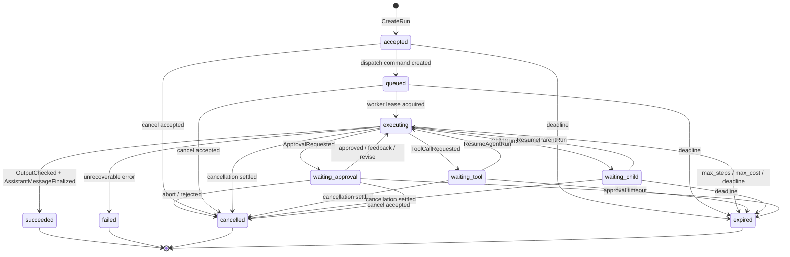
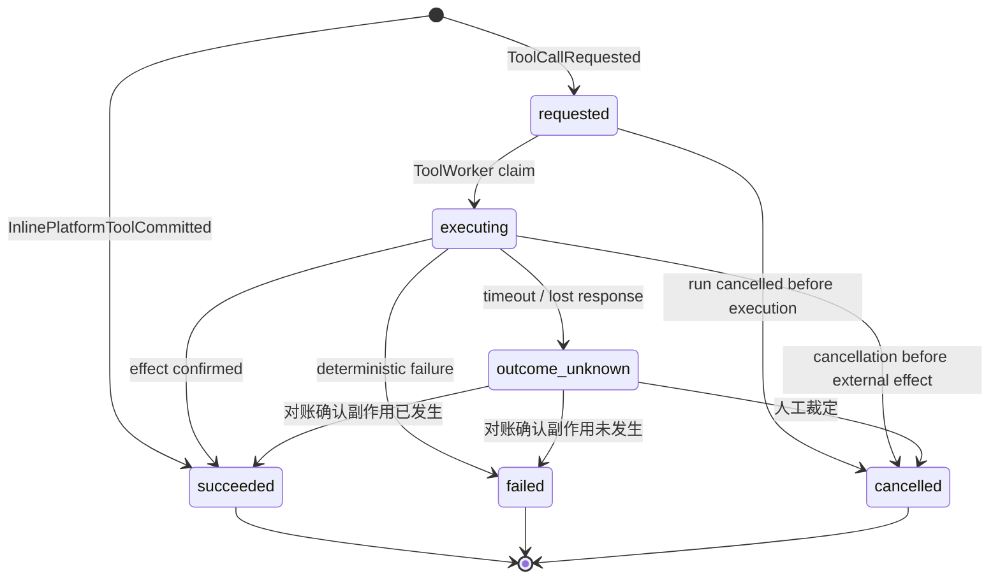
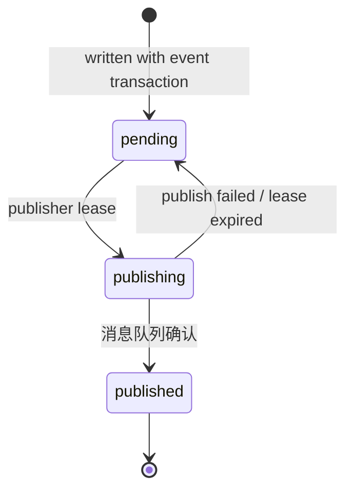

# 核心状态机与不变量

> 定位：主线文档。本文档定义 Run、ToolCall 和 Command 能怎么变。可以把它当成“状态交通规则”：哪些路能走，走之前要检查什么，走完要写哪些事件。多 Agent 编排里的 `waiting_child` 也是 Run 状态机的一部分，具体模式见 [orchestration-patterns.md](./orchestration-patterns.md)。

> 命名权威：本文档是核心 Run / ToolCall / Command 生命周期事件与命令的命名基准（如 `RunAccepted`、`ToolCallRequested`、`ResumeAgentRun`、`ResumeParentRun`、`ChildRunSpawned`、`ReconcileToolEffect`、`RuntimeTerminationRequested`、`ToolCallManuallyResolved`）。领域事件由各自专题文档拥有：`Memory*` 见 [memory.md](./memory.md)，`Guardrail*` / `SecuritySignal*` 见 [agent-safety-and-guardrails.md](./agent-safety-and-guardrails.md)，`Checkpoint*` / `Escalation*` / `BudgetTransferred` 见 [orchestration-patterns.md](./orchestration-patterns.md)。其他文档引用这些名字即可，不要另立新名；核心名的新增或改名先在这里落地，再被别处引用。

## 问题、决策与风险

**问题**：一次 Agent 执行会跨过 API、队列、Worker、模型、工具和后台巡检。只看一列 `status` 不够：两个 Worker 可能都拿着旧状态，同时写出彼此冲突的新结果。

**决策**：Run、ToolCall、Command 都用显式状态机表达。每次转换必须说明：谁发起、前置条件、检查哪个版本、写入什么事件、是否发出 command、失败后怎么处理。

**为什么不简单让 Worker 直接改状态**：Worker 可能重复收到 command，也可能在租约过期后才完成；取消、超时、并行工具完成也可能同时发生。直接改状态会让终态被覆盖，或让同一 run 被续跑多次。

**忽略后果**：取消的 run 可能被迟到工具结果唤醒；并行工具可能没人续跑；未知副作用可能被重做；管理员修复可能绕过审计和不变量。

## 通用规则

- Event 表示已经发生的事实，Command 表示希望某个消费者执行的下一步动作。
- Run 状态转换检查 `run_version`；ToolCall 状态转换检查 `tool_call_version`；Command 发布检查 `command_id` 去重。
- `seq` 只做 user 内提交顺序，不做并发控制；conversation 只是过滤维度。
- 终态 run 不被普通流程改写；修复必须创建替代 run 或新的执行尝试。
- `cancel_requested` 是中断标志，不是终态；`cancelled` 才是最终状态。

| 应该 | 不应该 |
| --- | --- |
| 把状态转换写成带版本检查的条件写 | 先读状态再无条件 update |
| 把取消传播给正在运行的执行体 | 只把 DB 状态改成 cancelled |
| 把迟到结果记录为事实或旧尝试 | 用迟到结果恢复已取消 run |
| 通过 Repair Command API 修复终态 | 直接改终态 run state |

## 怎么读转换表

每张转换表都按同一套问题展开：

- **当前状态**：对象现在在哪里。
- **触发方**：是谁想推动它往前走。
- **允许条件**：什么时候可以走这一步。
- **检查什么**：用哪个版本、fence 或唯一键防并发写错。
- **写入什么**：状态变化后必须留下哪些事件和投影。
- **发出什么命令**：是否需要异步唤醒 Worker。
- **如果失败**：版本过期、重复投递或权限不够时怎么收敛。

## Run 状态机

Run 表示一次 Agent 执行。它可以等待工具、等待子 Run、等待审批、被取消、过期、失败或成功。

### Run 转换表

| 当前状态 | 触发方 | 允许条件 | 检查什么 | 写入什么 | 发出什么命令 | 如果失败 |
| --- | --- | --- | --- | --- | --- | --- |
| 无 | API 创建 run | 已认证；租户拥有会话；幂等 key 没用过或命中同一请求 | 幂等唯一键 | 用户消息 `MessageAppended`、`accepted`、`RunAccepted`、幂等响应 | `StartAgentRun` | 相同 key 返回原 run；key 相同但请求体不同则拒绝 |
| `accepted` | EventService 登记调度 | run 已受理，调度命令和事件在同一事务内 | `run_version` | `queued`、`RunQueued` | 无，或使用已登记的命令 | 版本已变化则说明别的写入先赢 |
| `queued` | AgentWorker 领取 | inbox claim 成功：没有 `completed` 记录，也没有未过期的 `running` lease；拿到租约和 fence | `run_version`、fence | `executing`、`RunStarted`、`attempt_id` | 无 | `completed` 重复命令被忽略；未过期 claim 等待或延迟重投；旧 fence 变成旧尝试 |
| `executing` | AgentWorker 请求工具 | 工具计划有效；权限 schema 已知；并行组未打开 | `run_version`、fence | `waiting_tool`、`ToolCallRequested` | 每个工具一条 `ExecuteToolCall` | 版本过期则丢弃这次 LLM 尝试，不推进 run |
| `executing` | AgentWorker 发起子 Run | `spawn_agent_run` 通过 schema、权限、guardrail、深度和预算检查；child group 尚未打开 | `run_version`、fence | `waiting_child`、`ToolCallSucceeded`、`ChildRunSpawned`、child group、预算划拨 | 每个子 Run 一条 `StartAgentRun` | 版本过期则丢弃这次 spawn 计划；不得只让父 Run 等待而不创建子 Run |
| `executing` | AgentWorker 请求审批 | 策略判断操作危险，需要人审批 | `run_version`、fence | `waiting_approval`、`ApprovalRequested` | `NotifyApproval` | 版本过期则丢弃这次尝试 |
| `waiting_tool` | ToolWorker 完成并赢得汇合 | 并行组条件满足；已锁住 `parallel_group`；run 仍在等待工具 | `run_version` | `executing`、`ToolGroupJoined` / `RunResumed` | `ResumeAgentRun` | 如果 run 已取消/过期，只记录跳过，不发续跑命令 |
| `waiting_child` | Child Run 完成并赢得汇合 | child group 条件满足；已锁住 `child_group`；run 仍在等待子 Run | `run_version` | `executing`、`ChildGroupJoined` / `RunResumed`、必要时回收预算 | `ResumeParentRun`，提前满足 `any` / `quorum` 时取消剩余子 Run | 如果 run 已取消/过期，只记录迟到事实，不发续跑命令 |
| `waiting_approval` | Approval API 批准 | 审批人有权限；审批未过期 | `run_version` | `executing`、`ApprovalGranted` | `ResumeAgentRun` | 如果已过期/取消，拒绝这次审批 |
| `waiting_approval` | Approval API 带反馈批准 | 审批人有权限；审批未过期；feedback 通过 schema / DLP 检查 | `run_version` | `executing`、`ApprovalGrantedWithFeedback` | `ResumeAgentRun`，feedback 进入下一步上下文 | 如果已过期/取消，拒绝这次审批 |
| `waiting_approval` | Approval API 要求 revise | 审批人有权限；审批未过期；当前 approval kind 支持 revise | `run_version` | `executing`、`ApprovalRevisionRequested` | `ResumeAgentRun`，revision 要求进入当前阶段上下文 | 如果是普通危险工具审批，不允许 revise，只能拒绝或取消 |
| `waiting_approval` | Approval API 拒绝 / abort | 审批人有权限；run 仍在等待审批 | `run_version` | `cancelled`、`ApprovalRejected` / `RunCancelled` | 需要时发 `RuntimeTerminationRequested` | 如果已终态，返回当前终态 |
| `executing` | AgentWorker 输出最终回复 | 最终回复已生成；预算未越界；`OutputChecked` 对最终消息和渲染目的地返回 `allow` 或 `redact` | `run_version`、fence、`output_check_id` | `succeeded`、`OutputChecked`、`AssistantMessageFinalized`、`RunSucceeded` | 只发实时通知 | 版本过期则把输出视为旧尝试结果；输出检查失败则重写、隔离或转 `failed` / `waiting_approval` |
| 任一非终态 | AgentWorker 或策略失败 | 错误不可恢复，或重试次数已耗尽 | `run_version`、fence | `failed`、`RunFailed` | 无 | 版本过期说明别的转换先赢 |
| 任一非终态 | Cancel API | 调用者有权限；run 还不是终态 | `run_version` | 设置 `cancel_requested`；没有执行体在跑时可直接 `cancelled` | `RuntimeTerminationRequested` / 取消工具命令 | 如果已终态，直接返回当前状态 |
| 任一非终态 | Timer / Sweeper | 到了 `due_at`；没有合法 Worker 还能继续推进 | `run_version` | `expired`、`RunExpired` | 需要时终止 runtime | 版本过期说明 Worker 或取消先赢 |

**Run 不变量**：每个 `run_version` 最多产生一个可执行的下一步。`succeeded`、`failed`、`cancelled`、`expired` 是终态，普通流程不能再推进。需要修复时创建新事件或 replacement run，不直接篡改终态。

## 取消语义

取消分两步：

1. Cancel API 用 `run_version` CAS 设置 `cancel_requested`，并发出必要的中断命令。
2. 正在运行的 AgentWorker / ToolWorker 通过 heartbeat 或下一次短事务看到该标志，协作式中止，并请求 RuntimeManager 终止 sandbox。若 Run 正在等待子 Run，取消会递归传播到所有非终态子 Run。所有执行体停止或被标记为旧尝试后，Run 进入 `cancelled`。

这一区分很重要：`cancel_requested` 表示“不要再开始新的工作，并尽快停下”；`cancelled` 表示“系统已经收敛到最终取消状态”。如果工具副作用已经发生，ToolCall 事实仍应记录；如果子 Run 已经完成，它的结果也可以记录。但 join 推进父 Run 时必须因 Run 不再处于 `waiting_tool` 或 `waiting_child` 而失败。

## ToolCall 状态机

ToolCall 表示一次工具调用。`outcome_unknown` 是非终态，表示外部效果是否发生还不知道。

### ToolCall 转换表

| 当前状态 | 触发方 | 允许条件 | 检查什么 | 写入什么 | 发出什么命令 | 如果失败 |
| --- | --- | --- | --- | --- | --- | --- |
| 无 | AgentWorker | Run 正在执行；工具 schema 有效；权限类型已知 | 父 Run 的 `run_version` | `requested`、`ToolCallRequested`，必要时记录副作用意图 | `ExecuteToolCall` | 父 Run CAS 失败则丢弃工具请求 |
| 无 | EventService 内联平台工具 | Run 正在执行；平台工具 schema / 权限 / guardrail 通过；所有效果都在同一 EventStore 事务内完成 | 父 Run 的 `run_version` | `succeeded`、`ToolCallSucceeded`、平台效果事件；`tool_call_version = 1` | 平台效果需要的 outbox，例如 `StartAgentRun` | 父 Run CAS 失败则整笔事务失败，不创建半截平台效果 |
| `requested` | ToolWorker 领取 | inbox claim 成功；配额已预留；拿到 fence | `tool_call_version`、fence | `executing`、`ToolCallStarted`、`JobAttemptStarted` | 无 | `completed` 重复命令被忽略；未过期 claim 等待或延迟重投；配额失败则写失败或重试命令 |
| `requested` | 取消传播 | 父 Run 已 `cancel_requested`；工具还没开始 | `tool_call_version` | `cancelled`、`ToolCallCancelled` | 无 | 如果已执行，走 runtime 终止路径 |
| `executing` | ToolWorker 成功 | `read_only` 工具已完成输出校验和 attempt 记录；外部副作用工具已确认效果且 effect ledger 为 `confirmed` | `tool_call_version`、fence | `succeeded`、`ToolCallSucceeded`、结果事件 | 汇合胜出时可能发 `ResumeAgentRun` | 版本过期则只记录旧尝试，不恢复 Run |
| `executing` | ToolWorker 确定失败 | 失败原因明确，可以安全记录 | `tool_call_version`、fence | `failed`、`ToolCallFailed`、错误信息 | 汇合完成时可能发 `ResumeAgentRun` | 版本过期则只记录旧尝试 |
| `executing` | 超时或响应丢失 | 无法证明外部效果是否发生 | `tool_call_version`、fence | `outcome_unknown`、`ToolCallOutcomeUnknown` | 到 `due_at` 后发 `ReconcileToolEffect` | 禁止盲目重试 |
| `executing` | 外部效果发生前被终止 | 工具还没越过副作用边界 | `tool_call_version`、fence | `cancelled`、`ToolCallCancelled` | 无 | 如果可能已越过边界，转 `outcome_unknown` |
| `outcome_unknown` | Sweeper / 对账器 | 对账发现外部资源或 provider 确认 | `tool_call_version`、`effect_scope`、`effect_key` | `succeeded`、`ToolCallSucceeded`、ledger `confirmed` | 可能触发汇合/续跑 | 仍未知则重新安排或升级人工 |
| `outcome_unknown` | Sweeper / 对账器 | 对账证明外部效果没发生 | `tool_call_version`、`effect_scope`、`effect_key` | `failed`、`ToolCallFailed`、ledger `failed` | 可能触发汇合/续跑 | 仍未知则重新安排或升级人工 |
| `outcome_unknown` | Repair API | 自动对账用尽；双人审批通过 | `tool_call_version` | `cancelled`、`ToolCallManuallyResolved` | 可能触发汇合/续跑 | 审批无效则拒绝 |

**ToolCall 不变量**：同一 `(tenant_id, effect_scope, provider_id, tool_name, effect_key)` 最多产生一次有效外部副作用，不能因为 replacement run、Repair redrive 或新的 `tool_call_id` 而重复创建资源、扣费或外发请求。同一 effect key 如果携带不同 `request_hash`，必须拒绝或进入人工裁定，不能复用旧结果。外部副作用工具的 `succeeded` 必须有 effect ledger 的 `confirmed` 记录和结果事件；`read_only` 工具没有外部 effect ledger，但必须有 request summary、attempt、输出校验和审计记录。内联平台工具没有外部 effect ledger，但必须把平台效果和 ToolCall 成功写在同一个 EventStore 事务中。ToolCall 完成不递增 `run_version`；只有 join 或平台工具引发的 Run 转换才递增 `run_version`。

## Command 状态机

Command 表示 outbox 中的一条执行意图。它的发布状态和业务执行结果是两回事。

### Command 转换表

| 当前状态 | 触发方 | 允许条件 | 检查什么 | 写入什么 | 发出什么命令 | 如果失败 |
| --- | --- | --- | --- | --- | --- | --- |
| 无 | EventService | 某次状态转换需要异步执行下一步 | `command_id` 唯一 | `pending` outbox row，带 `store_epoch` | 无 | 重复 command id 按幂等范围忽略或拒绝 |
| `pending` | OutboxPublisher | 已到 `available_at`；拿到发布租约 | publisher lease token | `publishing`；发布次数 +1 | 尝试发布到消息队列 | 租约冲突说明另一个 publisher 在处理 |
| `publishing` | OutboxPublisher | 消息队列已确认；当前 store epoch 匹配 | publisher lease token、`store_epoch` | `published`、`published_at` | 消息已经发出 | 如果标记失败，之后会重发；消费者用 inbox 去重 |
| `publishing` | OutboxPublisher / Sweeper | 发布失败或发布租约过期 | publisher lease token 或超时 | 回到 `pending`，设置下次 `available_at` | 稍后重试 | 毒性命令按策略进入 DLQ/Repair |

**Command 不变量**：outbox 只保证“发布 command”；Worker 执行结果由 `job_attempt`、Run、ToolCall 和事件记录。Publisher 崩溃会产生重复投递，消费者必须用 inbox 的 `UNIQUE (tenant_id, consumer_name, command_id)` 去重。
