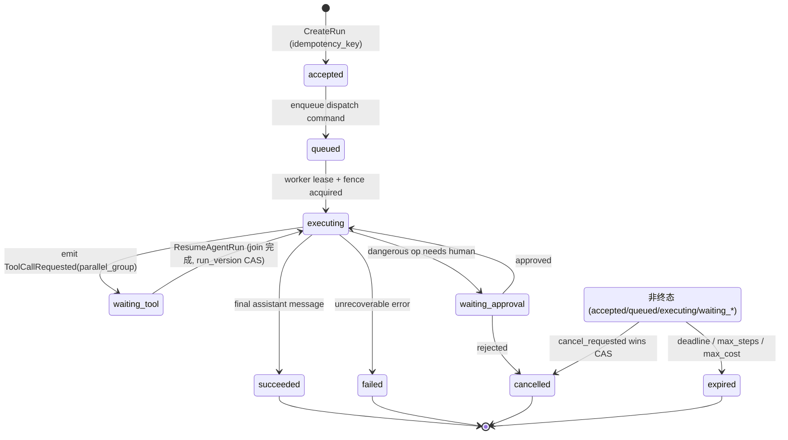
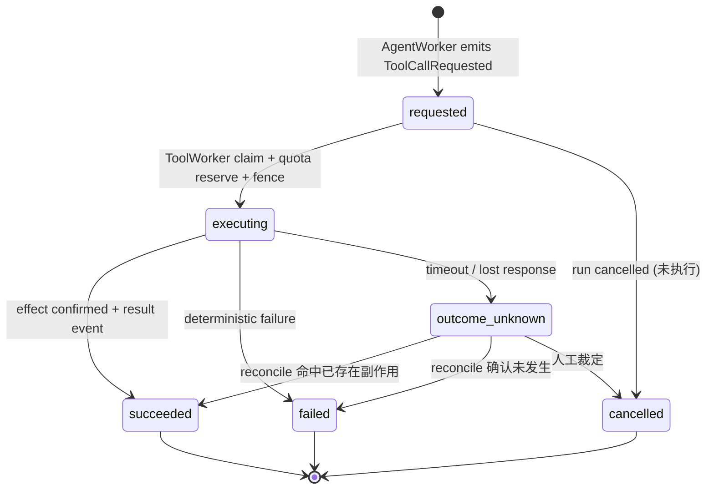
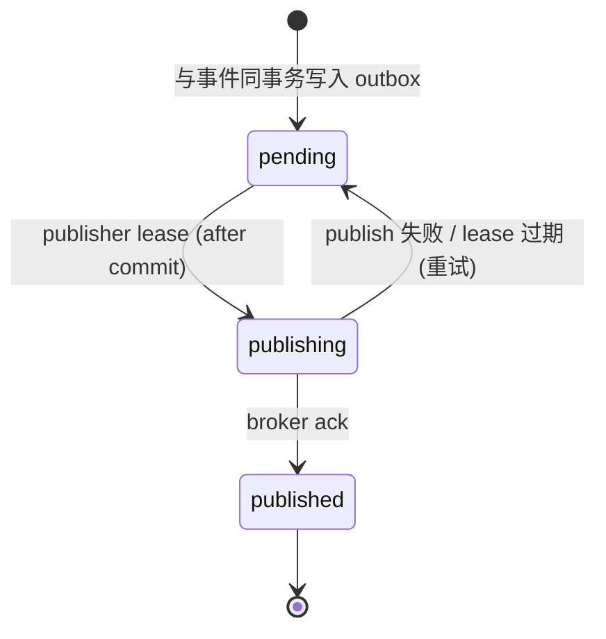

# 核心状态机与不变量

> 本文档是 [architecture.md](./architecture.md) 的子文档，定义系统的形式化正确性规约。

正确性的核心是：每个实体只能沿合法状态路径前进，且每个版本最多产生一个有效后继。系统正式定义三个状态机：Run、ToolCall、Command。

**Run 和 ToolCall 是两个独立聚合，各自拥有独立的乐观并发令牌**：Run 状态转换用 `run_version` CAS，ToolCall 状态转换用 `tool_call_version` CAS。这一分离是并行 tool call 能够工作的前提——N 个并行 ToolWorker 各自完成时只竞争自己的 `tool_call_version`，不会在 `run_version` 上产生假冲突；只有当 join 条件满足、需要将 Run 从 `waiting_tool` 推进到 `executing` 时，才竞争 `run_version`。

每次状态转换都是一次带对应聚合版本（`expected_run_version` 或 `expected_tool_call_version`）或去重键（`effect_key` / `command_id`）的条件写，转换失败即拒绝，不存在"绕过状态机"的写路径。

## Run 状态机

一次 Agent 执行的生命周期。`waiting_tool` / `waiting_approval` 是挂起态，由 `ResumeAgentRun` 命令唤醒；`cancelled` / `expired` 可从任一非终态进入。

**不变量**：每个 `run_version` 最多产生一个可执行 continuation；终态（`succeeded`/`failed`/`cancelled`/`expired`）不可被普通流程改写，只能由 Repair Command API 创建 replacement run。

## ToolCall 状态机

一次工具调用的生命周期。`outcome_unknown` 是关键的非终态：当外部调用超时或响应丢失、无法确认副作用是否发生时进入，必须经 reconciliation 才能落到终态，禁止直接重试。

**不变量**：同一 `effect_key` 最多产生一次有效外部副作用；`succeeded` 必须伴随 effect ledger 中 `confirmed` 记录与一条结果事件。每次 ToolCall 状态转换以 `expected_tool_call_version` 做条件写，与 `run_version` 独立——ToolCall 完成不递增 `run_version`，Run 状态转换不递增 `tool_call_version`。

## Command 状态机

outbox 中一条命令（执行意图）的发布生命周期，与业务执行解耦。

**不变量**：outbox 只负责"把命令送达 broker"，不负责业务执行完成；publisher 可能在 ack 后、标记 `published` 前崩溃，因此重复投递必然存在，消费端必须经 inbox（`UNIQUE (tenant_id, consumer_name, command_id)`）去重。

## 要点

- **区分事件与命令**。事件表示"已发生的事实"（`ToolCallSucceeded`），命令表示"希望某消费者执行的意图"（`ResumeAgentRun`）。不要让一个对象（旧设计的 `agent.run.requested`）既像事件又像 job。
- **取消是正交标志，不是简单终态**。`cancel_requested` 与完成通过同一个版本条件竞争：完成先提交则取消返回"run 已终态"；取消先提交则后续完成因版本/状态不匹配被拒绝；外部副作用是否已发生交由 reconciliation 处理。**取消还必须传播到正在运行的执行体**：DB 标记 `cancel_requested` 后，在飞 ToolWorker 通过 lease heartbeat 读到取消标志后协作式中止，并对 sandbox 发出 `RuntimeTerminationRequested`（正常路径也复用该命令，不只属于 Repair）。否则取消只改了状态，昂贵的 sandbox / 长工具仍在烧钱运行。
- **失控保护**。每个 run 必须有 `max_steps`、`max_cost`、`deadline` 与循环检测，防止 Agent↔Tool 自激或被注入内容诱导的无限循环。`max_steps` / `max_cost` 在 `executing` 态由 worker 当场判定；但当 run 处于 `waiting_tool` / `waiting_approval` 挂起态时没有任何 worker 在跑，`deadline` 与 approval 超时只能由 **Timer / Sweeper**（见 [operations.md](./operations.md)）按 `due_at` 主动触发 `expired` / 超时转换。
